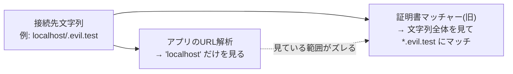

# 2026-09-26（土）

> 今日のひとこと：文字列としてのホスト名解釈が複数レイヤーでズレると検証が抜ける、という教訓が目立つ一日でした。Bunがワイルドカード証明書のホスト名照合とIPリテラル解析を厳格化し、同時期にNode.jsも`--allow-net`権限チェックをファイルディスクリプタ経由でバイパスできる穴を塞いでいます。仕様面ではHTMLがメディア要素の`loading`属性を読むタイミングを修正し、Next.jsはページ/レイアウトの区別を捨てたキャッシュ木構造の統一に着手しました。

## トップニュース

Bunに、TLS証明書のホスト名照合とIPアドレスリテラル解析を厳格化する2つの修正が入った。証明書マッチャーとIPアドレス判定ロジックが、文字列としてのホスト名の解釈でズレていたことが原因。

**何が変わる**：JS側`tls.checkServerIdentity`とネイティブ（Rust）側の両方のホスト名マッチャーが、DNS名として妥当な文字（英数字・ハイフン・アンダースコア・ドット）以外を含む文字列には証明書のSAN/CNを一切マッチさせないよう変更された（#43873）。あわせて、IPリテラルの解析を`core::net`の厳格なパーサに統一し、`127.1`のような短縮形、16進表記`0x7f000001`、CIDR付き`::1/64`のような非正規形式をIPアドレスとして受理しないようにした（#43979）。

**なぜ変えた**：これまでは`"localhost/.evil.test"`のようなURL区切り文字を含む文字列にも、`*.evil.test`のようなワイルドカード証明書がマッチしてしまっていた。アプリ側がこの文字列をURLとしてパースすると`"localhost"`だけを見るのに、証明書マッチャーは文字列全体を見てしまうという「解釈の不一致」が生じていた。IPリテラルの判定も同様に、c-aresの寛容なパーサが受理する非正規形式と証明書側の判定がズレていた。

**何に効く・誰が困る**：`fetch()`、`Bun.connect()`、Redis/SQLクライアント、Node.js互換の`tls.connect()`まで、Bunの全TLSクライアントが対象になる。内部サービスやlocalhostへの証明書検証を回避する攻撃を防ぐ修正で、開発者側の対応は基本的に不要（挙動が安全側に厳格化されるだけ）。IPリテラルを緩く解釈する自作コードがある場合は、非正規表記を渡していないか見直す価値がある。

**ここまでの経緯**：このダイジェストでは今回初めて詳しく取り上げる。2件のPRは同日にまとめてマージされた。

- 2026-09-24：[前号](2026-09-24.md)で取り上げたTLS証明書ホスト名照合のIDNAマッピング修正（#43040）がマージ
- 2026-09-25：ホスト名マッチャーの厳格化（#43873）とIPリテラル解析の厳格化（#43979）が同日連続でマージ

出典: https://github.com/oven-sh/bun/pull/43873 （関連: https://github.com/oven-sh/bun/pull/43979）

## 今日の深掘り

### 証明書ホスト名照合とIPリテラル解析、「文字列の解釈のズレ」がどうTLS検証を抜けるか

選んだ理由：トップニュースと同じ変更だが、複数のパースレイヤーが同じ文字列を別の意味で解釈するとセキュリティ境界がどう抜けるか、という一般的な教訓を、同じ日にNode.jsで見つかった別カテゴリの権限バイパス修正と横に並べて読める。

背景：TLSのサーバー証明書検証は、証明書のSAN/CNに書かれたホスト名パターンと、接続先として指定された文字列を照合する処理である。この照合はアプリ側のURL解析、Bunのネイティブ（Rust）側のホスト名マッチャー、IPアドレス判定という複数のレイヤーをまたいで行われる。

変更点：#43873では、ホスト名マッチャーがDNS名として妥当な文字以外を含む入力（`"localhost/.evil.test"`のような区切り文字を含む文字列）に対して、証明書のワイルドカードパターンを一切マッチさせないよう修正した。#43979では、`is_ip_address`/`to_ip_address`が使っていたc-aresの寛容なパーサを`core::net`の厳格な実装に置き換え、`127.1`のような短縮形、`0x7f000001`のような16進表記、`::1/64`のようなCIDR付き表記をIPアドレスとして受理しないようにした。テストケースを75件追加し、修正前はそのうち58件が失敗することを確認している。

周辺コード：この2つの修正は、fetch・Bun.connect・Redis/SQLクライアント・Node.js互換tlsレイヤーが共有するホスト名・IPアドレス判定の基盤部分に位置する。

この変更から分かる設計思想：セキュリティ境界に関わる文字列判定は、パーサを共有するか、少なくとも「妥当な文字集合」を明示的に制限しないと、複数レイヤー間の解釈のズレを突かれる。同じ期間にNode.jsでも`new Socket(fd)`が`--allow-net`の権限チェックをバイパスできる問題（#66117）が修正されており、「高レベルAPIだけをチェックして低レベルの入口を見落とす」という同系統の穴が、別のランタイムでも同時期に見つかっている。

出典: https://github.com/oven-sh/bun/pull/43873 （関連: https://github.com/oven-sh/bun/pull/43979、類例: https://github.com/nodejs/node/pull/66117）

### Solidのnextブランチで、サーバー専用の「穴」を表す値がPromiseから凍結thenableに変わった理由

選んだ理由：「なぜPromiseそのものを使わないのか」という反直感的な設計判断が明確で、本のミニ実装（Promiseベースの非同期値）と対比しやすい。

背景：Solid next（v2系）は`ssrSource:"client"`のように、サーバーでは値を持たずクライアント側でだけ解決される値をサポートしている。サーバー側でこの値を読むと、意図的にリアクションを一時停止させるための特別な「穴（hole）」を投げる仕組みになっている。

変更点：この「穴」を表す`CLIENT_HOLE`は、実装上は普通のPromiseだった。Promiseは`then`されるたびに内部でリアクション（コールバック）を登録して保持するため、同じ`CLIENT_HOLE`を200回読むと、解決されないPromiseに200個のリアクションが溜まり続けるメモリリークになっていた。修正では、`then`は実装しているが実際には何もコールバックを保持しない「凍結された（inert）thenable」に置き換えた。

周辺コード：サーバーでのクライアント専用値の読み取りは、Solidのサスペンス・非同期メモの仕組みと同じパスを通る。表面的には「Promiseのように振る舞えばよい」ため、これまでネイティブPromiseで代用されていた。

この変更から分かる設計思想：「Promise風に振る舞えばよい」という要件は、実際にPromiseを使うことを意味しない。長時間稼働するサーバープロセスでは、コールバックをためこむだけの「本物のPromise」はリークの温床になりうるため、必要な振る舞い（`then`が呼べること）だけを持つ最小限のオブジェクトを自作する方が安全な場合がある。

出典: https://github.com/solidjs/solid/pull/3658

## 仕様の変更

### WHATWG（HTML）

#### メディア要素のloading属性を、パーサの「安定状態を待つ」タイミングまで待って読むよう修正

【HTML】`<video loading=lazy>`のように書くと、HTMLパーサが属性を1つずつ追加していく途中でリソース選択アルゴリズムが動くため、`src`属性の処理時点ではまだ`loading`属性が付いておらず、既定値のEagerと誤認されてしまうことがあった。仕様の記述を、パーサが「安定状態を待つ」ステップを経た後に`loading`属性を読む形に修正した。
なぜ変えたか：Chromiumは既にこの2段構えの挙動で動いており、仕様の記述を実装の実態に合わせるため（関連Issue: whatwg/html#12854）。GeckoとWebKitはmedia要素の`loading`属性自体を未実装。
出典: https://github.com/whatwg/html/pull/12970

### CSSWG（csswg-drafts）

#### ViewTimelineコンストラクタのsubjectオプションが必須に

【CSS】`ViewTimeline.subject`はIDL上non-nullなのに、コンストラクタ引数の`ViewTimelineOptions.subject`は省略可能という矛盾があった。WGの決議（後述「議論ウォッチ」参照）に基づき、`subject`をコンストラクタの必須メンバーに変更した。
なぜ変えたか：IDLの型定義と実際に構築できる値の不整合を解消するため。
出典: https://github.com/w3c/csswg-drafts/pull/14526 （関連Issue: https://github.com/w3c/csswg-drafts/issues/13959）

動きなし：whatwg/dom, whatwg/fetch, whatwg/streams, whatwg/url, tc39/ecma262（マージPRなし）, tc39/proposals（Stage変更なし）, w3c/aria, w3c/ServiceWorker, w3c/wcag3

## ブラウザの実装

### Chrome Platform Status / blink-dev

Chrome 154が安定版リリースされた。chromestatus.com・blink-devは本セッションのegressポリシーでブロックされ個別Intentスレッドは直接確認できなかったが、リリースノートから実装段階に到達した機能を把握できた。

- レスポンシブiframe：親ページのiframeにCSSを指定し、埋め込み側HTMLにmeta要素を追加するだけで、埋め込みドキュメントのレイアウトオーバーフローサイズに自動リサイズできる機能がShip。
- `scroll-marker-group`の`tabs`/`links`モード：WAI-ARIAのtablist/tab、navigation/linkパターンに沿った2モードの指定がShip。

出典: https://developer.chrome.com/release-notes/154 、https://www.bram.us/2026/09/23/responsive-iframes/
取得できず：chromestatus.com、groups.google.com（blink-dev）は本セッションのegressポリシーでブロックされ、個別のIntent to Prototype/Experiment/Shipスレッド一覧は直接確認できなかった。

### web-platform-tests/interop

#### Interop 2027、キャリーオーバー評価issueが12件一斉作成

【Interop】2026年のInvestigation対象だった12領域（Navigation API、Scoped custom element registries、Scroll-driven animations、Scroll snap、View transitionsなど）について、2027年も継続すべきかを判定するissueが一斉に作成された。
なぜ：例年恒例のフォーカスエリア選定プロセスの一環。決定はまだ出ていない。
出典: https://github.com/web-platform-tests/interop/issues/1481 （#1481〜#1492）

## OSSのPR

### Next.js

#### Turbopackが、ページ/レイアウトの区別を捨てたRouteTree構造に統一される

【Next.js】従来はCacheNodeが独自のツリー構造を持ち、ページかレイアウトかを`isPage`フラグで判定していた。これを`RouteTree<CacheNode>`という共通構造に置き換え、パラメータの比較（VaryPath）とルート構造の比較を分離。各セグメントが依存するパラメータを`varyParams`として記録し、Prefetchスケジューラも「親が子を判定する」から「各ノードが自分自身を判定する」設計に変えた。6本のPRに分けて進められた。
なぜ変えたか：検索パラメータの変更でページ自体は変わらないのにデータは変わる、という2つの関心が混在しており、無関係なパラメータ変更時に不要な再レンダリングが起きていたため。将来のReact Ledgers機能との統合も見込む。
出典: https://github.com/vercel/next.js/pull/98970 （関連: #98971〜#98975）

#### 実験的カスタムwebpackサポートを撤回

【Next.js】直前に追加した実験的機能が、モノレポ環境でNext.js自体が重複インストールされる不具合を招いたため、安定版リリース前に撤回した。
なぜ変えたか：修正には依存関係グラフの精査が必要で内部作業が1週間ブロックされており、revertを優先したため。
出典: https://github.com/vercel/next.js/pull/99227

#### PPR対応ページへ遷移後のServer Actionsハングを修正

【Next.js】PPR対応ページへの遷移後に元のページのServer Actionを呼ぶと、リクエストストリームが既に消費済みで再読込しようとしてハングする不具合があった。保存済みのactionBodyを再利用するよう修正した。
なぜ変えたか：ストリームは一度しか読めないため。
出典: https://github.com/vercel/next.js/pull/99252

その他：

- Edge SSRのメタデータストリーミングが、Node SSRと同じボット判定ポリシーに従うよう修正（[#99128](https://github.com/vercel/next.js/pull/99128)）
- `next/root-params`のゲッターをモジュール単位に分割し、無関係なパラメータでキャッシュが無効化されないよう修正（[#99239](https://github.com/vercel/next.js/pull/99239)）
- プリレンダーマッチャーのパラメータ二重デコードを修正（[#99121](https://github.com/vercel/next.js/pull/99121)）
- turbo-tasksのGC回りの細かい修正（root判定・逆辺の解体・followerの除去など）（[#98614](https://github.com/vercel/next.js/pull/98614)、[#98615](https://github.com/vercel/next.js/pull/98615)、[#98843](https://github.com/vercel/next.js/pull/98843)、[#98942](https://github.com/vercel/next.js/pull/98942)、[#99145](https://github.com/vercel/next.js/pull/99145)）
- bundle-analyzerのUI改善（URL状態保持、Suspense化、高DPI対応など）（[#98530](https://github.com/vercel/next.js/pull/98530)、[#98535](https://github.com/vercel/next.js/pull/98535)、[#99197](https://github.com/vercel/next.js/pull/99197)、[#99251](https://github.com/vercel/next.js/pull/99251)、[#99253](https://github.com/vercel/next.js/pull/99253)）
- pack-nextでpnpm 11+向けのoverrides設定先を動的選択（[#99199](https://github.com/vercel/next.js/pull/99199)）
- Turbopackがパッケージディレクトリ全体を無駄にトレースしないよう修正（[#99238](https://github.com/vercel/next.js/pull/99238)）
- 内部traceサーバープロセスに名前を付与（[#99257](https://github.com/vercel/next.js/pull/99257)）

### Vite

その他：

- module-runnerのsourceURLに空白を含むパスがあるとV8がsourceURLを途中で切ってしまい、エラー時のファイル名が失われる不具合を修正（[#23513](https://github.com/vitejs/vite/pull/23513)）
- `forwardConsole`でオブジェクト/配列出力のサイズを制限（[#23565](https://github.com/vitejs/vite/pull/23565)）
- bundled-devモードでRolldownランタイムのバージョン不整合を解消（[#23568](https://github.com/vitejs/vite/pull/23568)）
- `cross-spawn`から`tinyexec`への依存置き換え（[#23583](https://github.com/vitejs/vite/pull/23583)）

### Rolldown

#### HMRのPartial Acceptの精度を上げるため、インポート先が使うバインディング名をランタイムグラフに追加

【Rolldown】`import.meta.hot.acceptExports()`によるPartial Acceptが正しく機能するには、各インポーターがどのエクスポート名を使っているかをHMRランタイムが知る必要がある。ランタイムグラフに、静的importエッジごとのエクスポート名一覧を持つ`bindings`フィールドを追加した。
なぜ変えたか：Partial Acceptの精度向上とHMRペイロード削減のため（ベンチマークで3.46%改善）。
出典: https://github.com/rolldown/rolldown/pull/10856

その他：

- リポジトリからCLAUDE.mdを削除（[#10925](https://github.com/rolldown/rolldown/pull/10925)）
- バインディング層のデバッグ用強制パニック関数を削除（[#10989](https://github.com/rolldown/rolldown/pull/10989)）
- macOSのファイル監視で、変更のないパスに対してFSEventsバックエンドを不要に再起動していたバグを修正（[#10992](https://github.com/rolldown/rolldown/pull/10992)）

### oxc

#### HTML風の行コメント`<!-- -->`をパーサが正しく解析できるように

【oxc】新しいCommentKind（Html Open/Close）を導入し、マーカー文字列を除去しつつコメント範囲の位置情報を保持するようにした。ASTの変更のため、rolldownなど下流ツールはCommentKindの分岐追加が必要になる。
なぜ変えたか：HTMLコメント値にマーカーの残骸が混入するバグが報告されたため（Issue #22803）。
出典: https://github.com/oxc-project/oxc/pull/22933

#### React Compiler変換に`reportDiagnostics`オプションを追加

【oxc】致命的でない診断情報を`errors`配列で取得できる新オプションを追加した。デフォルト動作は変えないopt-in設計。
なぜ変えたか：0.148.0以降、どの関数がコンパイルをスキップされたか可視化する手段が失われていたため。
出典: https://github.com/oxc-project/oxc/pull/26624

#### 正規表現パーサにバッファ境界アサーションのサポートを追加

【oxc】jviereck/regjsparserのポートで、upstreamの90件のテストケースを取り込み、仕様準拠の境界アサーション処理を実装した。
なぜ変えたか：不明（upstream実装への追従）。
出典: https://github.com/oxc-project/oxc/pull/27048

その他：

- React Compilerで`**`/`**=`のセマンティクスをJS仕様に一致させる修正（reactの正確性バグ修正のポート）（[#26895](https://github.com/oxc-project/oxc/pull/26895)）
- 非8進数の数値リテラルで`.`や`e`の後のアンダースコアを誤ってエラーにしていたレキサーのバグを修正（[#27072](https://github.com/oxc-project/oxc/pull/27072)）
- フォーマッタのコメント配置の細かな修正（JSDoc行末スペース保持、代入演算子前コメント、隣接ブロックコメントの詰め配置など）（[#26861](https://github.com/oxc-project/oxc/pull/26861)、[#26997](https://github.com/oxc-project/oxc/pull/26997)、[#27035](https://github.com/oxc-project/oxc/pull/27035)、[#27036](https://github.com/oxc-project/oxc/pull/27036)、[#27037](https://github.com/oxc-project/oxc/pull/27037)、[#27039](https://github.com/oxc-project/oxc/pull/27039)、[#27041](https://github.com/oxc-project/oxc/pull/27041)）
- `oxc_parser`側のバグに起因して現状直せないlexerのconformanceテストをスキップ（[#27071](https://github.com/oxc-project/oxc/pull/27071)）

### Node.js

#### プロセス全体にタイムアウトを強制する`--process-timeout=N`フラグを追加

【Node.js】ネイティブのウォッチドッグスレッドが経過時間を監視し、メインスレッドに割り込みをかける新機能。タイムアウト時はJSスタックトレースとイベントループを止めているリソースを出力し、exit code 124で終了する。
なぜ変えたか：OS/CIレベルのタイムアウトはプラットフォームごとに一貫せず、JSの`setTimeout`はビジーループやネイティブコードのブロックを検知できないため。
出典: https://github.com/nodejs/node/pull/66138

#### `new Socket(fd)`が`--allow-net`の権限チェックをバイパスできる問題を修正

【Node.js】ファイルディスクリプタを直接渡すSocket生成経路では、`--permission --allow-net`のネットワーク権限チェックが素通りしていた。stdio/IPC用のfdは例外扱いしつつ、それ以外はチェックを効かせるよう修正した。
なぜ変えたか：複数の重複したセキュリティリサーチャーからの報告を受けたため。
出典: https://github.com/nodejs/node/pull/66117

#### zstdの不完全なフレームで`reset()`すると無音でデータ破損する不具合を修正

【Node.js】zstdはバッファを完全flushしてから次のジョブを始める必要があるが、フレーム完了状態を追跡していなかったため、未完了のまま`reset()`すると壊れた出力を無音で生成していた。例外`ERR_ZLIB_INCOMPLETE_FRAME`を投げるよう修正した。
なぜ変えたか：データ破損が無音で起きるのは危険なため（Issue #66087）。
出典: https://github.com/nodejs/node/pull/66088

その他：

- カスタム同期DNSルックアップ失敗時にTLS接続がSNI初期化前に落ち、エラーが別のTypeErrorに隠される問題を修正（[#65624](https://github.com/nodejs/node/pull/65624)）
- `URLSearchParams`のキー衝突検出用Mapを遅延生成し高速化・メモリ削減（[#65801](https://github.com/nodejs/node/pull/65801)）
- package mapの末尾スラッシュ付きURLの格納形式不一致でモジュール解決が失敗する不具合を修正（[#66054](https://github.com/nodejs/node/pull/66054)）
- `util.isPartialDeepStrictEqual()`を公開APIとして追加（[#66118](https://github.com/nodejs/node/pull/66118)）
- 実験的VFSの予約ルートをfs経由で読み取れるようにし、`vfs.vfsBase()`を追加（[#66140](https://github.com/nodejs/node/pull/66140)）
- `process.ref()`/`process.unref()`を実験的APIから正式版に卒業（[#66213](https://github.com/nodejs/node/pull/66213)）
- HTTPパーサの`maxHeaderPairs`上限の渡し方を変更し最大7.4%高速化（[#66250](https://github.com/nodejs/node/pull/66250)）
- `BlockList.check()`・`net.isIPv6()`・FFI文字列引数確保などの細かな性能改善（[#66165](https://github.com/nodejs/node/pull/66165)、[#66166](https://github.com/nodejs/node/pull/66166)、[#66178](https://github.com/nodejs/node/pull/66178)）

### Bun

#### TLS証明書のホスト名照合とIPリテラル解析を厳格化

【Bun】→ トップニュースおよび今日の深掘り参照。
出典: https://github.com/oven-sh/bun/pull/43873 （関連: https://github.com/oven-sh/bun/pull/43979）

#### MySQLキューで失敗したクエリが後続クエリの結果をすり替える不具合を修正

【Bun】失敗したリクエストをキューからpopしてoffsetを進めてしまい、後続クエリが別クエリの結果行を受け取ってしまうデータ整合性の不具合を修正した。
なぜ変えたか：失敗したprepareに対する同時実行クエリが応答を受け取れずハングする問題が報告されていたため（Issue #40634）。
出典: https://github.com/oven-sh/bun/pull/36842

#### fetch/HTTP2/fs.watchで分かれていたAbortSignal監視を`AbortHandle`に統合

【Bun】3つの独立した実装が個別にAbortSignalを監視していたのを、`AbortHandleOwner`とKeepAlive契約による単一の所有権モデルに統合した。コールバック実行中はオーナーの生存を保証し、use-after-freeを防ぐ。
なぜ変えたか：不明（メモリ効率・安全性・実装の単純化が動機として挙げられている）。
出典: https://github.com/oven-sh/bun/pull/43933

その他：

- バンドラが引数なし/リテラル引数のみで呼ばれ常に同じ値を返すimport関数の呼び出しを畳み込めるようにした（`--define`によるdead branch解決の順序問題を解消）（[#43936](https://github.com/oven-sh/bun/pull/43936)）
- `WriteStream`の高速パスで`FileSink`の書き込みバックログをflushしてから完了するよう修正（[#43879](https://github.com/oven-sh/bun/pull/43879)）
- デッドコード削除（WebCore/WebView/bake HMR/JSBuffer関連）（[#43778](https://github.com/oven-sh/bun/pull/43778)、[#43828](https://github.com/oven-sh/bun/pull/43828)、[#43880](https://github.com/oven-sh/bun/pull/43880)、[#43914](https://github.com/oven-sh/bun/pull/43914)）
- Postgres接続のBindパラメータエンコードを`encode_request`に一本化する内部リファクタ（[#43892](https://github.com/oven-sh/bun/pull/43892)）
- 内部ベンチマーク・lintツールをCIに統合（[#43943](https://github.com/oven-sh/bun/pull/43943)）

### TypeScript

#### API経由で作成した単独のソースファイルに、キャッシュ可能なIDを付与

【TypeScript】`api.createSourceFile`等で作った単独のソースファイルに、グローバルなパースキャッシュに組み込むためのトラック可能なIDを付与した。`using`によるdisposableな「リース」パターンでキャッシュから借用する形にし、同一内容なら`api.createProgram()`でも同じインスタンスを再利用する。
なぜ変えたか：同一内容のファイルを複数回パースする無駄を解消するため。
出典: https://github.com/microsoft/TypeScript/pull/64434

その他：

- api-extractorが必要とするASTヘルパー（`isExternalModule`等）を追加（[#64439](https://github.com/microsoft/TypeScript/pull/64439)）
- JSX automatic runtime使用時にauto-import解決がクラッシュする不具合を修正（[#64417](https://github.com/microsoft/TypeScript/pull/64417)）

### Biome

その他：

- GritQLフォーマッタで`within`パターンに`until`句がない場合の余分な末尾スペースを修正（[#11952](https://github.com/biomejs/biome/pull/11952)）
- `noFocusedTests`ルールがメソッドチェーン呼び出し（`builder.fit(...)`）を誤検知していたのを修正（[#11958](https://github.com/biomejs/biome/pull/11958)）
- `noUnusedVariables`ルールが自分自身しか参照しない再帰的アロー関数を未使用として検出できるように（[#11959](https://github.com/biomejs/biome/pull/11959)）

### Solid

main（1.x系）：動きなし。直近コミットは2026-09-04で、対象期間内のマージなし。

next（2.0系、以下すべて`next`ブランチへのマージ）：

#### サーバー専用の「穴」がPromiseから凍結thenableに変わる

【Solid】→ 今日の深掘り参照。
出典: https://github.com/solidjs/solid/pull/3658

#### 観測用イベントAPIを単一チャンネルに統合する4部作の再設計

【Solid】10種類あった記録購読APIを`OBSERVE.records.subscribe(type,...)`に一本化し、コピーオンライトのリスナー配列でゼロアロケーション化した。診断コードの統合、観測サーフェスの削減、Server-Timingのレコード投影化まで含む破壊的変更の連作。
なぜ変えたか：観測系APIの一貫性向上とパフォーマンス改善、未テストの拡張点の削減のため。
出典: https://github.com/solidjs/solid/pull/3644 （関連: #3646, #3649, #3650）

#### SSRシリアライズの競合による未処理rejectionでのプロセスクラッシュを修正

【Solid】サーバー側でシリアライズ対象のPromiseが先に拒否されると、Node.jsが未処理rejectionでプロセスを終了させてしまう不具合を修正した。
なぜ変えたか：本番SSRプロセスのクラッシュを避けるため。
出典: https://github.com/solidjs/solid/pull/3642

#### "live"をイベントストリーム化する大型機能「Stage 8 Phase A」を追加

【Solid】`/data/<id>`から`/live/<id>`へエンドポイントを変更してSSE化し、接続をPromise/非同期イテラブルが解決するまで維持する仕組みを追加した。サーバーコンポーネントのライブ更新基盤の再設計。
なぜ変えたか：不明（ステージングされた大型機能開発の一部）。
出典: https://github.com/solidjs/solid/pull/3653

その他：

- optimisticレーン下での非同期メモ初回到達時の3つの不具合を修正（誤った診断・undefinedの捏造・isPendingプローブの二重登録）（[#3651](https://github.com/solidjs/solid/pull/3651)、追随: [#3652](https://github.com/solidjs/solid/pull/3652)）
- パフォーマンストラックのラベルが最も近いコンポーネントから始まるよう修正（[#3645](https://github.com/solidjs/solid/pull/3645)）
- client-holeを読む派生の非同期計算がハングせずFINAL扱いでハンドオフするよう修正（[#3661](https://github.com/solidjs/solid/pull/3661)）

本への影響：react-hook-form/react-hook-formは対象期間内マージ0件のため、既存章（01〜04）への影響なし。

### Ladybird（masterブランチ）

#### GCのディスパッチを、C++ vtableから型ごとのテーブル（CellTypeInfo）に変更

【ブラウザ】各セル型に`CellTypeInfo`テーブル（visit_edges/finalize/破棄/external_memory_size/class_name）を持たせ、GCのディスパッチをC++の仮想関数から型ごとのテーブル参照に移行した。74ファイルに影響する大規模な変更。
なぜ変えたか：Rustで定義された型はC++のvtableを提供できないため。将来Rust所有オブジェクトをGC管理下に置くための地ならし。
出典: https://github.com/LadybirdBrowser/ladybird/pull/12175

#### CSS Anchor Positioningの再チェック範囲を、部分再レイアウトのサブツリーに限定

【ブラウザ】`anchor()`やposition-areaを1箇所使っているだけで文書全体の部分再レイアウトがブロックされていた問題を修正し、依存関係のあるサブツリーだけを対象にするよう変更した。
なぜ変えたか：CSS Anchor Positioning利用時のレイアウト性能劣化を防ぐため。
出典: https://github.com/LadybirdBrowser/ladybird/pull/12171

#### Linux版で、ライセンス制約のあるコーデックをシステムFFmpegから読み込むように変更

【ブラウザ】バンドルFFmpegから特許・ライセンス制約のあるコーデック（H.264/HEVC/AAC等）を除去し、Linuxではシステム提供のFFmpegライブラリを動的ロードするようにした（macOSは既にVideoToolbox/AudioToolboxで対応済み）。
なぜ変えたか：ロイヤリティが発生するコーデックをバンドルする法的・配布上のリスクを避けるため。
出典: https://github.com/LadybirdBrowser/ladybird/pull/12164

その他：

- レイアウトパスの複数箇所で冗長な再計算を削減（Speedometer2 +0.42%、Speedometer3 +0.99%、StyleBench +4.14%）（[#12163](https://github.com/LadybirdBrowser/ladybird/pull/12163)）
- `[[Set]]`が新規プロパティを追加する際のreceiver探索を1回に削減（Speedometer2 +0.92%、Speedometer3 +1.26%）（[#12169](https://github.com/LadybirdBrowser/ladybird/pull/12169)）
- 埋め込みSVGのサイズ計測で内部要素の走査をスキップし高速化（[#12172](https://github.com/LadybirdBrowser/ladybird/pull/12172)）
- シャドウルート直下の子要素のdisplay変更をシャドウホスト起点で再構築するよう修正（[#12158](https://github.com/LadybirdBrowser/ladybird/pull/12158)）
- DOMExceptionのトレースバックメモリをGCに報告するよう修正（[#12173](https://github.com/LadybirdBrowser/ladybird/pull/12173)）

動きなし：facebook/react, react-hook-form/react-hook-form, solidjs/solid（main）

## 議論ウォッチ

### TC39第116回会議（2026-09-29〜10-01、東京）のアジェンダが確定

【TC39】論点：どの提案がStage 3→4（仕様確定）、Stage 2.7→3、Stage 2→2.7、Stage 1→2、Stage 0→1に進むか。
今回の進展：Stage 3→4候補にIterator Join、Iterator Includes、Iterator Chunking、Dynamic Code Brand Checks、Disallow Adding New Private Fields to Non-extensible Objectsが並んだ。Stage 2.7→3候補はThenable Curtailment。Stage 2→2.7候補はESM Phase Imports、export defer、JSON.parse Options。
次に決まりそうなこと：Iterator系とDynamic Code Brand ChecksのStage 4入り（仕様確定）が有力。
出典: https://github.com/tc39/agendas/blob/main/2026/09.md

### CSSWGの電話会議で複数の決議が固まる

【CSS】論点：animation-triggersの独立モジュール化、`calc-size()`のキーワード名変更、フォームコントロールのダークモード背景、ViewTimelineのIDL整合性など。
進展：
- animation-triggersを独立モジュール`animation-triggers-1`として新規作成する方向で決議（Issue #13245）
- `calc-size(any, ...)`の`any`キーワードは分かりにくいため`none`にリネームする方向で決議（Issue #14208）
- ダークモードでのinput/select/textarea等の背景を明るくする方向で決議（Issue #14461）
- `ViewTimelineOptions.subject`を必須にする方向で決議し、今号の「仕様の変更」で扱ったPR #14526で仕様に反映済み（Issue #13959）

次に決まりそうなこと：animation-triggers-1のモジュール分離と`calc-size()`のリネームは、いずれも仕様エディットが次のステップ。
出典: https://github.com/w3c/csswg-drafts/issues/13245 、https://github.com/w3c/csswg-drafts/issues/14208 、https://github.com/w3c/csswg-drafts/issues/14461 、https://github.com/w3c/csswg-drafts/issues/13959

### CSS Align `flow-start`/`flow-end`にMozillaが肯定的ポジション

【CSS】論点：Flexbox/Grid-Lanesで配置方向が反転する場合に備え、`flex-start`/`flex-end`の別名として`flow-start`/`flow-end`をアライメントキーワードに追加すべきか。
今回の進展：2026-09-25、Mozillaが肯定ポジション（position: positive）を表明。対応するWebKit側は同日時点でまだ未決定。
次に決まりそうなこと：WebKitのポジション表明を待って、CSSWGでの正式な仕様入りに進むか判断される見込み。
出典: https://github.com/mozilla/standards-positions/issues/1455

### Device Bound Session Credentials（DBSC）にMozillaが否定ポジション

【ブラウザ】論点：ベアラートークンCookieの代わりに暗号鍵でセッションを認証し、セッションハイジャックを抑止する仕組みを導入すべきか。
今回の進展：2026-09-24、Mozillaが否定ポジションでクローズ（具体的な反対理由本文は未ログイン状態のページからは確認できず）。
次に決まりそうなこと：Mozilla側の実装は見込まれない状況。Chromeは既に提供中。
出典: https://github.com/mozilla/standards-positions/issues/912

## 続報

### Interop 2027提案受付の後続、キャリーオーバー評価が始まる

[9月23日](2026-09-23.md)の号で取り上げたInterop 2027フォーカスエリア提案の受付締め切りに続き、今日は2026年のInvestigation対象12件について2027年も継続すべきか判定するissueが一斉に作成された（決定→仕様策定の前段階）。
出典: https://github.com/web-platform-tests/interop/issues/1481

### Bunの証明書検証強化、IDNAマッピング修正から一歩進む

[9月24日](2026-09-24.md)の号で取り上げたBunのTLS証明書ホスト名照合のIDNAマッピング修正（#43040）に続き、今日はワイルドカード証明書のホスト名解釈とIPリテラル解析そのものを厳格化する2件の修正が入った（実装の継続的な強化）。
出典: https://github.com/oven-sh/bun/pull/43873

## 仕様を読む会の候補

- **Bunのホスト名/IPリテラル検証の厳格化**（oven-sh/bun #43873, #43979）：文字列の解釈のズレが複数レイヤーをまたいでセキュリティ境界を抜ける典型パターンを、実際のパーサ実装を読みながら学べる。同時期のNode.jsの権限バイパス修正（#66117）と比較すると理解が深まる（出典: https://github.com/oven-sh/bun/pull/43873）。
- **Next.jsのRouteTree統合**（vercel/next.js #98970〜#98975）：ページ/レイアウトの区別を捨てて木構造を統一する、というキャッシュ設計の大規模リファクタを6本のPRを通して読める（出典: https://github.com/vercel/next.js/pull/98970）。
