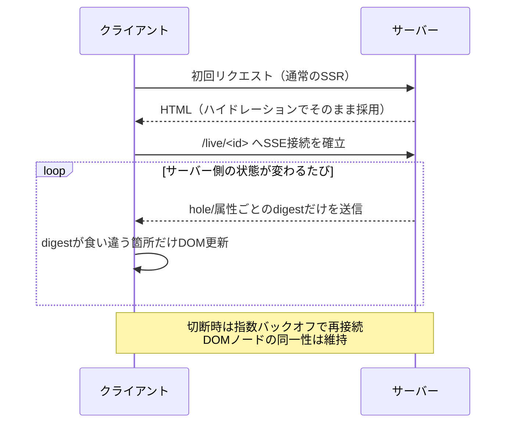

# 2026-09-27（日）

> 今日のひとこと：仕様まわりはUTCの週末に沈んだ静かな一日でしたが、OSS側は「所有権と同一性をどう再定義するか」が揃った日でした。Solid nextはサーバーコンポーネントを常設SSE接続に載せ替える大改修の第2弾を投入し、Wadoはコンパイラの名前解決を全面書き換え、Servoはクロスオリジンオブジェクトの実装をGeckoに合わせて統合しています。

## 今日のリリース

- 【RHF】react-hook-form v7.89.0：`watch`購読・`values`購読・`dirtyFields`計算の3件のパフォーマンス改善を含むパッチリリース（出典: https://github.com/react-hook-form/react-hook-form/releases/tag/v7.89.0）

## トップニュース

Solid（nextブランチ、2.0開発版）が、サーバーコンポーネントを1回きりのリクエスト/レスポンスではなく「常設接続」に載せ替える大改修の第2弾をマージした。前日の号で取り上げた「Stage 8 Phase A」（`/data/<id>`から`/live/<id>`へのSSE化）に続く、Part Bにあたる。

**何が変わる**：`live(fn)`で呼び出したサーバーコンポーネントの接続が、初回のSSRレンダリング結果をそのままハイドレーションで採用したうえで、以後はSSE（Server-Sent Events）で持続的にDOM差分だけを流し込む方式になった。差分は「hole（穴）」や属性ごとのdigest比較で検出し、切断時は指数バックオフで再接続、既存DOMノードの同一性は保ったまま復旧する。`GET(fn)`によるサーバーコンポーネントの読み出しも、event-streamレスポンスとして同じ経路を通るようになった（PR #3660）。

**なぜ変えた**：複数回のHTTPリクエスト/レスポンスの往復を1本の持続接続に置き換えることで、遅延と帯域を削減する狙い。プログレッシブエンハンスメントとハイドレーション互換性（初回はSSRのHTMLをそのまま使い、追加リクエストを発生させない）は維持したまま実現している。

**何に効く・誰が困る**：Solid 2.0のサーバーコンポーネントを使うアプリに効く変更で、まだrc版（2.0.0-rc.9）の開発途上機能。裏を返すと、サーバー側が持続的なSSE接続を張り続けられるホスティング環境が前提になる。接続を短時間で切る一部のサーバーレス/エッジ実行環境では、この設計の恩恵をそのまま受けられない可能性がある。

**ここまでの経緯**：

- 2026-09-26：[前号](2026-09-26.md)で取り上げた「Stage 8 Phase A」（PR #3653）で、サーバーコンポーネントの読み出しを`/live/<id>`エンドポイントのSSE化として立ち上げ
- 2026-09-26（本号対象期間）：Part B（PR #3660）で、常設接続化・差分適用・再接続・`GET(fn)`のevent-stream化までを実装

出典: https://github.com/solidjs/solid/pull/3660 （前段: https://github.com/solidjs/solid/pull/3653）

## 今日の深掘り

### Solidのサーバーコンポーネント、なぜ「毎回リクエストする」をやめて「繋ぎっぱなしで差分を流す」に変えたか

選んだ理由：トップニュースと同じ変更だが、「サーバーコンポーネント＝毎回サーバーに聞きに行く関数」という素朴な実装から、本物がどこまで踏み込んで最適化するかを追える題材。

背景：Solid 2.0のサーバーコンポーネントは、クライアント側に来ない値（データベース接続やAPIキーなど）をサーバー側だけで扱うための機構。愚直に作れば「呼ぶたびにHTTPリクエストを送り、結果をJSONで受け取ってDOMを作り直す」で動くが、これだと呼び出し1回ごとにラウンドトリップが発生し、サーバー側の状態が変わるたびに再度リクエストし直す必要がある。

変更点：PR #3660は、サーバーコンポーネントの接続を「1回のリクエストで終わる」ものから「開きっぱなしのストリーム」に変えた。具体的には、初回はSSRされたHTMLをそのままクライアントが引き継ぎ（ハイドレーション）、以降はサーバー側の状態が変わるたびに、変更があった部分（hole＝差し込み口や属性）のdigestだけをSSE経由で送る。クライアントは受け取ったdigestが自分の持つ値と食い違ったときだけDOMを更新する。接続が切れたときは指数バックオフで再接続し、再接続後も同じDOMノードを使い続ける（作り直さない）。`GET(fn)`によるサーバーコンポーネントの読み出しも同じevent-stream経路に統一された。

周辺コード：この仕組みはSolidのハイドレーション・サスペンスの経路と地続きで、前日の号（Phase A）で作られた`/live/<id>`エンドポイントの上に、双方向の差分適用ロジックを積み増す形で実装されている。

この変更から分かる設計思想：「サーバーコンポーネント」という機能を素朴に実装すると「関数を呼ぶたびにネットワークを1往復する」になりがちだが、Solidはそれを「1本の接続の上で差分だけを流す」設計に踏み込んでいる。プログレッシブエンハンスメント（JSが無くても初回表示は成立する）とハイドレーション互換性を犠牲にせずに、これをやっている点が本物の作り込みどころ。

出典: https://github.com/solidjs/solid/pull/3660

### Wadoのfor文、クロージャが「ループ変数を1個共有する」バグをどう修正したか

選んだ理由：JavaScriptの`var`ループ変数をクロージャが共有してしまう有名な落とし穴（ECMAScriptが`let`で「反復ごとに新しい束縛」を用意して解決した問題）と、そっくり同じ形のバグを、Wasm Component Model向けの新言語Wadoが独立に踏んでいる。ミニ実装で素朴なfor文を作ると必ず出会う題材として好適。

背景：Wadoは`for (let mut i = 0; ...; i++)`というC言語スタイルのfor文を持つ。ループ本体でクロージャを作り、そのクロージャが`i`をキャプチャして後で呼び出す、というコードは自然に書けてしまう。

変更点：修正前は、ループのヘッダで宣言した`i`をクロージャがキャプチャすると、本体側で`i`への書き込みがあった場合に全てのクロージャが同じ束縛を共有し、ループが終わった後の最終値を見てしまうミスコンパイルがあった（PR #2173）。これはECMA-262が`for (let i = ...)`に対して「反復ごとに新しい束縛を作る」という規則を持つのと同じ問題で、Wadoはこれを満たしていなかったことになる。修正は、ループ本体の実行後に`let mut i = i;`という形でヘッダの束縛を再宣言し、反復ごとに独立した束縛を作ることで実現した。あわせて、どの変数が実際に書き換えられるかを解析する「書き込み解析」を新設し、クロージャが実際に必要とする場合だけ束縛をヒープに逃がす（不要なボックス化を避ける）ようにしている。

周辺コード：ループの束縛と、それをクロージャがどう捕捉するかの判定は、コンパイラのbinder/elaborator（意味解析）を横断する変更で、「スコープ外の名前かどうか」の判定もbinderからelaboratorへ移した、とPR本文に記載がある。

この変更から分かる設計思想：「反復ごとに新しい束縛を作る」という一見地味な仕様は、クロージャとループを組み合わせたときに初めて挙動の違いとして表面化する。JavaScriptがこの問題に何年も向き合った末に`let`を追加した歴史を踏まえると、新しい言語であるWadoが同じ問題に独立に到達し、同じ形の解決（反復ごとの再束縛）を選んだのは興味深い収束と言える。

出典: https://github.com/wado-lang/wado/pull/2173

### Servoが独自実装をやめてGeckoに合わせた理由：クロスオリジンの`Location`を1つの型に統合

選んだ理由：「仕様どおりに書いたはずの実装」が、なぜ他のブラウザエンジンに実装を寄せる形でリファクタされるのか、という設計判断が見える題材。ブラウザの内部実装が「仕様＋他実装との整合」の両方に引っ張られることを示す好例。

背景：`window.location`は、同一オリジンのウィンドウからは通常の`Location`として、クロスオリジンのiframeなど別オリジンのウィンドウからは非常に限定されたプロパティしか持たない特別な`Location`として振る舞う必要がある（`href`への代入は許すが読み取りはできない、など）。Servoはこれを、通常の`Location`とは別のWebIDL実装である`DissimilarOriginLocation`という独立した型で扱っていた。

変更点：PR #48417は、この`DissimilarOriginLocation`を廃止し、Geckoと同様に単一の`Location`実装（内部で同一オリジンの`Window`かクロスオリジンの`DissimilarOriginWindow`のどちらを持つかで振る舞いを分岐する）に統合した。あわせて、旧`DissimilarOriginLocation`のWebIDLがクロスオリジン向けのプロパティを正しくマーキングできていなかった不具合も一緒に修正され、複数のWPTサブテストが新たに通過するようになったとPR本文に記載がある。これはIssue #26982（クロスオリジンオブジェクトの扱い全般の見直し）に向けた最初の一歩と位置づけられている。

周辺コード：この変更はスクリプトエンジン（`script`クレート）内の、クロスオリジン境界に関わるWebIDL実装群の一角。同じ設計方針が今後、他のクロスオリジンオブジェクト（`Window`自体や`History`など）にも広がっていく可能性がある。

この変更から分かる設計思想：仕様は「クロスオリジンのLocationは何ができないか」を定めるが、「実装を2つの型に分けるか、1つの型の中で分岐するか」までは指定しない。Servoは独自に型を分けていたが、Geckoの実装（1つの型の中で分岐）に寄せることで、仕様が本来求めるセキュリティ境界を実装の構造としても表現し直した。ブラウザエンジンの実装は、仕様だけでなく「他のエンジンがどう設計したか」からも学び直すことがある。

出典: https://github.com/servo/servo/pull/48417

## ブラウザの実装

### Chrome Platform Status / blink-dev

取得できず：本セッションのegressポリシーで`chromestatus.com`、`developer.chrome.com`、`groups.google.com`、`chromereleases.googleblog.com`のいずれもブロックされ、対象期間（直近24時間）に絞った新規Intentスレッドやリリースを確認できなかった。WebSearch経由でChrome 155 Beta（CSS `symbols()`関数、コーナーごとのshorthandなど）やいくつかのblink-dev Intentスレッドの存在は確認できたが、いずれも対象期間より前の情報である可能性が高く、掲載を見送った。

### web-platform-tests/interop

#### CSS Relative Colorの「powerless（無力）」成分、WebKit実装者がテストの期待値に疑義

【Interop】`hsl(from lch(20 20 none) h s l)`のように、色空間変換で値が定まらない（powerless）成分を含む相対色構文の変換結果について、WebKit実装者がテストの期待値と食い違うとissueを新規に立てた。テスト作成者に説明を求めている段階で、決定はまだ出ていない。
なぜ：CSS Color 4のpowerless/missing成分の扱いは以前から論争のある領域（関連issue #1334）。
出典: https://github.com/web-platform-tests/interop/issues/1494

その他：

- Interop 2027に向けた「継続要否」判定issueが4件新規オープン（Accessibility testing [#1489](https://github.com/web-platform-tests/interop/issues/1489)、JPEG XL [#1490](https://github.com/web-platform-tests/interop/issues/1490)、Mobile testing [#1491](https://github.com/web-platform-tests/interop/issues/1491)、WebVTT [#1492](https://github.com/web-platform-tests/interop/issues/1492)）。前号までに取り上げた一斉起票の続き。

## OSSのPR

### Next.js

#### エージェント経由アップグレード（`next upgrade --ai`）が、Git不要・プレレリースchannel対応に

【Next.js】3本のPRで、AIエージェントによる自動アップグレード機能を拡張した。Gitリポジトリが無いアプリでもGit依存の手順（worktree作成やPR作成）を飛ばして実行できるようにし、RC/betaなどプレレリースchannelでもnpmのdist-tagから同一channel内の最新版を解決できるようにし、セキュリティ勧告によるブロック時には理由と回避コマンドを案内するようにした。
なぜ変えたか：プレリリース版を使うアプリやGitを使わない環境でも、エージェントによる自動アップグレードを実用にするため。
出典: https://github.com/vercel/next.js/pull/99217 （関連: https://github.com/vercel/next.js/pull/99223 、https://github.com/vercel/next.js/pull/99230）

#### Turbopackのexport mangling用facade分割を撤回

【Next.js】export名マングリングのためだけにモジュールをfacadeに分割する処理（直前に追加）が、動的importでのみ読まれるモジュールのシングルトンを実行時に2つの別インスタンスへ分裂させる回帰を起こしたため、安定版リリース前に撤回した。Turbopack開発者のレビューでは「完全撤回ではなくopt-inフラグにすべき」との指摘もあり、後日のフラグ化が課題として残っている。
なぜ変えたか：re-exportのあるモジュールとないモジュールでfacade分割の要否が食い違い、共有すべきシングルトンが壊れたため。
出典: https://github.com/vercel/next.js/pull/99285

#### レンダリングのエントリポイントに`RouteMatch`型を導入し、`resolvedPathname`をrequestから引き剥がす

【Next.js】app pageの各レンダリング経路（Node/Edge/direct server/static export）に`resolvedPathname`を保持する`RouteMatch`型を明示的に渡すようにし、従来requestのメタデータ経由で暗黙的に受け渡していた依存を断った。
なぜ変えたか：Next.js内部をrequest/responseオブジェクト中心の設計から脱却させる大きな流れの一環。prerendering時には実在しないRequest/Responseを偽装して使うコードが残っており、それを解消するため。将来的には`renderOpts`などもここに移す計画。
出典: https://github.com/vercel/next.js/pull/99259

その他：

- webpackローダーがシンボリックリンク境界を跨いでファイルシステムルートの依存を読めるよう修正（[#99202](https://github.com/vercel/next.js/pull/99202)）

### oxc

#### React Compiler lintルール、引数なし`new Date()`を非純粋関数呼び出しとして扱う

【oxc】React本家のDate純粋性チェックをoxcのreact-compiler lintルールに移植。引数なしの`new Date()`は実行時刻に依存するため非純粋と判定し、タイムスタンプを渡す呼び出しは引き続き純粋として許可する。
なぜ変えたか：React本体の純粋性判定ロジックと挙動を一致させるため。
出典: https://github.com/oxc-project/oxc/pull/26894

#### oxlintの`--type-check-only`モードで、型認識ルールを正しくスキップ

【oxc】`--type-check-only`実行時に型認識ルール（TSGolint経由）が実行され続け、抑制されているはずのlintエラーが混入していた不具合を修正。空のルールリストを送るよう変更した。
なぜ変えたか：`--type-check-only`実行時にdisableコメントが無視され誤検知する報告への対応。
出典: https://github.com/oxc-project/oxc/pull/27076

その他：

- CFGウォーカーが`body`を持たない宣言（`declare module "*.css";`など）でクラッシュしていたのを修正（[#27075](https://github.com/oxc-project/oxc/pull/27075)）

### TypeScript

#### プロジェクト参照ビルドを扱う非同期API「Build Orchestrator」を追加

【TypeScript】旧`SolutionBuilder`相当の機能を、`build()`/`buildReferences()`/`clean()`/`cleanReferences()`という非同期APIとして再設計し、Go実装側に対応する`orchestrator`を実装した。プロジェクト参照グラフ全体を扱うOrchestratorと、ファイル単位を扱うincremental program APIを分離する狙い。watchモードは別PRに持ち越し。
なぜ変えたか：将来的なsnapshotベースのincremental program（パースキャッシュの再利用）につなげ、バッチ処理のパフォーマンスを上げるため。
出典: https://github.com/microsoft/TypeScript/pull/64158

#### エディタのグローバル診断の扱いをStrada（旧実装）方式に合わせ、位置情報のないエラーが誤って出る不具合を修正

【TypeScript】incrementalビルド中のコメントのみの編集で、ホバー等のエディタ操作が位置情報を持たない循環参照エラーを誤って出し、どの機能を先に叩いたかで診断結果が変わってしまっていた。グローバル診断の収集をStrada方式に合わせつつ、エディタからのクエリでは付随的なグローバルエラーを除外するよう分離した。
なぜ変えたか：エディタ操作の順序によって表示されるエラーが変わるという再現性のなさを解消するため。
出典: https://github.com/microsoft/TypeScript/pull/64452

### Biome

#### 制御フローグラフが、真偽値の確定するリテラル条件（`while (true)`など）を無限ループとして認識するように

【Biome】`while (true)`のようなリテラル条件のループを、制御フローグラフが無限ループと認識しておらず、`noUnreachable`・`useGetterReturn`等のルールが誤検知していた。リテラル条件の真偽値をループの戻りジャンプの設定に反映するロジックを追加した。
なぜ変えたか：制御フロー解析に依存するリンタールールの誤検知を防ぐため。
出典: https://github.com/biomejs/biome/pull/11955

### Solid

main（1.x系）：動きなし（直近コミットは2026-09-04）。

next（2.0系、以下すべて`next`ブランチへのマージ）：

#### サーバーコンポーネントの常設SSE接続化「Stage 8 Part B」

【Solid】→ トップニュースおよび今日の深掘り参照。
出典: https://github.com/solidjs/solid/pull/3660

#### storeの列挙操作が、キーごとの「存在ノード」を作らなくなる

【Solid】`Object.keys`/`for...in`/spread/`Object.entries`/`JSON.stringify`などの列挙操作が、1個のkey-setノードへの購読で済むところを、キーごとに約640B相当の「存在（presence）ノード」を生成してしまっていたバグを修正。30フィールドのstoreに対する`Object.keys`読み取りのメモリが2.0KB→20KBに肥大化し、生成時間も1.5〜2倍に悪化していた。同一パス内の観測者が既にkey-setノードを保持していれば、descriptorトラップでのpresence読み取りをスキップするようにした。ベンチマークでObject.keysが23.6ms→11.1ms、for...inが22.4ms→11.5ms、spreadが36.0ms→23.7msに改善。
なぜ変えたか：rc.9で入ったパフォーマンス退行の修正。
出典: https://github.com/solidjs/solid/pull/3668

#### 重なるoptimistic更新が、内側のエフェクトを誤って破棄する不具合を修正

【Solid】2つの重なるoptimisticアクションが同じkeyed `<For>`内に別々の行を挿入する際、内側にネストしたエフェクトが誤って破棄されDOMから行が消える不具合を修正。lane pass（トランザクションに先行して直接コミットする経路）が張る「フレーム」を、別トランザクションの「ゾンビ」ではなく専用の"lane frame"として区別し、エフェクトのrun適用時に解放するようにした。
なぜ変えたか：Solidのリアクティブコアのフレーム/ゾンビ管理に起因する、行消失というユーザーに見える不具合を修正するため。
出典: https://github.com/solidjs/solid/pull/3669

その他：

- 非同期`dynamic()`の解決値がハイドレーション時に再実行されず、サーバのシリアライズ結果をクライアントが採用するよう修正（[#3671](https://github.com/solidjs/solid/pull/3671)）
- 同一アクション内で連続するoptimistic storeのsetterが、先行setterの追加行を見えなくしていたバグ修正（[#3670](https://github.com/solidjs/solid/pull/3670)）
- ドキュメントのlive channelがReadableStreamとして正しく扱われず最初の値で止まるバグを修正（[#3667](https://github.com/solidjs/solid/pull/3667)）
- 非同期ソースから同期的に派生するoptimistic storeが、別トランザクションの再取得後に永久にオーバーレイが外れなくなる問題を修正（[#3663](https://github.com/solidjs/solid/pull/3663)）
- バンドルサイズ削減の監査・CI管理の仕組みを導入（[#3673](https://github.com/solidjs/solid/pull/3673)）

### React Hook Form

#### `setError`/`clearErrors`が`errors`オブジェクトの新しい参照を作るように

【RHF】`setError`と`clearErrors(name)`が`_formState.errors`オブジェクトの参照を更新していなかったため、React Compilerでメモ化された子コンポーネントが古いエラー状態を表示し続けていた。`errors`変更後に新しい参照を作る処理を追加した。
なぜ変えたか：React Compilerの参照同一性に依存した依存関係追跡との相性問題への対応。
出典: https://github.com/react-hook-form/react-hook-form/pull/13791

#### dirtyFieldsの再計算を、実際に読まれるまで遅延

【RHF】従来`updateDirtyFields`は毎回dirtyFieldsツリー全体を再計算していたが、`_state.dirtyFieldsStale`フラグを導入し、フィールドが未購読の間は再計算を遅延、実際に必要になったタイミングだけ計算するよう変更した。20フィールドのフォームで、最初の変更後は`getDirtyFields`が呼ばれなくなることをテストで確認している。
なぜ変えたか：不要な再計算によるパフォーマンス劣化を防ぐため。
出典: https://github.com/react-hook-form/react-hook-form/pull/13788

その他：

- `_getWatch`が全フィールドwatch以外でも`_formValues`全体をspreadしていたのを、フィールド指定時はコピーを避けるよう修正（[#13792](https://github.com/react-hook-form/react-hook-form/pull/13792)）
- `values`を購読する複数のコールバックが個別に`_formValues`をspreadしていたのを、1回のスナップショットを使い回すよう修正（[#13787](https://github.com/react-hook-form/react-hook-form/pull/13787)）

リリース：上記3件のパフォーマンス改善を含む v7.89.0 が公開された（今日のリリース参照）。

### Ladybird（masterブランチ）

#### 描画更新ごとのiframeビューポート矩形報告を、実際にレイアウトしたドキュメントだけに限定

【ブラウザ】ヒットテストは自分自身とその祖先だけをレイアウトして表示リストを記録するが、別ドキュメント（別のiframe）が前回の描画更新以降に変化していると、レイアウトのアサーションに失敗しクラッシュしていた。描画（ペイント）後に、実際にレイアウトしたドキュメントについてのみ矩形を報告するよう修正した。
なぜ変えたか：iframeを含む子ドキュメントが古いレイアウトを持つ状態でのヒットテストという、レアケースのクラッシュを防ぐため。
出典: https://github.com/LadybirdBrowser/ladybird/commit/ce8522297756da6ee577345f905a242d7fdaf980

#### キーボードスクロールが「誰が始めたスムーズスクロールか」を追跡するように

【ブラウザ】WebContent側がユーザー入力（キー/ホイールのスナップステップ）のために要求したスムーズスクロールが、コンポジタからはプログラム的スクロールに見えてしまい、後続のキーステップがそれを乗っ取って残り距離を捨てていた不具合を修正。`smooth_scroll_to()`に`SmoothScrollInitiator`を持たせ、ユーザー入力由来のアニメーションを「ユーザースクロール」として明示的にマークするようにした。
なぜ変えたか：keydownリスナーがある、iframe内、フォーカス変更直後のページでSpaceキーによるスクロールがスムーズ/インスタントを交互に切り替えてしまう不具合を防ぐため。
出典: https://github.com/LadybirdBrowser/ladybird/commit/b3c6a2d85362569bcb5165bbad9acaba75ba19a7 （関連: https://github.com/LadybirdBrowser/ladybird/commit/6f1f16e2）

### Servo

#### `sticky`指定のテーブル行が、静的レイアウトでも余分な`inset`を適用していた不具合を修正

【ブラウザ】本来`position: relative`のときだけ適用すべき`inset`を、sticky指定のテーブル行/行グループが静的レイアウトオフセットとしても適用してしまい、テーブルボックスの外に押し出されていた。修正によりWPTの`css-position/sticky`配下4テストが成功に変化。
なぜ変えたか：他の呼び出し箇所と同じ条件に揃えるため（Issue #47754）。
出典: https://github.com/servo/servo/pull/48380

#### クロスオリジンiframe用の`Location`実装を、Geckoに合わせて単一の型に統合

【ブラウザ】→ 今日の深掘り参照。
出典: https://github.com/servo/servo/pull/48417

#### コールバックの保持方法を`Rc`からGC連携の`RootedCallback`/`TracedCallback`へ移行

【ブラウザ】`Function`/`SimpleCallback`/`PromiseJobCallback`等のコールバック型を`Rc`で保持していた箇所を、GCが正しく追跡できる`RootedCallback`/`TracedCallback`に置き換えた。振る舞いの変更はなく既存テストで十分と明記されている。
なぜ変えたか：JS↔Rust間のコールバック参照をGCのルート管理下に統一するため（Issue #47889の一部）。
出典: https://github.com/servo/servo/pull/48408

その他：

- Headersでのアロケーションを削減（[#48422](https://github.com/servo/servo/pull/48422)）
- `AttributeMutationReason`を削除（[#48413](https://github.com/servo/servo/pull/48413)）
- fetchレスポンス用のみbodyストリームを作成するよう修正（[#48409](https://github.com/servo/servo/pull/48409)）
- `muted`の定義をWHATWG HTML仕様の更新に追随（[#48403](https://github.com/servo/servo/pull/48403)）
- Android版のナビゲーション/ライフサイクル処理を`ServoNavigator`/呼び出し元へ整理（[#48416](https://github.com/servo/servo/pull/48416)、[#48412](https://github.com/servo/servo/pull/48412)、[#48414](https://github.com/servo/servo/pull/48414)）

### Wado

docs/wep-*.md：新規WEP「仕様書中のコード例をe2eフィクスチャとして検証する」を追加（仕様書353個のコード例のうち実測124個しかコンパイルを通っていなかったことが動機）。既存WEPも複数更新（参照の同一性定義、resource ownership、Loamのチェックポイント/ABI境界、Tide WEPを「The Web Interface for Wado」へ改名）。

#### 名前解決を「参照箇所のスコープが指す宣言」で行うよう全面書き換え

【Wado】従来は名前解決が「綴りの一致」に依存しており、ユーザー定義の`struct List`とコンパイラ組み込みの`List`が誤って同一視される余地があった。解決結果を`Resolutions`という統一システムに集約し、モノモーフィ化のキーも宣言＋identityベースに統一した（約65コミットの大型PR）。
なぜ変えたか：綴りベースの名前解決が持つ、ユーザー定義とビルトインの衝突可能性を構造的に排除するため。
出典: https://github.com/wado-lang/wado/pull/2172

#### C-styleのfor文で、クロージャがループ変数を反復ごとに独立してキャプチャするように

【Wado】→ 今日の深掘り参照。
出典: https://github.com/wado-lang/wado/pull/2173

#### protobufサポートをコンパイラから独立ライブラリ「Grog」へ移設

【Wado】コンパイラ組み込みだった`core:protobuf`と`#[wire(number)]`属性を撤廃し、独立したジェネレータ兼ランタイムライブラリ`lib:grog`に全面移設した。proto2/proto3/editions、oneof、unknownフィールド保持まで対応し、Loam経由でONNXのモデル形式デコードにも使われる。
なぜ変えたか：コンパイラがプロトコル固有の知識を持たないようにするため。
出典: https://github.com/wado-lang/wado/pull/2175

その他：

- 参照の`==`をRust同様の値比較に変更し、同一性比較は新設の`ref_eq`に分離（破壊的変更）（[#2180](https://github.com/wado-lang/wado/pull/2180)）
- Loamがsafetensors形式のチェックポイントを読み込みGPT-2(124M)を実行可能に、Component Model ABIの2^28-1要素上限に対応したストリームのバッチ書き込みも追加（[#2178](https://github.com/wado-lang/wado/pull/2178)）
- Rustのケース単位turbofish構文と、`null`を`Option<!>`として扱う型推論を追加（[#2168](https://github.com/wado-lang/wado/pull/2168)）
- 反駁不可能パターンの裸の名前はグローバルを解決しないというルールに統一（[#2177](https://github.com/wado-lang/wado/pull/2177)）
- Web系バインディングを単一パッケージ`wado-lang:web`に統合し、コンパイラの`web:*`特別扱いを撤廃（[#2167](https://github.com/wado-lang/wado/pull/2167)）
- パーサジェネレータGaleの高速化（JSONトークナイズ最大400倍、Rustパーサ全体で約1.45倍）（[#2176](https://github.com/wado-lang/wado/pull/2176)、[#2182](https://github.com/wado-lang/wado/pull/2182)）

上記以外に、言語・コンパイラ設計に関わらない変更（chore/fix/test/docsなど）が対象期間中に約240件あったが、件数のみ記載する。

動きなし：facebook/react, vitejs/vite, sveltejs/svelte, vuejs/core（minorブランチ）, servo/stylo, react-hook-form/react-hook-form（コード面はリリース参照）, ghc/ghc

## 議論ウォッチ

### WebKitの標準ポジション、Document-Isolation-PolicyとWindow Controls Overlayに動き

【ブラウザ】論点：Document-Isolation-Policy（#399、COOP/COEPを介さずドキュメント単体でクロスオリジン分離をオプトインできるようにする提案）と、Window Controls Overlay（#557、PWAのタイトルバー領域をアプリが使えるようにするAPI。Chromiumは実装済みだがWebKitは態度未定）の2つのissueが対象期間内に更新された。
今回の進展：両issueともコメント欄の中身はWebFetchでは取得できず、更新があったことのみ確認できた。
次に決まりそうなこと：不明（次回以降でコメント内容を追う）。
出典: https://github.com/WebKit/standards-positions/issues/399 、https://github.com/WebKit/standards-positions/issues/557

### HTMLに`<select appearance:base>`のシャドウツリー継承問題が新規提起

【HTML】論点：`<select>`をカスタムスタイル（`appearance: base`）で描画する際、`::picker`疑似要素とシャドウツリーの継承関係の扱いが未整理だという指摘。
今回の進展：2026-09-27、annevkが新規issueを起票。同日中に1件コメントが付いたが、議論は立ち上げ段階。
次に決まりそうなこと：不明。
出典: https://github.com/whatwg/html/issues/12996

## 続報

### Solidのサーバーコンポーネント常設接続化、Phase AからPart Bへ

[前号](2026-09-26.md)で取り上げた「Stage 8 Phase A」（`/live/<id>`エンドポイントへのSSE化、PR #3653）に続き、今日は常設接続の上でDOM差分を流し込み、切断時に再接続する「Part B」（PR #3660）がマージされた（発案→実装、の途上）。
出典: https://github.com/solidjs/solid/pull/3660

### Next.jsのRouteTree統合、キャッシュ以外のレンダリング経路にも波及

[前号](2026-09-26.md)で取り上げたTurbopackのRouteTree統合（ページ/レイアウトの区別を捨てる、PR #98970〜#98975）に続き、今日はレンダリングのエントリポイントに`RouteMatch`型を導入してrequestオブジェクト経由の暗黙依存を断つ変更（PR #99259）と、同じTurbopackのfacade分割を巡る撤回（PR #99285）が入った。request/response中心の設計から脱却する、より大きな流れの一部として位置づけられている（実装の継続）。
出典: https://github.com/vercel/next.js/pull/99259 （関連: https://github.com/vercel/next.js/pull/99285）

## 仕様を読む会の候補

- **Wadoのfor文クロージャキャプチャ修正**（wado-lang/wado #2173）：JavaScriptが`let`で解決した「ループ変数の共有」問題に、独立した新言語がどう到達し、どう直したかを実装コードで読める（出典: https://github.com/wado-lang/wado/pull/2173）。
- **Solidのサーバーコンポーネント常設接続化**（solidjs/solid #3660, #3653）：「サーバーコンポーネント＝呼ぶたびにリクエスト」という素朴な実装から、SSEによる差分ストリーミングへ踏み込む設計変更を、2回にわたるPRを通して読める（出典: https://github.com/solidjs/solid/pull/3660）。
