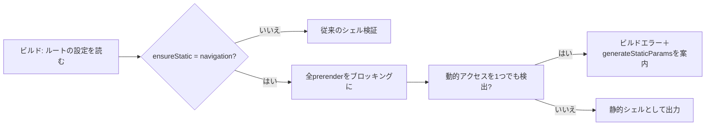

# 2026-09-29（火）

> 今日のひとこと：Next.jsが「ナビゲーション時に一切サーバー計算をしない」を保証する `ensureStatic = "navigation"` の初期実装を入れました。あわせてoxlint v1.86.0 / oxfmt v0.71.0が出ています。（前号は9/27で、9/28号は出ていないため、9/27〜9/29朝の約2日分をまとめています）

## 今日のリリース

- 【oxc】oxlint v1.86.0 / oxfmt v0.71.0：`typescript/no-generated-empty-object-type` の追加と `only-export-components` の `allowCompoundComponents` 対応、oxfmtは同梱Prettierを3.9.9へ更新（出典: https://github.com/oxc-project/oxc/pull/27132）
- 【oxc】oxc（crates）v0.152.0：ASTから未使用APIを削る破壊的変更（`impl AsRef<str> for StringLiteral` の削除など）が中心（出典: https://github.com/oxc-project/oxc/pull/27133）

## トップニュース

### Next.jsに「ナビゲーションではサーバー計算をしない」を保証する設定が入る

【Next.js】Partial Prefetching（PPF）に、ルートの `ensureStatic = "navigation"` を強制する初期実装が入った。この設定を付けたルートは、静的シェルに動的データが一切残っていないことをビルドで検証される。

**何が変わる**：このモードではプリレンダーがすべてブロッキングになり、動的パラメータは `output: "export"` と同様に `generateStaticParams` で全部列挙する必要がある。動的データは `Suspense` で囲んでいても不可。エラーメッセージも「`instant = false` かSuspenseで囲め」ではなく「`generateStaticParams` で `params` を静的にせよ」を案内するものに変わった。

**なぜ変えた**：PR本文によると、指定されていないパラメータに対して「フォールバックのシェル＋リクエスト時の再レンダー（resume）」を返すと、「ナビゲーションにリクエスト単位の計算はない」という約束が破れるため。クライアント側だけで完結するIO（`use(io())` や `useSearchParams()`）は、再レンダー不要なので許される。

**何に効く・誰が困る**：ナビゲーションを確実に即時にしたいサイトに効く。逆に、パラメータを列挙できない動的ルートでは使えない。PR本文は、`useParams()` だけで済むルートにフォールバックを認める案は実装が難しく、将来見直すとしている。dev用のエラー表示（提案カード）とドキュメントは後続PRの予定。

**ここまでの経緯**：

- 2026-09-28：`ensureStatic = "navigation"` の初期実装をマージ（#99171）
- 2026-09-28：`navigation()` と `prefetch()` から `unstable_` 接頭辞を外す（#99241）。続いて #99371 でスナップショットを追従
- 2026-09-28：PPFのrouterに残っていたデバッグログを削除（#99365）

出典: https://github.com/vercel/next.js/pull/99171

## 今日の深掘り

### `ensureStatic = "navigation"`：「静的であること」をどう検証するか

選んだ理由：機能の宣言（設定値）を、ビルド時の検証ロジックに落とす流れが1つのPRで読める。素朴な実装との違いも明確。

背景：Cache Components / PPFでは、ルートは静的シェルと動的な穴（hole）に分かれる。従来の検証は「動的データが `Suspense` の中にあればよい」だった。しかしナビゲーション時の保証としては、Suspense内でも動的なら結局リクエスト時に計算が走る。

変更点（コミット abe3b50、`packages/next`）：

- ビルドで `appConfig.unstable_ensureStatic === 'navigation'` を読み、`_isEnsureStaticPage` をprerender manifestに記録する（`src/build/index.ts`）。条件は `cacheComponents` と、ルートのPPFが有効なこと。
- 静的シェル検証を、このモードでは「動的アクセスは一切不可」に厳しくする。表現は `trackDynamicAccessInStaticRoute` と `getDisallowedReasonsInStaticRoute` で、devとprodの両方で使う。
- サーバーprerenderが部分的（partial）だとすでにエラーなので、その場合は静的シェル検証を走らせて穴の位置を報告する。
- `buildAppStaticPaths` は最も一般的なフォールバックシェル以外を作らない。デプロイ出力にフォールバックのセグメントデータが必要だったため、1つだけ残した。

PR本文が認めている弱点：サーバーとクライアントの穴が混在すると、クライアント側の穴をサーバーの動的データと誤報告することがある。また、クライアントが動的データのPromiseを受け取っても `use()` しなかった場合は位置を指せず、汎用メッセージになる。

この変更から分かる設計思想：保証を「実行時の心がけ」ではなく、ビルドが落ちる検証にする。そして保証が壊れるケース（フォールバック＋resume）を、機能を狭めることで先に潰している。

出典: https://github.com/vercel/next.js/pull/99171

## 仕様の変更

### whatwg/html

#### `<selectedcontent>` が、select内のすべての子孫で最新に保たれる

【HTML】これまでは `select` 配下の最初の `selectedcontent` だけが更新されていた。今後は、無効でない子孫すべてが更新対象になる。`option` の削除や移動、`selectedcontent` の移動による更新はマイクロタスクで行い、木が不整合な状態で書き換えないようにした。`selectedIndex` / `value` / `selected` には `[CEReactions]` が付いた。
なぜ変えたか：削除ステップの中で次の要素を更新すると、木の途中状態を書き換えてしまうため（PR本文より）。
出典: https://github.com/whatwg/html/commit/b346db7

その他：

- 挿入された iframe/frame での `javascript:` URL のloadイベントを修正（[cbc0d17](https://github.com/whatwg/html/commit/cbc0d17)）

### w3c/csswg-drafts

#### スクロールスナップ：スナップ位置を捕まえるのはスクロールコンテナだけになる

【CSS】`scroll-snap-type` の適用対象が「すべての要素」から「スクロールコンテナ」に変わった。「captures snap positions」という概念は削除。スナップ位置は最も近い祖先のスクロールコンテナが受け取り、その値が `none` でも、さらに外側へ探しに行かない。
なぜ変えたか：コミットメッセージは #14445 への対応とだけ書かれ、理由は本文にない（詳細は不明）。
出典: https://github.com/w3c/csswg-drafts/commit/528b2e3

その他：

- `css-fonts-5` に文字サイズのメタテキストの例を追加（[b78b59c](https://github.com/w3c/csswg-drafts/commit/b78b59c) ほか、同じ変更のコミット群）

### w3c/aria

その他：

- ARIA Notifyの導入部とi18n例の editorial のみのため、詳細は省略

動きなし：whatwg/dom, whatwg/fetch, whatwg/streams, whatwg/url, tc39/ecma262, tc39/proposals, w3c/ServiceWorker, w3c/wcag3（対象期間にコミットなし。domは最終が9/24）

## OSSのPR

### microsoft/TypeScript

#### `es2026` がtargetとlibとして使えるようになる

【TypeScript】`--target es2026` と `lib` の `es2026` が有効な値になった。
出典: https://github.com/microsoft/TypeScript/pull/64096

その他：

- 同じオブジェクト型のmapped typeどうしの交差を簡約しない（[#64481](https://github.com/microsoft/TypeScript/pull/64481)）、複数宣言のプロパティだけ never 簡約を検査（[#64499](https://github.com/microsoft/TypeScript/pull/64499)）
- テンプレートリテラル型のサイズに上限を設ける（[#64194](https://github.com/microsoft/TypeScript/pull/64194)）
- クラスのstatic blockで未使用ローカルを報告（[#64485](https://github.com/microsoft/TypeScript/pull/64485)）
- `getJSDocCommentsAndTags` を6.0相当の挙動で復活（[#64455](https://github.com/microsoft/TypeScript/pull/64455)）
- ダイヤモンド継承のAST生成を修正（[#64503](https://github.com/microsoft/TypeScript/pull/64503)）
- ローカライズ関連の整備（[#64507](https://github.com/microsoft/TypeScript/pull/64507)、[#64454](https://github.com/microsoft/TypeScript/pull/64454)、[#64504](https://github.com/microsoft/TypeScript/pull/64504)）

### vercel/next.js

注目は、トップニュースの #99171 のみ（見出しと参照のみ）。

その他：

- `navigation()` / `prefetch()` の `unstable_` を削除（[#99241](https://github.com/vercel/next.js/pull/99241)）
- Turbopack：tree-shakeの空チャンクによるpart id ずれを修正（[#95516](https://github.com/vercel/next.js/pull/95516)）、`with` 句の保持（[#95529](https://github.com/vercel/next.js/pull/95529)）、app-routerの `split_module` 修正（[#95522](https://github.com/vercel/next.js/pull/95522)）、副作用のないimportの除去（[#95781](https://github.com/vercel/next.js/pull/95781)）
- SSRの動的importを遅延化（[#98836](https://github.com/vercel/next.js/pull/98836)）
- カスタムキャッシュハンドラが初回リクエストで欠ける不具合を修正（[#99372](https://github.com/vercel/next.js/pull/99372)）
- アダプタ配備の未登録ルートでDraft Modeを許可（[#99370](https://github.com/vercel/next.js/pull/99370)）
- バンドルアナライザ：テーブルの仮想化（[#98539](https://github.com/vercel/next.js/pull/98539)）とソート修正（[#99369](https://github.com/vercel/next.js/pull/99369)）
- DevToolsにセキュリティ更新の提案を表示、AI upgradeの対話（[#99002](https://github.com/vercel/next.js/pull/99002)、[#99232](https://github.com/vercel/next.js/pull/99232)、[#99235](https://github.com/vercel/next.js/pull/99235)、[#99291](https://github.com/vercel/next.js/pull/99291)、[#99319](https://github.com/vercel/next.js/pull/99319)）

### oxc-project/oxc

#### oxfmtの設定・ignore処理がCLIとLSPで共有される

【oxc】`ConfigScopes` を導入して設定の読み込みを一本化し、ignore判定もCLIとLSPで共通化した。stdinモードで、ネストした設定より前にglobal ignoreを確認するようにもなった。
なぜ変えたか：PR本文の記載は確認していない（推測を避け、不明）。
出典: https://github.com/oxc-project/oxc/pull/27126 、https://github.com/oxc-project/oxc/pull/27125

その他：

- lexerのcontext walk（曖昧トークン判定）の整理と修正を連続投入（[#27085](https://github.com/oxc-project/oxc/pull/27085)〜[#27122](https://github.com/oxc-project/oxc/pull/27122)、約17件）
- `oxc_str` に `JSStr` / `JSChar` / `JSStrBuilder` を追加（[#26435](https://github.com/oxc-project/oxc/pull/26435)）
- ASTの未使用APIを削除する破壊的変更（[#27136](https://github.com/oxc-project/oxc/pull/27136)、[#27135](https://github.com/oxc-project/oxc/pull/27135)、[#27134](https://github.com/oxc-project/oxc/pull/27134)、[#27123](https://github.com/oxc-project/oxc/pull/27123)）
- transformer：`using` をclassic for・catch・finallyで変換（[#27148](https://github.com/oxc-project/oxc/pull/27148)、[#27142](https://github.com/oxc-project/oxc/pull/27142)）
- minifier：iife+directive、arguments copy の修正（[#27060](https://github.com/oxc-project/oxc/pull/27060)、[#27140](https://github.com/oxc-project/oxc/pull/27140)）
- linter：ルールの修正多数（[#27150](https://github.com/oxc-project/oxc/pull/27150)、[#27146](https://github.com/oxc-project/oxc/pull/27146)、[#26925](https://github.com/oxc-project/oxc/pull/26925) ほか）、React Compilerの再帰関数式対応（[#26796](https://github.com/oxc-project/oxc/pull/26796)）
- oxfmt：CLI再呼び出し、LSPのprettierignore再読込などの修正（[#27051](https://github.com/oxc-project/oxc/pull/27051)、[#27129](https://github.com/oxc-project/oxc/pull/27129)）

### biomejs/biome

#### SCSSの構文対応が進む

【Biome】SCSSのパーサー/フォーマッターが、`@layer`・`@container`・プロパティ名・`attr()` 内の補間（interpolation）と、ネストした宣言に対応した。
なぜ変えたか：PR本文で確認できた記述なし（不明）。
出典: https://github.com/biomejs/biome/pull/12000 、https://github.com/biomejs/biome/pull/11999 、https://github.com/biomejs/biome/pull/12003 、https://github.com/biomejs/biome/pull/12007 、https://github.com/biomejs/biome/pull/12005

その他：

- lint規則を追加：`useStrictBooleanExpressions`（[#11750](https://github.com/biomejs/biome/pull/11750)）、Svelte向け `noSvelteExportLet`（[#11956](https://github.com/biomejs/biome/pull/11956)）と `useSvelteKitRuneImports`（[#11960](https://github.com/biomejs/biome/pull/11960)）
- Unixデーモンのソケット権限を制限（[#11928](https://github.com/biomejs/biome/pull/11928)）
- resolverをsalsaベースに（[#11965](https://github.com/biomejs/biome/pull/11965)）
- 型推論のジェネリック束縛の修正とベンチ追加（[#11834](https://github.com/biomejs/biome/pull/11834)、[#12006](https://github.com/biomejs/biome/pull/12006)）
- CLI・formatter・lintの細かな修正（[#11978](https://github.com/biomejs/biome/pull/11978)、[#11975](https://github.com/biomejs/biome/pull/11975)、[#11974](https://github.com/biomejs/biome/pull/11974)、[#11983](https://github.com/biomejs/biome/pull/11983)、[#11969](https://github.com/biomejs/biome/pull/11969)）

### react-hook-form/react-hook-form

#### 購読を「名前」で絞って、値のcloneを省く

【RHF】`_valuesSubscriberCount`（数だけ）を、名前つきの `_valuesSubscribers`（Set）に置き換えた。`_hasValuesSubscriber(name)` で、そのフィールドを見ている購読者がいる場合だけ `cloneObject(_formValues)` を行う。さらに、購読解除後もformStateの追跡が残るようにし（#13794）、購読者への配信時の冗長な状態マージも省いた（#13796）。
なぜ変えたか：PR本文は簡素で、パフォーマンス改善（perf）と読める範囲にとどめる。
本への影響: `src/rhf/02-proxy-form-state.md`、`src/rhf/04-controller.md`（Issue #16）
出典: https://github.com/react-hook-form/react-hook-form/pull/13793 、https://github.com/react-hook-form/react-hook-form/pull/13794 、https://github.com/react-hook-form/react-hook-form/pull/13796

その他：

- `handleSubmit`/`trigger` などが `formState.errors` を毎回新しい参照にする修正（[#13800](https://github.com/react-hook-form/react-hook-form/pull/13800)）
- subjectの購読処理を改善（[#13795](https://github.com/react-hook-form/react-hook-form/pull/13795)）
- 出力サイズ削減（[#13797](https://github.com/react-hook-form/react-hook-form/pull/13797)、[#13798](https://github.com/react-hook-form/react-hook-form/pull/13798)）

### sveltejs/svelte

その他：

- スニペット内の宣言がパラメータを再宣言するとコンパイルエラー（[#18842](https://github.com/sveltejs/svelte/pull/18842)）
- `migrate` の2件の修正（[#18817](https://github.com/sveltejs/svelte/pull/18817)、[#18816](https://github.com/sveltejs/svelte/pull/18816)）
- `await` ラッパーの位置情報を保持（[#18859](https://github.com/sveltejs/svelte/pull/18859)）
- 破棄後のboundaryリセットを無視（[#18886](https://github.com/sveltejs/svelte/pull/18886)）、中断されたdeferred transitionの扱い（[#18776](https://github.com/sveltejs/svelte/pull/18776)）
- カスタム要素の属性更新時のハイドレーション状態の復元（[#18467](https://github.com/sveltejs/svelte/pull/18467)）

### vuejs/core（minorブランチ）

その他：Vapor Modeの修正が約19件。listenerの登録順（[#15646](https://github.com/vuejs/core/pull/15646)）、`<style module>` の解決（[#15621](https://github.com/vuejs/core/pull/15621)）、KeepAlive内のv-else-if（[#15655](https://github.com/vuejs/core/pull/15655)）、SVGの名前空間判定（[#15656](https://github.com/vuejs/core/pull/15656)）、vdomとの相互運用（[#15669](https://github.com/vuejs/core/pull/15669)、[#15682](https://github.com/vuejs/core/pull/15682)、[#15681](https://github.com/vuejs/core/pull/15681)）、フォーム要素まわりの終了タグ（[#15693](https://github.com/vuejs/core/pull/15693)）など。

### vitejs/vite

その他：

- bundled-dev のテスト調整とworkerのspec有効化（[#23606](https://github.com/vitejs/vite/pull/23606)、[#23289](https://github.com/vitejs/vite/pull/23289)）
- テストでネイティブconfigローダー非互換のコードを置換（[#23605](https://github.com/vitejs/vite/pull/23605)）

### LadybirdBrowser/ladybird

#### ナビゲーションと履歴走査をUIプロセスに移す（プロセス分離の続き）

【Ladybird】ナビゲーション、リロード、戻る/進む、セッション履歴のステップを、レンダラーではなくブラウザのUIプロセスが扱うようになってきた。戻る/進むは、仕様の「キューされたステップ」（session history traversal steps）で選ぶ形に置き換わり、独自の保留状態機械（世代、delta一覧、コールバック、ステージ）は削除。`SiteIsolationManager` も解体された。
なぜ変えたか：コミットメッセージは、履歴の走査を仕様の手順に揃え、状態をUIプロセスが持つ木に集約する方向と読める（意図の全文は未確認）。
出典: https://github.com/LadybirdBrowser/ladybird/commit/61b323e 、https://github.com/LadybirdBrowser/ladybird/commit/ca3361d

その他：

- レンダラー/WebDriverが LibWeb・LibJS 等をリンクしない分離を進行（[c43d07e](https://github.com/LadybirdBrowser/ladybird/commit/c43d07e)、[5b313ef](https://github.com/LadybirdBrowser/ladybird/commit/5b313ef)、[89673e6](https://github.com/LadybirdBrowser/ladybird/commit/89673e6)）
- LibWebSocket：不正なフレームや制御フレームの拒否など、RFC 6455の検証を強化（[62a943f](https://github.com/LadybirdBrowser/ladybird/commit/62a943f)、[b76c8a3](https://github.com/LadybirdBrowser/ladybird/commit/b76c8a3)、[6b9c54d](https://github.com/LadybirdBrowser/ladybird/commit/6b9c54d) ほか）
- macOSでスレッドのQoSクラスを設定（[d245983](https://github.com/LadybirdBrowser/ladybird/commit/d245983)）
- LibJS：プロパティキーや名前のコピーを避ける最適化（[5818454](https://github.com/LadybirdBrowser/ladybird/commit/5818454)、[ff60dc6](https://github.com/LadybirdBrowser/ladybird/commit/ff60dc6)）

### servo/servo・servo/stylo

その他：

- text-wrap-modeをアトミックインライン周辺で尊重（[#48469](https://github.com/servo/servo/pull/48469)）、`::first-letter` を最初の整形済み行に限定（[#48307](https://github.com/servo/servo/pull/48307)）
- abspos grid の子孫をgrid areaに解決（[#47519](https://github.com/servo/servo/pull/47519)）
- `DissimilarOriginWindow::Length` とWindowProxyの列挙トラップを実装（[#48411](https://github.com/servo/servo/pull/48411)）
- Stylo：`calc-typed-arithmetic` と `alpha-color-function` のprefをデフォルト有効化（[servo #48338](https://github.com/servo/servo/pull/48338)、[stylo #468](https://github.com/servo/stylo/pull/468)、[stylo #469](https://github.com/servo/stylo/pull/469)）
- 他にandroid・webgl・cookie・fonts等の修正が約20件

### wado-lang/wado

期間中のコミットは約366件。設計に関わるものだけ挙げる。

その他：

- WEPの更新（変数型のlocalの書き込み順など、[26745ffa](https://github.com/wado-lang/wado/commit/26745ffa)）とweb WEPを実装済みに更新（[c9374de2](https://github.com/wado-lang/wado/commit/c9374de2)）
- コンパイラのメモリ解析（[#2210](https://github.com/wado-lang/wado/pull/2210)）と、by-value引数の不要コピー削除（[7ed29f57](https://github.com/wado-lang/wado/commit/7ed29f57)）

動きなし：facebook/react（最終コミット9/22）、solidjs/solid の main（nextブランチは未確認）、ghc/ghc（最終9/25）

## 仕様を読む会の候補

- HTMLの `selectedcontent` の更新アルゴリズム（[b346db7](https://github.com/whatwg/html/commit/b346db7)）：「木の途中状態を書き換えない」ためにマイクロタスクへ回す設計は、DOMの挿入・削除ステップの読み方の良い題材。
- CSSスクロールスナップの「捕まえる」規定（[528b2e3](https://github.com/w3c/csswg-drafts/commit/528b2e3)）：定義を1つ削って仕様が簡単になる変更。
