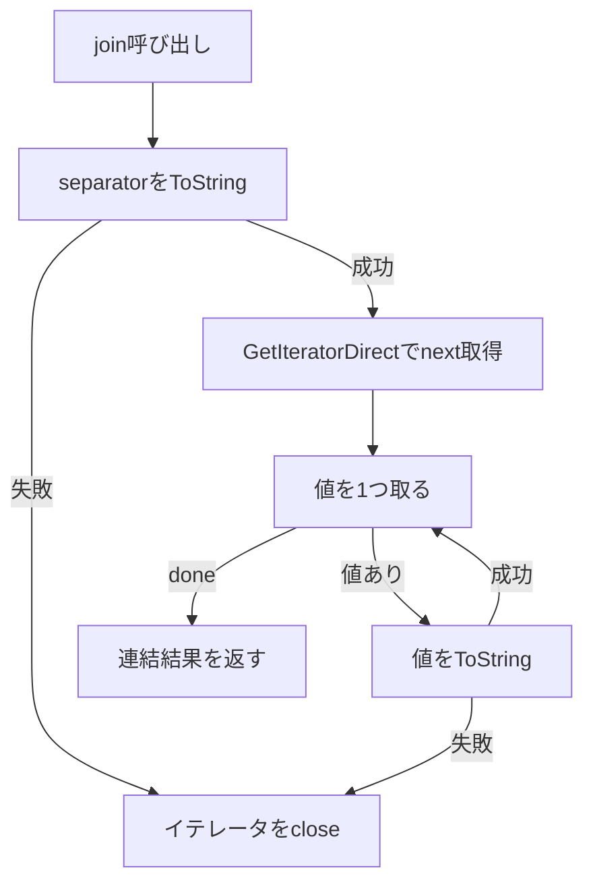

# 2026-09-30（水）

> 今日のひとこと：TC39の9月会議（9/29）で、Iterator Join・Iterator Includes・Iterator Chunking の3提案がそろってStage 4（仕様確定）に進みました。OSS側では、Solid nextが「SSRの非同期エラーが別リクエストの `onError` に届く」不具合を直しています。

## 今日のリリース

- 【Next.js】v16.3.7：Turbopackのタスク基盤で、強い一貫性の読み取りがキャンセル済みタスクに当たると止まる不具合を直すバックポート（[#98931](https://github.com/vercel/next.js/pull/98931)）。セキュリティ修正は含まない（出典: https://github.com/vercel/next.js/releases/tag/v16.3.7）（10/01に追記）

## トップニュース

### イテレータ系3提案（join / includes / chunking）がStage 4に

【TC39】2026年9月29日のTC39会議の結果として、`Iterator.prototype.join`、`Iterator.prototype.includes`、`Iterator.prototype.chunks` などを足す3つの提案が Stage 4 になった。tc39/proposals の `README.md` の進行中の表から `finished-proposals.md` へ移され、想定リリースは ES2027 と記録されている。

**何が変わる**：配列にしかなかった「まとめて扱う」操作が、イテレータのまま使えるようになる。

- `join(separator)`：要素を文字列にして連結する（Iterator Join、Kevin Gibbons）
- `includes(searchElement, skippedElements)`：`SameValueZero` で一致する要素があるか調べる（Iterator Includes、Michael Ficarra）
- チャンク化：イテレータを固定長の部分列にまとめる（Iterator Chunking、Michael Ficarra。重ならない分割と、重なる窓の両方を扱う）

**なぜ変えた**：Iterator Joinの提案READMEによると、配列以外のイテラブルを連結するには `Iterator.from(it).reduce((a, b) => a + sep + b)`（途中の文字列を毎回作り、空のイテレータで落ちる）か、`Array.from(it).join(sep)`（全体を配列にしてしまう）しかなかった。配列を作らずに、配列の `join` と同じ意味で書けるようにするのが動機。

**何に効く・誰が困る**：大きな列や無限に近い列をストリームのまま加工したい書き手に効く。実際に使えるかはブラウザとNode.jsの実装待ちで、Chunkingの提案READMEは Stage 3 時点で「2つ以上の出荷済み実装が次の条件」と書いていた。今回の変更に含まれるコミットは、Stage 4に必要な条件の確認までは示していない。

**ここまでの経緯**：

- 2024-02：Iterator Chunking が Stage 1（会議ノート 2024-02）
- 2026-03：Iterator Includes が Stage 1/2/2.7 の検討に出る（会議ノート 2026-03）
- 2026-05：Iterator Chunking と Iterator Includes が Stage 3（会議ノート 2026-05-20）
- 2026-09-26号：今回の会議のアジェンダに Stage 4 候補として並んでいたことを取り上げた（[9/26号](2026-09-26.md)）
- 2026-09-29：3提案とも Stage 4 に

出典: https://github.com/tc39/proposals/commit/3c956df / https://github.com/tc39/proposals/commit/3c1e9ee / https://github.com/tc39/proposals/commit/ee92ecf

## 今日の深掘り

### `Iterator.prototype.join`：仕様の1手順ごとに「途中で失敗したらどうするか」が決まっている

選んだ理由：`join` は機能としては単純だが、仕様の手順を読むと、イテレータという「後始末が要るもの」を仕様がどう扱うかが分かる。

背景：`Array.prototype.join` は配列の中身を添字で読むだけなので、途中で失敗しても後始末は要らない。イテレータは `return()` を呼んで閉じる責任があり、`join` がそれを引き受けることになる。

変更点（tc39/proposal-iterator-join の `spec.html`、読んだ版は `--depth 1` のclone時点のmain）：

```
1. Let _obj_ be the *this* value.
2. If _obj_ is not an Object, throw a *TypeError* exception.
3. Let _iterated_ be the Iterator Record { [[Iterator]]: _obj_, [[NextMethod]]: *undefined*, [[Done]]: *false* }.
4. If _separator_ is *undefined*, then  Let _sep_ be *","*.
   Else, Let _sep_ be Completion(ToString(_separator_)).
        IfAbruptCloseIterator(_sep_, _iterated_).
5. Set _iterated_ to ? GetIteratorDirect(_obj_).
...
   If _value_ is neither *undefined* nor *null*, then
     Let _valueString_ be Completion(ToString(_value_)).
     IfAbruptCloseIterator(_valueString_, _iterated_).
```

読みどころは3つ。

- 区切り文字の `ToString` は、`GetIteratorDirect` より前に行う。`separator` の変換が失敗しても、`next` メソッドはまだ取り出されない。ただしイテレータは `IfAbruptCloseIterator` で閉じられる。
- 要素が `undefined` か `null` なら空文字列として扱う。ここは `Array.prototype.join` と同じ。
- 要素の `ToString` が例外を投げたら、そこでも `IfAbruptCloseIterator` でイテレータを閉じてから例外を伝える。

同じ提案群の `includes` も同じ作りで、`skippedElements` の型が不正なら `IteratorClose` してから `TypeError` / `RangeError` を投げ、一致が見つかったときも `IteratorClose(_iterated_, NormalCompletion(true))` で閉じる（`proposal-iterator-includes/spec.emu`）。



この変更から分かる設計思想：「消費する側が途中で降りるとき、イテレータを必ず閉じる」を、各メソッドの手順に1行ずつ明示している。ヘルパーごとに例外経路を書くことで、実装が近道をして閉じ忘れる余地を消している。

出典: https://github.com/tc39/proposal-iterator-join / https://github.com/michaelficarra/proposal-iterator-includes

### Solid next：SSRのエラーが「最後に描画したリクエスト」の `onError` に届く不具合

選んだ理由：モジュールのグローバル変数を「今のリクエスト」の代わりに使うと何が壊れるか、という古典的な落とし穴が、修正の理由とテストの両方から読める。

背景：SSR中の非同期処理は、描画が終わってから失敗することがある。`reportServerError` は、リクエストごとのエラーフック（`renderToStream` の `onError`）を、モジュールグローバルの `sharedConfig.context.errorPolicy` から探していた。ここは「最後に触ったレンダリングのコンテキスト」で、終わった `renderToString` のコンテキストも残る。

変更点（solidjs/solid の `next` ブランチ、コミット `51a1a494`）：

```ts
// 呼び出し側が、自分の描画に属するフックを渡す
reportServerError(
  err,
  { kind: "render", handling: "client", boundary: id },
  o,
  ctx.errorPolicy   // グローバルではなく、境界が作られたときのコンテキストから
);
```

`reportServerError` はグローバルを読むのをやめ、呼び出し側が渡した `hook` だけを使う。`undefined` なら `configureServerErrors` で登録したアンビエントのフックだけが答える。

- `<Loading>` / `<Errored>` の境界は、作られたときに掴んだコンテキストの `errorPolicy` を渡す。
- `failRender` とシリアライザは、レンダラー自身の `options.onError` を渡す。
- 描画の途中で呼ばれるサーバー関数（プロセス内呼び出し）は、`await` の後でも属する描画を失わないよう、`renderToString` / `renderToStream` が開始時に `onError` をリクエストイベントに紐づけて登録する（`request-error-hook.ts`、`WeakMap`）。`WeakMap` は `Symbol.for` で登録した記号の下に置かれる。サーバー関数のバンドルが同じモジュールのコピーを持つため、という理由がコミット本文にある。

テストは `concurrent-render-error-policy.spec.tsx`。2つ目のリクエストの `renderToString(onError)` を各経路に割り込ませ、漏れる8ケースが修正前のコミットでは落ちることを確認している。すでに通っていた2ケース（再試行パスでの拒否など）は、修正後も答えが変わらないことを固定するためのガード。

被害の重さは本文にある。別リクエストのハンドラーがエラーの詳細を受け取り、その返り値が「こちらのリクエストのクライアントに送られる値」になる。同日、`lazy()` の `preload()` / `moduleUrl` と `getTraceContext()` でも、同じ「グローバルの描画コンテキストを読む」原因の修正が入った（`7f9bd7a`）。

この変更から分かる設計思想：暗黙の「今の文脈」を引数の明示に置き換え、非同期をまたいでも正しく所属できるようにする。グローバルが便利なのは、同時に動くレンダリングが1つのときだけ。

出典: https://github.com/solidjs/solid/commit/51a1a494 / https://github.com/solidjs/solid/commit/7f9bd7a6

## 仕様の変更

### tc39/proposals

トップニュースで扱った Stage 4 への移行のほか、`b83ca6e` で Stage 2.7 の提案のレビュアーが補われた（[b83ca6e](https://github.com/tc39/proposals/commit/b83ca6e)）。

### whatwg/html

#### 遅延読み込みのメディアが、`source` 挿入で load イベントを遅らせなくなる

【HTML】`source` 要素が、メディア要素のリソース選択アルゴリズムの待機中に挿入されたとき、「load イベントを遅らせるフラグ」を無条件に true に戻していた。遅延読み込み（`loading=lazy`）の分岐ではこのフラグを誰も下げないため、load イベントがいつまでも来なかった。今後は、`loading` が Eager 状態か、スクリプトが無効なときだけフラグを戻す。
なぜ変えたか：コミットメッセージが、lazy側の分岐でフラグが下ろされないことを挙げている（Issue #12971）。
出典: https://github.com/whatwg/html/commit/92f2480

動きなし：whatwg/dom, whatwg/fetch, whatwg/streams, whatwg/url, tc39/ecma262, w3c/ServiceWorker, w3c/aria, w3c/wcag3

### w3c/csswg-drafts

#### スクロールスナップ：単一軸のスクロールコンテナは、その軸だけでスナップ位置を持つ

【CSS】単一軸のスクロールコンテナ（片方向にしかスクロールできない箱）は、スクロールできる軸でだけスナップ位置を作る。スクロールできない軸に `scroll-snap-type` を指定しても効果はない。スナップ位置を「捕まえる」祖先も、軸ごとに「その軸でスクロール可能な最も近い祖先」になった。
なぜ変えたか：コミットメッセージに説明はなく、詳細は不明。
出典: https://github.com/w3c/csswg-drafts/commit/d603df8

その他：

- `::highlight(*)` の追加（[568abd3](https://github.com/w3c/csswg-drafts/commit/568abd3)）
- `scroll-snap-align` の書字方向の解決を明確化（[efada14](https://github.com/w3c/csswg-drafts/commit/efada14)）

## OSSのPR

### solidjs/solid（`next` ブランチ）

深掘りで扱った修正（[51a1a494](https://github.com/solidjs/solid/commit/51a1a494)、[7f9bd7a6](https://github.com/solidjs/solid/commit/7f9bd7a6)）のほかの動き。

#### アトリビュートのスロットが「データコンテキストごとに1つ、位置にバインド」になる

【Solid】"Stage 7" の第2形として、属性スロットを、データコンテキストごとに1つ作って位置にバインドする方式が入った（#3704）。過去の号で追ってきたコンパイラ／SSR改修の続きにあたる。詳しい設計の説明は、本文に書ける根拠を読んでいないので、今日は見出しの紹介にとどめる。
出典: https://github.com/solidjs/solid/pull/3704

その他：

- `createErrorBoundary` などの型と `sharedConfig`・`$DEVCOMP` の型を `solid-js/internal` へ移動（[#3709](https://github.com/solidjs/solid/pull/3709)）
- ストアのキー読み取りが、adoption hold 下でリーダーを保持しないよう修正（[#3707](https://github.com/solidjs/solid/pull/3707)）
- observe に `OBSERVE.include` と、サーバー関数の `request` レコードを追加（[#3705](https://github.com/solidjs/solid/pull/3705)、[#3708](https://github.com/solidjs/solid/pull/3708)）
- `until` の `AbortSignal` 型をDOM libなしでも解決（[7b8fd28](https://github.com/solidjs/solid/commit/7b8fd28a)）
- `getRequestEvent` が他リクエストのイベントにフォールバックしないよう修正（[cbf47d5](https://github.com/solidjs/solid/commit/cbf47d59)）
- 設計ドキュメントの更新（[#3711](https://github.com/solidjs/solid/pull/3711)）

動きなし：`main` ブランチ

### vercel/next.js

#### プリレンダー時の `notFound()` / `redirect()` が、HTTPステータスとリダイレクト先に反映される

【Next.js】Suspenseの中で `notFound()`、`unauthorized()`、`forbidden()`、`redirect()`、`permanentRedirect()` を投げるページをプリレンダーしたとき、正しいHTTPステータスと `Location` を返すようになった。レイアウトとSuspenseのフォールバックは残し、クライアントが適切なエラーバウンダリーで復帰できるようにする。
競合の規則：リダイレクトはアクセスフォールバックに勝つ。同種の中では最初に観測されたエラーが勝つ。リクエスト時のストリーミングは変わらず、`connection()` の後の動的な `notFound` は200を返しうる。
なぜ変えたか：プリレンダー済み出力にステータスを付けるための対応（PR本文に社内Issueへのリンクあり）。
出典: https://github.com/vercel/next.js/pull/99078

その他：

- クライアントコンポーネントのロード指標を、HTMLレンダーに絞る／非同期モジュール評価を含める（[#99322](https://github.com/vercel/next.js/pull/99322)、[#99427](https://github.com/vercel/next.js/pull/99427)）
- HTMLレンダー完了時の後始末を1か所に統合（[#99426](https://github.com/vercel/next.js/pull/99426)）
- Turbopack：webpackローダーのビルド依存（ディレクトリ）の追跡とリクエスト対応（[#98838](https://github.com/vercel/next.js/pull/98838)、[#99071](https://github.com/vercel/next.js/pull/99071)）
- Turbopack：追加ルートで非再帰ウォッチャーを強制しない（[#99396](https://github.com/vercel/next.js/pull/99396)）
- バンドルアナライザーの修正3件（[#98702](https://github.com/vercel/next.js/pull/98702)、[#98695](https://github.com/vercel/next.js/pull/98695)、[#98542](https://github.com/vercel/next.js/pull/98542)）
- turbo-tasks-backendのコンパイル修正（[#99443](https://github.com/vercel/next.js/pull/99443)）
- deployモードのテスト有効化・整理が複数、docs、CI設定、テスト安定化（[#99400](https://github.com/vercel/next.js/pull/99400)、[#99402](https://github.com/vercel/next.js/pull/99402)、[#99193](https://github.com/vercel/next.js/pull/99193)、[#98994](https://github.com/vercel/next.js/pull/98994)、[#99012](https://github.com/vercel/next.js/pull/99012)、[#98156](https://github.com/vercel/next.js/pull/98156)、[#99378](https://github.com/vercel/next.js/pull/99378)、[#99089](https://github.com/vercel/next.js/pull/99089)）

### microsoft/TypeScript

#### `resolveObjectTypeMembers` の冪等性が戻る

【TypeScript】オブジェクト型のメンバーを解決する処理が、同じ入力から毎回同じ結果を返すようにする修正（#64372、Anders Hejlsberg）。PR本文がなく、原因と症状はコミットメッセージからは分からない（不明）。
出典: https://github.com/microsoft/TypeScript/pull/64372

その他：

- 宣言出力（declaration emit）まわり：`export default` の無名化できない推論戻り値でのpanic、export assignmentの宣言マップ、型のクローン回避、未型付けモジュールのimportで出る不安定な診断（[#63989](https://github.com/microsoft/TypeScript/pull/63989)、[#64460](https://github.com/microsoft/TypeScript/pull/64460)、[#63969](https://github.com/microsoft/TypeScript/pull/63969)、[#64479](https://github.com/microsoft/TypeScript/pull/64479)）
- `isolatedDeclarations` の `this.x = …` クラッシュ修正、JSX属性のemitクラッシュ修正（[#64471](https://github.com/microsoft/TypeScript/pull/64471)、[#64470](https://github.com/microsoft/TypeScript/pull/64470)）
- ネストしたrestバインディングの代入ターゲット変換、型のみimport句での `getTypeAtLocation` クラッシュ、JSでのTS2565の回帰（[#64422](https://github.com/microsoft/TypeScript/pull/64422)、[#64468](https://github.com/microsoft/TypeScript/pull/64468)、[#64523](https://github.com/microsoft/TypeScript/pull/64523)）
- `never` 還元のための交差型プロパティ検査を安定した順序に（[#64521](https://github.com/microsoft/TypeScript/pull/64521)）
- ファイルシステムルート近くのプロジェクト／ファイル監視、`tspath.GetCommonParents` の結果上書きバグ、コールバックFS APIの改善、Programオプションの寿命管理（[#64366](https://github.com/microsoft/TypeScript/pull/64366)、[#64493](https://github.com/microsoft/TypeScript/pull/64493)、[#64447](https://github.com/microsoft/TypeScript/pull/64447)、[#64519](https://github.com/microsoft/TypeScript/pull/64519)）
- CI／VSIX署名検証／パッケージフィードのproxy（[#64514](https://github.com/microsoft/TypeScript/pull/64514)、[#64537](https://github.com/microsoft/TypeScript/pull/64537)、[#64541](https://github.com/microsoft/TypeScript/pull/64541)）

### oxc-project/oxc

#### 正規表現：エスケープされたキャプチャグループ名を解読して照合する

【oxc】`/(?<Ꭰ>)\k<Ꭰ>/` のように、Unicodeエスケープで書いた名前と直接書いた名前が同じ名前として一致するようになった。キャプチャ名の事前走査とUnicodeエスケープの復号を共通化し、壊れた名前は本体のパーサーに任せて元の診断を保つ。TypeScriptの適合スナップショットから偽の「無効な参照」診断が消えた。
なぜ変えたか：同じ名前の別表記が一致しないため（PR本文）。
出典: https://github.com/oxc-project/oxc/pull/27156

その他：

- レキサー：分類テーブルのコンパイル時計算、キーワード分類の分岐削除、`Tables` / `PairLuts` の整理など11件（[#27160](https://github.com/oxc-project/oxc/pull/27160)、[#27169](https://github.com/oxc-project/oxc/pull/27169)、[#27166](https://github.com/oxc-project/oxc/pull/27166)、[#27189](https://github.com/oxc-project/oxc/pull/27189)、[#27187](https://github.com/oxc-project/oxc/pull/27187) ほか）
- ミニファイア：if文の統合と条件式の折りたたみ（[#26667](https://github.com/oxc-project/oxc/pull/26667)、[#26445](https://github.com/oxc-project/oxc/pull/26445)、[#27083](https://github.com/oxc-project/oxc/pull/27083)、[#25198](https://github.com/oxc-project/oxc/pull/25198)、[#26028](https://github.com/oxc-project/oxc/pull/26028)）
- パーサー：TS1242 / TS1243 の診断追加、インデックスシグネチャの重複診断を解消（[#27191](https://github.com/oxc-project/oxc/pull/27191)、[#27192](https://github.com/oxc-project/oxc/pull/27192)、[#27190](https://github.com/oxc-project/oxc/pull/27190)）
- `isolated-declarations` の修正2件（[#27009](https://github.com/oxc-project/oxc/pull/27009)、[#27173](https://github.com/oxc-project/oxc/pull/27173)）
- リンター：`react/jsx-no-target-blank` にsuggestion追加（[#27181](https://github.com/oxc-project/oxc/pull/27181)）
- フォーマッター：calleeと開きカッコの間のコメントの帰属を修正（[#27172](https://github.com/oxc-project/oxc/pull/27172)）
- napi：Wasm 128bit SIMD拡張を有効化（[#27179](https://github.com/oxc-project/oxc/pull/27179)）

### biomejs/biome

#### 型推論を速くする最適化が続く

【Biome】型推論のジェネリック置換のメモ化（#12029）、呼び出しシグネチャ解決のメモ化（#12017）、名前空間メンバーのモジュール単位のインデックス化（#12008）、Promise分類のHashSetをBrentのサイクル検出に置換（#12011）が入った。セマンティック側では、スコープの区間木を先行順インデックスに置換（#12016）、束縛範囲の読み取りでシンタックスノードの解決を省いた（#12009）。数値は読んでいない。
なぜ変えたか：PR本文は読んでおらず、速度改善が目的と推測される。
出典: https://github.com/biomejs/biome/pull/12029

その他：

- 新ルール `noMisplacedListElements`、Astro用 `noAstroConflictingSetDirectives`（[#11917](https://github.com/biomejs/biome/pull/11917)、[#11494](https://github.com/biomejs/biome/pull/11494)）
- テスト呼び出し先の判定をidentifier起点に絞るlint修正（[#12031](https://github.com/biomejs/biome/pull/12031)）
- HTML：開閉タグ名の完全比較、子要素の空白走査の最適化（[#12022](https://github.com/biomejs/biome/pull/12022)、[#12023](https://github.com/biomejs/biome/pull/12023)）
- Vueのスロットを新しいルートでパース、SCSSの `url()` 内 `if()` のパース、YAMLレキサーの割り当て削減（[#12030](https://github.com/biomejs/biome/pull/12030)、[#12012](https://github.com/biomejs/biome/pull/12012)、[#12032](https://github.com/biomejs/biome/pull/12032)）
- ベンチ、changeset、README、Vueフィクスチャの整理（[#12018](https://github.com/biomejs/biome/pull/12018)、[#12021](https://github.com/biomejs/biome/pull/12021)、[#12019](https://github.com/biomejs/biome/pull/12019)、[#12024](https://github.com/biomejs/biome/pull/12024)）

### vitejs/vite

- `renderBuiltUrl` にクエリを渡す（[#23586](https://github.com/vitejs/vite/pull/23586)）
- オプティマイザーが、除外したオプショナルpeerの `require` フォールバックを保持（[#23600](https://github.com/vitejs/vite/pull/23600)）
- bundled-dev：遅延チャンクのソースマップを配信（[#23026](https://github.com/vitejs/vite/pull/23026)）
- bundled-devのテストケース有効化（[#23246](https://github.com/vitejs/vite/pull/23246)）

### vuejs/core（`minor` ブランチ）

#### Vapor Modeの修正が1日で12件

【Vue】`runtime-vapor` と `compiler-vapor` の修正が続いた。ハイドレーション（空の末尾テキスト、リアクティブなstyleキー、入れ子の `v-if` テンプレート）、`Transition` の in-out の引き継ぎ、VDOMコンポーネントとの混在（Teleport内でのパッチ、非同期コンポーネントの `ref`）が中心。
なぜ変えたか：PR本文は読んでおらず、個別の理由は不明。
出典: https://github.com/vuejs/core/pull/15706

その他：

- `compiler-vapor`：緩い条件のclassName高速経路にカッコを付ける、kebab-caseの `keep-alive` を認識、リスト項目内の入れ子リストの閉じタグを保持（[#15709](https://github.com/vuejs/core/pull/15709)、[#15654](https://github.com/vuejs/core/pull/15654)、[#15698](https://github.com/vuejs/core/pull/15698)）
- `runtime-vapor`：VDOM非同期コンポーネントのテンプレートref、動的非同期コンポーネントのref更新、動的要素の空末尾テキストのハイドレーション（[#15705](https://github.com/vuejs/core/pull/15705)、[#15700](https://github.com/vuejs/core/pull/15700)、[#15667](https://github.com/vuejs/core/pull/15667)）
- `runtime-vapor`：ハイドレーション時のstyleキー追跡、in-out遷移の分岐の解放と待機中のleaveの保持（[#15663](https://github.com/vuejs/core/pull/15663)、[7372680](https://github.com/vuejs/core/commit/7372680b)、[a4bb6fe](https://github.com/vuejs/core/commit/a4bb6fee)、[5592ea3](https://github.com/vuejs/core/commit/5592ea3e)）
- `compiler-vapor`：入れ子の空／単独の `v-if` テンプレート分岐をフラグメントとしてハイドレート（[#15707](https://github.com/vuejs/core/pull/15707)）

### react-hook-form/react-hook-form

- `useWatch`：配列名を渡したとき、マウント前はフォームの `defaultValues` を優先（[#13805](https://github.com/react-hook-form/react-hook-form/pull/13805)）
- `cloneObject`：プロトタイプがnullのオブジェクトを複製できるように（[#13808](https://github.com/react-hook-form/react-hook-form/pull/13808)）
- 最初のエラーで止める検証が、現在の `shouldUseNativeValidation` を読むように（[#13806](https://github.com/react-hook-form/react-hook-form/pull/13806)）

### LadybirdBrowser/ladybird

#### スタイル計算：接頭辞関係の集合を、大きくなったらビットマップで持つ

【Ladybird】セレクターマッチングの「接頭辞関係」は、要素がある複合セレクターやステップに属するかを何度も聞かれる。これまでは昇順の位置リストを二分探索しており、StyleBench では `PrefixRelation::update` の時間の半分近くが、キャッシュミスする探索に使われていた。集合を `PositionSet` とし、最後の位置までのビットマップより小さいうちはリスト、大きくなったらビットマップで持つ。
なぜ変えたか：コミットメッセージの計測。参照される集合は約20000位置のうち450〜1800を占める。
出典: https://github.com/LadybirdBrowser/ladybird/commit/c1ee9f7

#### フォームコントロールの内部要素が、要素ごとにインラインスタイルを持つ

【Ladybird】`input` / `textarea` のUAシャドウツリーの内部要素は、役割ごとに共有の静的な宣言ブロックを渡されていた。ある要素経由のCSSOM編集が、そのブロックを持つ全要素に効き、所有ノードがないため誰も再計算しなかった。今後は要素ごとに所有コピーを持つ。
なぜ変えたか：共有ブロックの編集が他の要素に漏れるうえ、無効化が届かないため（コミットメッセージ）。
出典: https://github.com/LadybirdBrowser/ladybird/commit/bd214e2

その他（Andreas Klingの連続コミットが中心。件数は多いので要点のみ）：

- 描画・スタイル：カスケード圧縮の判断を1回に、宣言値のパスとテキストのコピー回避、定義済みカウンタースタイルをプロセスで1回登録、スタイルアトムの掃除、ルート相対長さにルートフォントメトリクスを使う（[cef7908](https://github.com/LadybirdBrowser/ladybird/commit/cef7908)、[b03e6d2](https://github.com/LadybirdBrowser/ladybird/commit/b03e6d2)、[773e93a](https://github.com/LadybirdBrowser/ladybird/commit/773e93a)、[10397e7](https://github.com/LadybirdBrowser/ladybird/commit/10397e7)）
- ネストしたshorthand置換を外側のshorthandとして解決（[a24457c](https://github.com/LadybirdBrowser/ladybird/commit/a24457c)）
- テーブルセルの計測共有とテキストセルのラン再生（[9496514](https://github.com/LadybirdBrowser/ladybird/commit/9496514)、[e7ac98c](https://github.com/LadybirdBrowser/ladybird/commit/e7ac98c)）
- LibGfx／LibUnicode：スレッド間でのフォントキャッシュの同期とスレッドごとのICUキャッシュ（[2701e65](https://github.com/LadybirdBrowser/ladybird/commit/2701e65)、[5eddd70](https://github.com/LadybirdBrowser/ladybird/commit/5eddd70)）
- ThreadSanitizerビルドのプリセットと関連調整（[f3d10f7](https://github.com/LadybirdBrowser/ladybird/commit/f3d10f7)）
- AppKitポートの削除（[6fede79](https://github.com/LadybirdBrowser/ladybird/commit/6fede79)）
- LibCompositing：表示リストの visual context をrunにのみ保持（[d6f5a58](https://github.com/LadybirdBrowser/ladybird/commit/d6f5a58)）
- ほか、`:playing` の状態クエリ、型セレクタの一致、テスト安定化などが約30件

### servo/servo

#### `display: none` のノードがアクセシビリティ上で隠れた扱いになる

【Servo】境界を調べる前に `display: none` を確認し、当てはまるノードは隠れたものとして印を付け、サブツリーにも伝播させる。隠れたノードは境界を調べない。
なぜ変えたか：Issue #46809 の修正（PR本文）。
出典: https://github.com/servo/servo/pull/47772

その他：

- `IDBCursor` の反復操作、`CanvasPath.roundRect`、WebGLの `ACTIVE_UNIFORM_BLOCKS` と `UNPACK_ALIGNMENT`（[#48400](https://github.com/servo/servo/pull/48400)、[#48293](https://github.com/servo/servo/pull/48293)、[#48495](https://github.com/servo/servo/pull/48495)、[#48479](https://github.com/servo/servo/pull/48479)）
- パスワード欄でのコピー／切り取りを禁止、未処理のPromise拒否をコンソールへ報告、ワーカーのメッセージチャネルが閉じたら `close` を呼ぶ（[#48404](https://github.com/servo/servo/pull/48404)、[#48486](https://github.com/servo/servo/pull/48486)、[#48477](https://github.com/servo/servo/pull/48477)）
- WebXR：IPCチャネルを汎用コールバックに置換、canvas：メモリマップしたフォントを保持、`HTMLScriptElement` などをboxで縮小、レイアウトのベクタを事前確保（[#48435](https://github.com/servo/servo/pull/48435)、[#48105](https://github.com/servo/servo/pull/48105)、[#48296](https://github.com/servo/servo/pull/48296)、[#48398](https://github.com/servo/servo/pull/48398)）
- styloの前回同期の後始末をレビューに合わせて調整、仕様リンクを drafts.csswg.org に置換（[#48339](https://github.com/servo/servo/pull/48339)、[#48424](https://github.com/servo/servo/pull/48424)）

動きなし：servo/stylo（独立したリポジトリとしての新規コミットなし）

### ghc/ghc

- 過去の修正（GHC 8.2.1で入った `2effe18ab5`）の回帰テスト #7803（スーパークラスのメソッドが特殊化されない問題）を追加（[234bab0](https://github.com/ghc/ghc/commit/234bab0)、GitHubミラーのコミット）

### wado-lang/wado

`docs/wep-*.md` の追加・変更はなし。コミットは約80件で、大半は `gale`（ANTLR文法ベースのパーサー生成系と見られるパッケージ）の蒸留、`docs/spec` の章の整理、zlibの内部リファクタリング（Claude名義や自動整形のコミットを含む）。設計に関わるものを拾う:

- 最適化：読まれないグローバルの、トラップしうる初期化子を残す（[b43005c](https://github.com/wado-lang/wado/commit/b43005c)）
- 仕様文書：`assert` を独立した章にし、アサーションは削除されず `-Os` でメッセージだけが落ちる旨を記述（[619ea3e](https://github.com/wado-lang/wado/commit/619ea3e)、[9498b82](https://github.com/wado-lang/wado/commit/9498b82)）
- エラボレーター：Reflectの引数数エラーを型引数の数として報告（[65d8b42](https://github.com/wado-lang/wado/commit/65d8b42)）

動きなし：facebook/react（コンパイラの内部整理 [#37699](https://github.com/facebook/react/pull/37699) のみ）, sveltejs/svelte

## 続報

- 9/26号で「Stage 4候補」として取り上げた Iterator Join / Includes / Chunking が、9/29の会議でStage 4になった。「発案 → 議論 → 決定」の決定まで来た。仕様への反映（ES2027）と各エンジンの出荷はこれから（[9/26号](2026-09-26.md)）。
- 同じ9/26号のアジェンダにあった Dynamic Code Brand Checks と、非拡張オブジェクトへのプライベートフィールド追加の禁止は、今回のtc39/proposalsのコミットには現れていない（今回の実行で確認したコミットの範囲では未確認）。

## 仕様を読む会の候補

1. `Iterator.prototype.join`（と `includes`）の仕様手順：`IfAbruptCloseIterator` が各所に入る理由を、配列の `join` と見比べながら読める。手順が短く、30分で読み切れる。
2. Solidのリクエスト単位のエラーフック（`reportServerError` と `request-error-hook.ts`）：グローバルな文脈を排除する設計を、テストと合わせて読める。

## 今回の実行で確認できなかったもの

- Chrome Platform Status、blink-dev、web-platform-tests/interop、各種Discussions／RFC、GitHub Advisory Database は、この実行環境からWebページを読めず（プロキシで403）、取得できず。ブラウザの実装、議論ウォッチ、脆弱性の節は置いていない。
- 今日のリリース：前回の実行以降に公開された対象のリリースタグは確認できなかった（Solid `2.0.0-rc.12` はバージョン更新コミットはあるが、確認時点でタグ未確認）。
