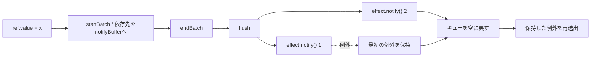

# 2026-10-01（木）

> 今日のひとこと：Next.jsが7件の脆弱性を直すセキュリティリリース（v16.3.8 / v15.5.27）を出しました。最も重いのは画像最適化のSSRF（High、DNSリバインディングで許可ドメインから内部IPへ届く）で、残りは `use cache` やSSG/ISRのキャッシュ汚染・情報漏えいです。TC39では Thenable Curtailment が Stage 3 に進みました。

## 今日のリリース

- 【Next.js】v16.3.8：7件のアドバイザリ（High 1、Moderate 5、Low 1）を直すセキュリティリリース。下の「脆弱性」を参照（出典: https://github.com/vercel/next.js/releases/tag/v16.3.8）
- 【Next.js】v15.5.27：15.x系へのバックポート。キャッシュ汚染2件と `dynamicParams` の修正を含む（出典: https://github.com/vercel/next.js/releases/tag/v15.5.27）
- 【Vue】v3.6.0-rc.10：Vapor Mode（`compiler-vapor` / `runtime-vapor`）の修正が中心。ハイドレーション、スロット、KeepAlive、vdomとの相互運用の不具合が多数直った（出典: https://github.com/vuejs/core/releases/tag/v3.6.0-rc.10）
- 【Biome】@biomejs/biome 2.5.15：nurseryルール `noReactObject…`（名前は変更ログで途中までしか確認できず）、`noSvelteExportLet`、`useLogicalProperties…` などの追加（出典: https://github.com/biomejs/biome/releases/tag/%40biomejs%2Fbiome%402.5.15）
- 【Servo】v0.7.0：月次の定例バージョン更新（コミットメッセージは “Regular monthly version bump”。目玉の変更は不明）（出典: https://github.com/servo/servo/pull/48535）
- 【Solid】solid-js / @solidjs/web 2.0.0-rc.13：公開ハイドレーションAPI（`isHydrating` など）の追加が含まれる。下の「OSSのPR」を参照（出典: https://github.com/solidjs/solid/pull/3718）
- 【Stylo】stylo 0.22.0 / selectors 0.41.0 ほか：ServoとFirefoxが共有する各crateの版上げ（出典: https://github.com/servo/stylo/pull/473）

## トップニュース

### Thenable Curtailment が Stage 3 に進む

【TC39】2026年9月30日のTC39会議の結果として、Matthew Gaudet の「Curtailing the power of "Thenables"」が Stage 2.7 から Stage 3 に進んだ。tc39/proposals の `README.md` で、Stage 2.7 の表から Stage 3 の表へ移されている。

**何が変わる**：Stage 3 は仕様文面が固まり、実装とテストに進む段階。提案の中身（どの `then` をどう制限するか）は、今回のコミットからは分からない。提案リポジトリの文面を読む必要がある（不明）。

**なぜ変えた**：Promiseは、`then` というメソッドを持つオブジェクトを何でも「thenable」として扱い、解決時にその `then` を呼ぶ。この仕組みはPromiseが現れる前のライブラリとの互換のためにあり、任意のオブジェクトに呼び出しが走る入口にもなる。提案名の「power of Thenables を削る」はこの入口を狭める意図を示す。ただしPR本文や提案READMEは今回読めていないので、制限の具体策は「不明」とする。

**何に効く・誰が困る**：実装が出荷されるまで利用者には影響しない。将来、`then` を生やしたオブジェクトを `await` や `resolve` に渡すコードの挙動が変わりうる。影響の範囲は提案本文で確かめるべき点。

**ここまでの経緯**：

- 2026-03：提案の会議ノートに初出（README の履歴リンクより）
- 2026-05、2026-07：会議で議論（README の履歴リンクより。7/20と7/22の2回）
- 2026-09-26号：Stage 2.7→3 の候補としてアジェンダに載ったことを取り上げた（[9/26号](2026-09-26.md)）
- 2026-09-30：Stage 3 に進んだ

出典: https://github.com/tc39/proposals/commit/b1afc30

## 今日の深掘り

### Vueのリアクティビティ：購読者が例外を投げても、バッチの残りに通知する

**選んだ理由**：Vue 3.6のリアクティビティは alien-signals の移植で、`flush` はその通知ループの心臓部。ここに「例外が出たらどうするか」という、素朴な実装が必ず踏む穴があった。

**背景**：`system.ts` の冒頭コメントに「alien-signals からの移植」とある。値が書き換わると、依存している effect が `notifyBuffer` というキューに積まれる。バッチの最後（`endBatch` で `batchDepth` が0になったとき）に `flush` がキューを先頭から順に `effect.notify()` する。

```ts
export function endBatch(): void {
  if (!--batchDepth && notifyBufferLength) {
    flush()
  }
}
```

出典: `packages/reactivity/src/system.ts`（444eef4 時点）

**変更点**：変更前の `flush` は、`notify()` が例外を投げるとループごと抜けた。そのとき `notifyIndex` と `notifyBufferLength` が戻らず、残りの effect に通知が届かないうえ、キューの残骸が次の書き込みで再送されうる。Issue #15674 がこの問題で、修正は #15676。

```ts
export function flush(): void {
  let hasError = false
  let error: unknown
  while (notifyIndex < notifyBufferLength) {
    const effect = notifyBuffer[notifyIndex]!
    notifyBuffer[notifyIndex++] = undefined
    try {
      effect.notify()
    } catch (err) {
      if (!hasError) {
        hasError = true
        error = err
      }
    }
  }
  notifyIndex = 0
  notifyBufferLength = 0
  if (hasError) {
    throw error
  }
}
```

出典: `packages/reactivity/src/system.ts`（ef5ff10）

要点は3つ。

- 例外を捕まえても、キューを最後まで流す
- 最初の例外だけを覚えておき、キューを空にして添字を0に戻してから再送出する
- 2つ目以降の例外は捨てる（コードから読み取れる挙動。仕様として文書化されているかは不明）

テストは3つ足されている。1つ目は、先に登録した effect が投げても後の effect が `[0, 1]` と再実行されること。2つ目は watcher のコールバックで同じこと。3つ目は、computed が「dirtyか調べる」段階で投げる場合で、代入文の外側で起きるため、例外が `x.value = undefined` まで伝わっても残りの通知は済み、無関係な書き込み（`other.value++`）で古い通知が再送されないことを確かめている。

**周辺コード**：



**この変更から分かる設計思想**：リアクティブシステムは「誰かが書き込んだ」という事実を、全購読者に届ける契約を持つ。購読者のバグでその契約が崩れると、他人のコードが巻き込まれる。そこで、例外は隠さず（最初の1つを必ず投げ直す）、ただし配信は止めない。DOMのイベントリスナーやRxの購読者が、1つのコールバックの例外で他の呼び出しを止めない設計と同じ考え方と読める（この比較は推測）。

出典: https://github.com/vuejs/core/pull/15676 / https://github.com/vuejs/core/commit/ef5ff10

### oxcのレキサー：演算子のルックアップ表を「2バイト用32枠＋3バイト用16枠」に分ける

**選んだ理由**：先日の号で触れた「演算子表のコンパイル時定数化」の続きにあたる、一連のパフォーマンス改善（#27061〜#27069、#27077）。キャッシュ行という、ハードウェアに近い理由で設計が決まる例。

**背景**：`crates/oxc_lexer/src/pipeline/operators.rs` は、`+=` や `>>>` のような演算子を「次の数バイトを整数にして、完全ハッシュ（衝突しないハッシュ）で1回引く」方式で認識する。以前は2バイト・3バイトの演算子を1枚の64枠の表に同居させていた。

**変更点**：

1. #27065：`OpTable` という型を導入（挙動は変えない整理）。表の中身は `static`（`OpTableData`）に置き、`OpTable` は `const` にして、ハッシュの乗数がコンパイル時定数になる。
2. #27066：表を128バイト境界に揃える（`#[repr(C, align(128))]`）。Apple Siliconの128バイト行2本、x86_64の64バイト行2組に収まる。
3. #27067：表を2つに分ける。2バイト用は32枠（128バイト）、3バイト用は16枠（64バイト）で、合計192バイト（変更前は256バイト）。

3.の効果として、コミットメッセージは次の2点を挙げている。

- 表が長さごとに分かれたので、別の長さの演算子に誤って一致しなくなる。直前の #27064 で足した `\0` チェックが不要になった
- 2バイト演算子の比較が16ビット比較1回になり、`coalesce` 内の3回分が「コピー・マスク・比較」の3命令から `cmp` 1命令になる

```rust
// 変更前
let mut ok = ((pack ^ key) & 0xFF_FFFF) == 0;
// 変更後
let mut ok = pack as u16 == q as u16;
```

出典: `crates/oxc_lexer/src/pipeline/coalesce/mod.rs`（b3b0a7e）

**周辺コード**：`OpTableData::new` は `const fn` で、コンパイル時に全演算子を表に並べる。乗数はソースに定数として書かれ、`test_perfect_hash` テストが「衝突しないこと」を検査する。演算子の一覧を変えて衝突が出たら、テストの失敗メッセージが新しい乗数を提案する、とモジュール先頭のコメントにある。

**この変更から分かる設計思想**：「1枚の汎用表」より「用途ごとに小さく分けた表」のほうが、データも命令も減る。表のサイズを2のべき乗に揃え、ハッシュを `key * mul >> (32 - BITS)` のシフト1回にしているのも、同じ考え方。ベンチマークの数値は、今回読んだコミットメッセージには載っていなかった（不明）。

出典: https://github.com/oxc-project/oxc/pull/27065 / https://github.com/oxc-project/oxc/pull/27066 / https://github.com/oxc-project/oxc/pull/27067

## 仕様の変更

### tc39/proposals

#### 6提案がStageを進める（9/30の会議結果）

【TC39】`tc39/proposals` のコミットから、9/30会議の結果が読み取れる。トップニュースのThenable Curtailment以外は次のとおり。

- `Composites` が Stage 2 に（Ashley Claymore）
- `export all from` が Stage 2、続けて Stage 2.7 に（Guy Bedford）。同日に2段階進んでいる
- `Deferred Re-exports` が Stage 2.7 に（Nicolò Ribaudo）
- `JSON.parseImmutable` が「JSON.parse options」と改名され Stage 2.7 に（Robin Ricard ほか）。改名の理由は今回の変更からは分からない（不明）
- `Bigint from exponential` が Stage 2 に（Richard Gibson）
- `Abort Controller` が Stage 1 に（Kevin Gibbons）

なぜ変えたか：Stage の変更は、会議での合意の記録。理由は各提案の会議ノートにあるが、今回は未取得（取得できず：ノート公開前の可能性があり、確認していない）。
出典: https://github.com/tc39/proposals/commit/dbed920 / https://github.com/tc39/proposals/commit/eaa17fb / https://github.com/tc39/proposals/commit/cf3caef / https://github.com/tc39/proposals/commit/ac9b6b5 / https://github.com/tc39/proposals/commit/201ae03 / https://github.com/tc39/proposals/commit/a6230e0

### w3c/csswg-drafts

#### css-color-4：LCH/Oklchの変換から「Hが欠けたらa=b=0」の規則を外す

【CSS】LCHとOklchをLab系へ変換するコードから「Hが欠けているとき a = b = 0」という行を削除した。
なぜ変えたか：コミットメッセージによると、この規則が往復変換（round-tripping）を妨げていた。Issue #14530 を修正している。
出典: https://github.com/w3c/csswg-drafts/commit/9c50d37

その他：

- css-scroll-anchoring-1 の見出しの閉じタグ修正（editorial。[f505fd1](https://github.com/w3c/csswg-drafts/commit/f505fd1)）
- css-syntax-3 の誤字修正（editorial。[897bfd4](https://github.com/w3c/csswg-drafts/commit/897bfd4)）

動きなし：whatwg/html, whatwg/dom, whatwg/fetch, whatwg/streams, whatwg/url, tc39/ecma262, w3c/aria, w3c/ServiceWorker, w3c/wcag3

## ブラウザの実装

### Servo

#### `alpha()` 色関数がServoで既定で有効に

【CSS】CSS Color 5 の `alpha()` 関数を、Servo側の実験フラグ `layout.css.alpha-color-function.enabled` を既定オンにして出荷した。実装はStylo側のPR #469で、ServoはそのStyloを使っている。
なぜ変えたか：PR本文は「実験フラグだったので、テストはすでにオンで動いていた」と書いており、実績を踏まえて既定に移した形。
出典: https://github.com/servo/servo/pull/48344

Chrome Platform Status、blink-dev、web-platform-tests/interop の更新は、今回は確認していない（取得せず）。

## OSSのPR

### Vue（minorブランチ）

#### リアクティビティ：購読者の例外でバッチが止まらなくなる

深掘りを参照。出典: https://github.com/vuejs/core/pull/15676

#### `useModel` がpropの未変更時にローカル値を保持する

【Vue】`runtime-core` の `useModel` で、親のpropが変わっていないのにローカル値が戻ってしまう問題を修正（Issue #15670）。
なぜ変えたか：Issueの番号のみ確認。詳しい経緯は取得できず。
出典: https://github.com/vuejs/core/pull/15672

#### Vapor：評価済みpropsと動的スロットがコンポーネントに届くように

【Vue】`runtime-vapor` で、コンポーネントへ渡す評価済みpropsと動的スロットが届かない問題を修正（Issue #15673）。
出典: https://github.com/vuejs/core/pull/15708

その他：

- Vaporの `v-if` / `v-for` スロットが無条件スロットを上書きできるよう修正（[#15714](https://github.com/vuejs/core/pull/15714)）
- Vaporでハイドレーション時に空ブランチをスロット全体として扱うよう修正（[#15713](https://github.com/vuejs/core/pull/15713)）
- Vaporで空スロットをvdomの子vnodeへ渡すよう修正（[#15719](https://github.com/vuejs/core/pull/15719)）
- Vaporのvdom内容のハイドレーションでsuspense境界を渡すよう修正（[#15720](https://github.com/vuejs/core/pull/15720)）
- Vaporルートのハイドレーション時にvdom親のCSS変数を解決するよう修正（[#15721](https://github.com/vuejs/core/pull/15721)）
- 3.6.0-rc.10のリリース（[444eef4](https://github.com/vuejs/core/commit/444eef4)）

### Solid（nextブランチ）

#### ハイドレーション状態の公開API（`isHydrating` など）が入る

【Solid】`isHydrating()`、`isHydratable()`、`getHydrationWriter()`、`takeHydrationValue()` と型 `HydrationWriter` / `HydrationValue` を公開した。Solid RouterやTanStack Solid Query/Routerのようなデータライブラリが、ハイドレーション中かどうかを知り、キー付きの値をサーバーからクライアントへ渡すための入口になる。
なぜ変えたか：これまでは内部用（`@internal`）の `sharedConfig` を直接読んでいたが、rc.12 で公開型宣言から外れ、TanStack Solid Queryのリリース前検査が型エラー（TS2305）で落ちた。そこで、ライブラリが一度だけ移行できる公開面を用意した（コミットメッセージより）。
出典: https://github.com/solidjs/solid/pull/3718

#### `createSSRResponse` が、シェルより前にレンダリングが終わっても決着する

【Solid】`createSSRResponse` は、出力側の最初の `write` でしか解決しなかったため、シェルより前に失敗・中断すると、Promiseが永久に保留になっていた。失敗なら本文なしの500（または設定済みの `Location` へのリダイレクト）、空の描画なら空の200で解決するようにした。Promiseは拒否されない。
なぜ変えたか：Issue #3719 の不具合。
出典: https://github.com/solidjs/solid/pull/3725

その他：

- ストリーミング境界の外側のシェルノードが、クライアントの書き込みで更新されない不具合を修正（[b68a907](https://github.com/solidjs/solid/commit/b68a907)）
- ハイドレーショントレース用の偽Promiseに `withResolvers` と `try` を追加（[#3727](https://github.com/solidjs/solid/pull/3727)）
- 「undefinedをコミットした実行」が無駄な再計算と数えられる誤りを修正（[#3716](https://github.com/solidjs/solid/pull/3716)）
- バインディングスロットのテキスト位置とfillの扱いを調整（[#3714](https://github.com/solidjs/solid/pull/3714)、[#3713](https://github.com/solidjs/solid/pull/3713)）
- JSX内のカバレッジ用pragmaを保持するよう修正（[#3301](https://github.com/solidjs/solid/pull/3301)）
- シリアライズしないサーバーバンドルが、プラグイン集合を保持し続けないようにした（[8d66ae5](https://github.com/solidjs/solid/commit/8d66ae5)）
- rc.13 のバージョン更新（[#3720](https://github.com/solidjs/solid/pull/3720)）

### Next.js

#### turbo-persistence：空間増幅を基準にしたコンパクションに置き換わる

【Next.js】Turbopackの永続キャッシュ（`turbo-persistence`）のコンパクションを、ハッシュシャード単位の「空間増幅（space amplification）」方針に置き換えた。設計はRocksDBのuniversal compactionとCassandraのUCSに倣ったとPR本文にある。
なぜ変えたか：turbo-tasksのGCは、墓石（tombstone）を、消す対象のデータと同じコンパクションで合流させないと、キャッシュを縮められない。従来のアルゴリズムは墓石を多く残し、GCを有効にしてもキャッシュは5%しか小さくならなかった、とPR本文にある。変更後はGC有効時にサイズがほぼ横ばいになる。
出典: https://github.com/vercel/next.js/pull/99268 / 続きの調整 https://github.com/vercel/next.js/pull/99433

#### Agent向けアップグレード通知が既定でオンに

【Next.js】`experimental.agenticAutoUpgrade` を `experimental.agentUpgrade` に改名し、既定を `true`（`security` 方針）にした。`future` 方針の値は `experimental-future` に改名。続くPR #99461 で、設定値から `true` を外している。
なぜ変えたか：PR本文は「エージェント向けの更新通知を既定で有効にする」としており、詳細な動機は書かれていない。
出典: https://github.com/vercel/next.js/pull/99311 / https://github.com/vercel/next.js/pull/99461

#### create-next-appでCache Componentsが既定に

【Next.js】`create-next-app` で生成する新規アプリが、Cache Componentsが有効な状態で始まる。
なぜ変えたか：PR本文によると、新規アプリの移行をやさしくするため。
出典: https://github.com/vercel/next.js/pull/99436

その他：

- PPF：ランタイムプリレンダーがRDCを無視していた不具合を修正（[#98025](https://github.com/vercel/next.js/pull/98025)）
- PPF：cachedNavigationsの経路でRDCを使う（[#98005](https://github.com/vercel/next.js/pull/98005)）
- 動的ルートの静的メタデータのプリレンダーを復元（[#99463](https://github.com/vercel/next.js/pull/99463)）
- ISRエントリのキャッシュ寿命を、インスタンス間・再起動をまたいで保つ（[#99289](https://github.com/vercel/next.js/pull/99289)）
- `revalidateTag` がプロファイル違いのとき、カスタムキャッシュハンドラへ届かない不具合を修正（[#99359](https://github.com/vercel/next.js/pull/99359)）
- 画像の品質設定を検証中に書き換えないよう修正（[#99476](https://github.com/vercel/next.js/pull/99476)、[#99394](https://github.com/vercel/next.js/pull/99394)）
- ルートハンドラの型検証からメタデータファイルを除外（[#99377](https://github.com/vercel/next.js/pull/99377)）
- App Routerの開発インジケーターを出力完了時に確定（[#99384](https://github.com/vercel/next.js/pull/99384)）
- Cache Componentsのデプロイテスト用エイリアスを削除（[#99446](https://github.com/vercel/next.js/pull/99446)）

### oxc

#### minifierが、同じモジュールのimport／exportを1文にまとめる

【oxc】`import {b} from "m"; import {g} from "m"` を `import {b, g} from "m"` に、`import {b, g} from "m"; export {g as a, b as c}` を `export {g as a, b as c} from "m"` にまとめる最適化が入った。import属性・フェーズ・type/value・名前空間指定子が合流を妨げる場合は分けたまま残す。デフォルト束縛が複数あるときは `default` という名前付きimportにまとめる。
なぜ変えたか：バンドラ出力に現れる、同じチャンクからの分割importの圧縮（Issue #13047）。#25533のPR本文は「AIでコードを生成し、レビューと挙動の修正、テストの追加を行った」と明記している。
出典: https://github.com/oxc-project/oxc/pull/25534 / https://github.com/oxc-project/oxc/pull/25533

#### parser：script内のmodule構文をパーサーで弾く

【oxc】スクリプト中の `import` / `export` を、semanticフェーズでなくparserで検出して拒否するようにした（Issue #25187）。
なぜ変えたか：PR本文によると「検出できるものはparserで行う」という既存の方針に揃えた。Babelもparserでこのエラーを報告する。
出典: https://github.com/oxc-project/oxc/pull/27220

#### parser：TypeScriptのtype memberの区切りを検証、型に依存するタプルrestの診断を削除

【oxc】type memberの区切り（`,` / `;` / 改行）を検証する一方、型に依存するタプルのrest診断を外した。
出典: https://github.com/oxc-project/oxc/pull/27222 / https://github.com/oxc-project/oxc/pull/27234

その他：

- minifier：ビット演算式の最小化（`(a OP b) | 0` → `a OP b`、`a & 0xffffffff` → `a | 0`）（[#27107](https://github.com/oxc-project/oxc/pull/27107)）
- minifier：`merge_import_export`などをその場更新にして高速化（[#27226](https://github.com/oxc-project/oxc/pull/27226)、[#27194](https://github.com/oxc-project/oxc/pull/27194)、[#27209](https://github.com/oxc-project/oxc/pull/27209)）
- lexer：演算子表まわりの性能改善と整理（[#27061](https://github.com/oxc-project/oxc/pull/27061)〜[#27069](https://github.com/oxc-project/oxc/pull/27069)、[#27077](https://github.com/oxc-project/oxc/pull/27077)。深掘りを参照）
- formatter：埋め込みテンプレートのレイアウトをソースの形でなくASTから決める（[#27218](https://github.com/oxc-project/oxc/pull/27218)）
- formatter：`quoteProps: consistent` をパターンと計算キーに対応（[#27216](https://github.com/oxc-project/oxc/pull/27216)）
- formatter：入れ子のinternedで `will_break` が指数的に遅くなるのを回避（[#27211](https://github.com/oxc-project/oxc/pull/27211)）
- linter：`numeric-separators-style` のBigInt、`no-zero-fractions` の修正の括弧（[#27207](https://github.com/oxc-project/oxc/pull/27207)、[#27206](https://github.com/oxc-project/oxc/pull/27206)）
- linter：`ImportOrExportKind` などの使い方を統一（[#27196](https://github.com/oxc-project/oxc/pull/27196)、[#27195](https://github.com/oxc-project/oxc/pull/27195)）

### TypeScript

#### Andersが、型引数から行った推論をキャッシュする

【TypeScript】`Cache inferences made from type arguments` (#64553)。型引数から行った推論の結果をキャッシュする変更。コミットメッセージは題名だけで、本文はない。PR本文とベンチマークは取得できず（github.comのPRページを読めなかった）。
出典: https://github.com/microsoft/TypeScript/pull/64553

#### チェッカーの排他的な取得を強制する

【TypeScript】`Enforce exclusive checker acquisition` (#64543)。チェッカーを同時に取得できないようにする変更。意図はコミットの題名までしか確認できていない（不明）。続いて [api] 関連のPR #64554、#64518 で、APIが返すシンボルを現在のスナップショット由来に揃える変更も入っている。
出典: https://github.com/microsoft/TypeScript/pull/64543

その他：

- 再帰的な呼び出し解決で、純粋な戻り型の推論を制約で絞ったままにする（[#64530](https://github.com/microsoft/TypeScript/pull/64530)）
- クラスの静的プロパティを、自クラス自身で文脈型付けしない（[#64525](https://github.com/microsoft/TypeScript/pull/64525)）
- 宣言出力で循環構造と切り詰めを報告（[#64461](https://github.com/microsoft/TypeScript/pull/64461)）
- `MarkLinkedReferencesRecursively` 経由の宣言出力で出る不安定な診断を修正（[#64482](https://github.com/microsoft/TypeScript/pull/64482)）
- 名前空間のexpandoエクスポートにexport修飾子を付ける（[#64545](https://github.com/microsoft/TypeScript/pull/64545)）
- import属性の型で `NoSubstitutionTemplate` を禁止（[#64243](https://github.com/microsoft/TypeScript/pull/64243)）
- CI・署名・パイプライン関連（[#64555](https://github.com/microsoft/TypeScript/pull/64555)、[#64559](https://github.com/microsoft/TypeScript/pull/64559)、[#64542](https://github.com/microsoft/TypeScript/pull/64542)、[#64547](https://github.com/microsoft/TypeScript/pull/64547)）

### Biome

その他：

- 2.5.15 のリリース（[#11815](https://github.com/biomejs/biome/pull/11815)）
- HTMLフォーマッターで、テキストと次行のインライン要素を連結するとき空白を保つ（[#12044](https://github.com/biomejs/biome/pull/12044)）
- 型推論で、コンテキストを保ちオーバーフローを避ける（[#12041](https://github.com/biomejs/biome/pull/12041)）
- `noUselessReturn` の修正で、波括弧のない本体とコメントを守る（[#12037](https://github.com/biomejs/biome/pull/12037)）

### Vite

#### preloadヘルパーの `<link>` 走査が二乗時間でなくなる

【Vite】ビルド時に注入されるpreloadヘルパーが、ページ内の `<link>` を毎回走査していた部分を、二乗時間にならない形に直した。PR本文はなく、共同作者表記が2人並ぶのみ。詳しい仕組みは未確認（不明）。
出典: https://github.com/vitejs/vite/pull/23510

その他：

- `renderBuiltUrl` がクエリ付きURLを返すときのCSSのpreloadを修正（[#23611](https://github.com/vitejs/vite/pull/23611)）
- `srcset` のパーセントエンコードされたURLを解決（[#23609](https://github.com/vitejs/vite/pull/23609)）
- `browser: false` のマッピングで出る「unsupported」警告を回避（[#23590](https://github.com/vitejs/vite/pull/23590)）
- `build.rolldownOptions.output.minify` を正しくマージ（[#23536](https://github.com/vitejs/vite/pull/23536)）

### react-hook-form

#### `ref` という名前のフィールドが、dirty判定で無視されなくなる

【RHF】`deepEqual` はDOMのrefを比較しないために `ref` キーを全部飛ばしていたが、それがフォーム値にも効いていた。`ref` という名前のフィールドではフォームがdirtyにならず、`setValue` で `ref` だけが変わるオブジェクトが変更なし扱いとなり、古い値が送信されていた。`ref` を無視するのはフィールドのエラーの比較だけに絞った。
なぜ変えたか：上記の実害の修正（PR本文より）。
出典: https://github.com/react-hook-form/react-hook-form/pull/13812

### Servo

その他：

- フォーカス：`select()` がテキスト入力をフォーカスするようにした（[#48475](https://github.com/servo/servo/pull/48475)）
- WebGL2のテクスチャアップロードで `HALF_FLOAT` を受け付ける（[#48536](https://github.com/servo/servo/pull/48536)）
- WebGL：`blitFramebuffer` と `clearBuffer` の後にキャンバスを提示（[#48473](https://github.com/servo/servo/pull/48473)）
- CSP制限のあるドキュメントで、埋め込み側がJSを実行できるようにした（[#48394](https://github.com/servo/servo/pull/48394)）
- テキストトラックのキュー描画の初期足場（[#48401](https://github.com/servo/servo/pull/48401)）
- PannerNodeのコーンゲイン計算の修正（[#48510](https://github.com/servo/servo/pull/48510)）
- a11y：AccessKitからの `Click` アクションの転送を許可（[#48512](https://github.com/servo/servo/pull/48512)）
- マルチプロセスモードのシャットダウンのハング修正（[#48523](https://github.com/servo/servo/pull/48523)）
- OpenHarmony/Androidまわり、CI、レイアウトの整理、WebNN WPTの有効化のrevert（[#48454](https://github.com/servo/servo/pull/48454)、[#48505](https://github.com/servo/servo/pull/48505)、[#48500](https://github.com/servo/servo/pull/48500)、[#48517](https://github.com/servo/servo/pull/48517)、[#48515](https://github.com/servo/servo/pull/48515)、[#48530](https://github.com/servo/servo/pull/48530)、[#48508](https://github.com/servo/servo/pull/48508)、[#48492](https://github.com/servo/servo/pull/48492)）

### Stylo

その他：

- stylo 0.22.0、selectors 0.41.0、servo_arc 0.5.0 などの版上げ（[#473](https://github.com/servo/stylo/pull/473)）

### Ladybird

この期間のコミットは約60件。`LibWeb` のスタイルエンジンまわりが大半を占める。コミットメッセージだけで、PR本文とレビューは読めていない。

#### スタイル計算を「スタイルエンジンが記録を持つ」形に寄せる一連の変更

【Ladybird】`Let the style engine compute records after inline style edits`、`Let the engine settle a style environment change itself`、`Key warm style cohorts by their current environment`、`Publish the connected element count with a style transaction` など、スタイルエンジンがレコードを持ち、C++側が個別に走査する部分を減らす一連のコミット。全体の設計意図はコミットの題名までしか確認できていない（不明）。
出典: https://github.com/LadybirdBrowser/ladybird/commit/a81c2a0 / https://github.com/LadybirdBrowser/ladybird/commit/2dfc025 / https://github.com/LadybirdBrowser/ladybird/commit/a2e65bb

#### `javascript:` URLのナビゲーションを仕様どおりにする修正

【Ladybird】`javascript:` URLのタスクを、iframeが登録される前にキューに入れる、削除済みnavigableのdocumentをfully activeと見なさない、挿入されたiframe/frameでloadイベントを正しく出す、といった修正。HTML標準のナビゲーションの手順に合わせる流れ。
出典: https://github.com/LadybirdBrowser/ladybird/commit/2b52d27 / https://github.com/LadybirdBrowser/ladybird/commit/5e5b58d / https://github.com/LadybirdBrowser/ladybird/commit/618693e

その他：

- `revert` / `revert-layer` がカスタムプロパティに代入されたときの扱い（[0847976](https://github.com/LadybirdBrowser/ladybird/commit/0847976)、[3979c7f](https://github.com/LadybirdBrowser/ladybird/commit/3979c7f)）
- 非表示中に計算したスタイルを、表示後に共有・保持しない（[94a6c59](https://github.com/LadybirdBrowser/ladybird/commit/94a6c59)、[6d3f7f1](https://github.com/LadybirdBrowser/ladybird/commit/6d3f7f1)）
- 総称フォントファミリーをスタイルと独立に解決（[16a1571](https://github.com/LadybirdBrowser/ladybird/commit/16a1571)）
- LibJS：非10進数の数値文字列で小数部の精度を保つ（[3cf962c](https://github.com/LadybirdBrowser/ladybird/commit/3cf962c)）
- 印字可能ASCIIの改行位置をブラウザに合わせる（[9f89df9](https://github.com/LadybirdBrowser/ladybird/commit/9f89df9)）
- ペイントダメージの行を二乗探索なしで1回ずつ保持（[a685ac3](https://github.com/LadybirdBrowser/ladybird/commit/a685ac3)）
- コンポジター、サンドボックス、LibWebView、Qtまわり（[d40b13e](https://github.com/LadybirdBrowser/ladybird/commit/d40b13e)、[5de9432](https://github.com/LadybirdBrowser/ladybird/commit/5de9432)、[cc1fbf1](https://github.com/LadybirdBrowser/ladybird/commit/cc1fbf1)、[d2bd2d7](https://github.com/LadybirdBrowser/ladybird/commit/d2bd2d7)）
- 上記以外にも多数のLibWebの個別修正がある（件数のみ：約60件中、上に挙げた分を除く）

### wado-lang/wado

この期間のコミットは110件。`docs/wep-*.md` の追加・変更は、数えた範囲で次のとおり。

#### WEP「`with` のない関数は、効果を持たない」が新設

【Wado】`docs/wep-2026-09-30-pure-functions.md`（題名は「A Function Without `with` Performs No Effects」）が追加され、仕様の約束を実際にコンパイラが守るように、効果システムの穴を塞ぐ変更が一連で入った。穴は3つ。

- ユーザー定義インターフェースの操作が、呼び出し側に何も要求しない
- ハンドラを差し込むことが、何も要求しない
- ハンドラのメソッドが、宣言せずに効果を持てる

決定は、インターフェースの操作を呼ぶ側が `with <Interface>` を宣言する、ハンドラを差し込むブロックがハンドラの宣言する効果を要求する、など。トラップ（`panic` など）は効果に数えない。また仕様では「pure」という語を使わず「効果」だけで語る（トラップや出力を避けられるという約束を含みすぎるため）。
なぜ変えたか：WEPのContext節によれば、「宣言なし＝効果なし」という約束が守られていなかったため。
出典: https://github.com/wado-lang/wado/commit/d713dde / https://github.com/wado-lang/wado/commit/dbd28b5 / https://github.com/wado-lang/wado/commit/7784025

その他：

- それ以外の110件は、エラボレーター、Inspect、フォーマッタ（Marl）、依存更新、golden fixtureの再生成など。上記WEP関連を除いた件数の内訳は未集計

動きなし：facebook/react, ghc/ghc, sveltejs/svelte, solidjs/solid の `main` ブランチ

## 続報

- 9/26号で取り上げた「Solid nextのサーバー専用『穴』がPromiseから凍結thenableに変わる」は、Promiseと「thenable」を分けるという話だった。今日、TC39ではThenable Curtailment（`then` を持つ任意のオブジェクトの扱いを狭める提案）が Stage 3 になった。直接の関係は確認できていないが、同じ「thenableの扱い」という論点のため、あわせて追うとよい（[9/26号](2026-09-26.md)）
- 9/26号でアジェンダ候補に挙がっていたThenable Curtailment（Stage 2.7→3）は、9/30に Stage 3 になった（[9/26号](2026-09-26.md)、上の「トップニュース」）
- 9/23号で取り上げた `next/og` のRCE（GHSA-vcvr-r3jv-pc5j）の緊急パッチから8日で、Next.jsは次のセキュリティリリースを出した。今回は7件で、下の「脆弱性」にまとめた（[9/23号](2026-09-23.md)）

## 脆弱性

### Next.js v16.3.8 / v15.5.27：7件のアドバイザリ

【脆弱性】2026-09-30に、npm `next` の7件のアドバイザリが公開され、同日に修正版 v16.3.8 と v15.5.27 が出た。影響は主に16.x系。15.x系（v15.5.27）には、キャッシュ汚染2件と `dynamicParams` の修正だけがバックポートされている（v15.5.26..v15.5.27 のコミットで確認）。

| アドバイザリ | 深刻度 | 中身 | 影響（アドバイザリ記載） |
|---|---|---|---|
| [GHSA-cjq9-62q9-8jv4](https://github.com/vercel/next.js/security/advisories/GHSA-cjq9-62q9-8jv4)（CVE-2026-94483） | High（8.3） | 画像最適化のSSRF | 16.0.0以上、`images.remotePatterns` を設定したアプリ |
| [GHSA-mcj8-r9mp-w47p](https://github.com/vercel/next.js/security/advisories/GHSA-mcj8-r9mp-w47p)（CVE-2026-94484） | Moderate（6.3） | ルート直下のcatch-allとSSG/ISRの併用で、共有レスポンスキャッシュが汚染され、別ユーザーに別の内容が出る・DoS | 15.0.0以上、16.0.0以上 |
| [GHSA-4jqv-mc3x-m676](https://github.com/vercel/next.js/security/advisories/GHSA-4jqv-mc3x-m676)（CVE-2026-94543） | Moderate（6.3） | セルフホストのPages RouterでSSG/ISRページのキャッシュが別ルートの内容に置き換わる。Vercel上は影響なし | 15.0.0以上、16.0.0以上 |
| [GHSA-f87g-xv8r-7p7x](https://github.com/vercel/next.js/security/advisories/GHSA-f87g-xv8r-7p7x)（CVE-2026-94485） | Moderate（6.3） | webpack使用時、`opengraph-image` などのメタデータ画像ルートが `dynamicParams` を無視し、`generateStaticParams()` で外したセグメントの画像が取れる | 16.0.0以上 |
| [GHSA-3w37-wq28-93x7](https://github.com/vercel/next.js/security/advisories/GHSA-3w37-wq28-93x7)（CVE-2026-94544） | Moderate（6.3） | 実行中の `use cache` の結果を重なったリクエストで共有するとき、Draft Modeと通常を区別せず、未公開の下書きが通常の応答や生成ページに漏れる | 16.3.0、Cache Components有効 |
| [GHSA-h694-7cp9-m8p3](https://github.com/vercel/next.js/security/advisories/GHSA-h694-7cp9-m8p3)（CVEなし） | Moderate（6.3） | 入れ子の `use cache` で、内側がroot paramを読んでも外側のキャッシュキーに入らず、別のroot param値の内容が返る | 16.3.0、`cacheComponents: true` |
| [GHSA-39w2-rjm5-chcv](https://github.com/vercel/next.js/security/advisories/GHSA-39w2-rjm5-chcv)（CVE-2026-94486） | Low（2.3） | `next dev` のMCPエンドポイントにオリジン検証がなく、悪意あるサイトを開くとファイルパスやルート一覧、ログが読まれる | 16.0.0以上、開発サーバーのみ |

**攻撃原理（いちばん重いSSRF）**：画像最適化は、外部画像を取る前にホスト名をDNSで引き、プライベートIPなら拒否していた。ところが実際の取得は `fetch()` に任せており、`fetch()` は自分でもう一度DNSを引く。攻撃者が `remotePatterns` に合うドメインのDNSを握っていれば、1回目は公開IP、2回目は内部IPを返す（DNSリバインディング）ことで、検査を通したあと内部ネットワークへ届く。検査と使用の間に値が変わる、典型的なTOCTOU（time-of-check to time-of-use）。

**成立条件**：`images.remotePatterns` を設定していること、許可したドメインのDNSを攻撃者が操作できること。`remotePatterns` を使っていなければ影響なし。アドバイザリの回避策は「許可ドメインのDNSが乗っ取られないか見直す」。

**修正コミットのdiff解説**：`e002ad68bd`（#214、`packages/next/src/server/image-optimizer.ts`）。`fetch()` をやめて `http`/`https` の `request` に切り替え、検査で引いたアドレスだけを返す `lookup` 関数をソケットに渡す。

```ts
// packages/next/src/server/image-optimizer.ts（e002ad68bd、抜粋）
export function createPinnedLookup(hostname, addresses): LookupFunction {
  return (lookupHostname, options, callback) => {
    if (lookupHostname !== hostname) { /* InvariantError */ }
    ...
    callback(null, matched[0].address, matched[0].family)
  }
}
```

ソケットは再びDNSを引かず、検査済みのアドレスへ接続する。さらに、Keep-Aliveの接続プールが別のIPへの接続を使い回さないよう、`http.Agent` を継承したクラスで `getName()` に検査済みアドレスの一覧（`imageLookupKey`）を足している。

**ほかの修正コミット**（v16.3.7..v16.3.8、どのアドバイザリに対応するかはコミット名からの推測を含む）：

- DNSリバインディング対策をMCPにも：`2d9f50a409`（#213）。MCPミドルウェアのパス判定を `startsWith('/_next/mcp')` から完全一致に変え、クロスサイト遮断（`block-cross-site-dev.ts`）を通るようにした（GHSA-39w2）
- Draft Mode：`bd9214f9a3`（#205）。`use-cache-wrapper.ts` で、重なったリクエスト間の重複排除にDraft Modeかどうかを含める（GHSA-3w37）
- 入れ子の `use cache`：`e92db4536a`（#223）。重複排除された内側のキャッシュから、root paramを読んだというメタデータが外側へ伝わるようにした（GHSA-h694と推測）
- `dynamicParams`：`8db4a627c9`（#215）。webpackのメタデータルートローダーが `dynamicParams` を引き継ぐ（GHSA-f87g）
- キャッシュキー：`719e4c67d6`（#218）。レスポンスキャッシュのキーを元のルートに結びつける（`route-cache-key.ts` を新設）。`40c2ba9042`（#196）は `/_next/data/` の判定を大文字小文字を区別するようにした1行修正（`getPathMatch(..., { sensitive: true })`）。この2つがキャッシュ汚染2件（GHSA-mcj8、GHSA-4jqv）に当たると推測するが、対応は不明

**同種の脆弱性パターン**：「検査したものと、使うものが同じか」。SSRF対策でIPを検査しても、接続時に名前を引き直せば意味がない（DNSリバインディング）。キャッシュの3件も同じ形で、キャッシュキーに入れた情報（ルート、Draft Modeか、root param）と、実際に中身を決めた情報がずれると、別人の結果が返る。9/23のRCEに続き、キャッシュと外部取得という「サーバーが代わりに何かをする」機能に修正が集中している。

出典: https://github.com/vercel/next.js/releases/tag/v16.3.8 / https://github.com/vercel/next.js/releases/tag/v15.5.27 / https://github.com/vercel/next.js/security/advisories

## 仕様を読む会の候補

- Thenable Curtailment の提案本文と、ECMA-262の `Promise Resolve Functions`：Stage 3 に入り、仕様文面が読める状態になった。いま「thenable」をどう扱っているか（現行の手順）と、何が変わるかを対で読める
- Wado の WEP `pure-functions` と効果システム：効果システム（Algebraic Effects）を、言語の仕様としてどう守らせるか。穴を3つ挙げてから塞ぐという文書の構成が、設計の議論の見本になる
