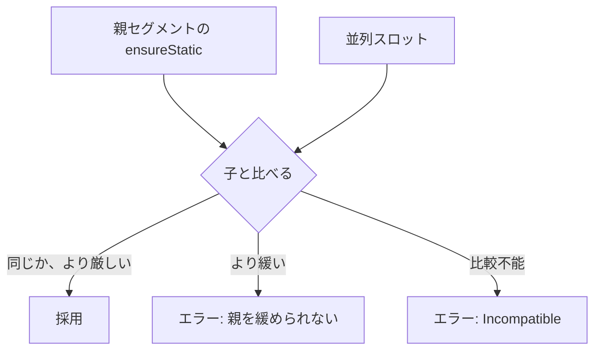

# 2026-10-02（金）

> 今日のひとこと：Next.jsが `unstable_ensureStatic` から `unstable_` を外して `ensureStatic` として安定化しました。TypeScriptは `Promise.allKeyed` / `allSettledKeyed` の型を `esnext` に追加しました。新規の脆弱性アドバイザリはありませんでした。

## 今日のリリース

- 【Vite】v8.3.2：CSSプリロードで `renderBuiltUrl` のクエリを扱う修正、ファイルウォッチャーのエラーでサーバーが落ちる問題の修正、中間ソースマップのエンコード回避などのパッチ（出典: https://github.com/vitejs/vite/releases/tag/v8.3.2）

## トップニュース

### Next.jsが `ensureStatic` を安定化する

【Next.js】App Routerのセグメント設定 `unstable_ensureStatic` が `ensureStatic` に改名された。2026-10-01にmainへ入った（#99513）。

**何が変わる**：セグメントの `export const ensureStatic = ...` で、どの描画フェーズに静的な出力を要求するかを指定する。値は `"auto"`、`"shell"`、`"prefetch"`、`"navigation"`、`false`（`app-segment-config.ts` のエラーメッセージによる）。コミットの変更は改名とエラーメッセージの文言だけで、挙動は変えていない。

**なぜ変えた**：コミットメッセージは「APIの形は変わらないと十分に確信しているので `unstable_` を外す」。PR本文はこの1文だけで、それ以上の議論は読めていない（不明）。

**何に効く・誰が困る**：`unstable_ensureStatic` を使っていた人は書き換えが要る。旧名を残す互換の仕組みがコミットに見当たらない（`git show` で確認した範囲）。同日の #99540 が「#97393 は古いマージで、改名に追従できていなかった」として、残っていた旧名を直している。

**ここまでの経緯**

- 2026-10-01 午前（JST）：#99513 で `ensureStatic` を安定化
- 2026-10-01：#97393 が `unstable_paramMatching` / `unstable_generateParamMatching` を追加（`unstable_` 付きのまま）
- 2026-10-01：#99540 で旧名 `unstable_ensureStatic` の取り残しを修正
- 2026-10-01：#99355 でドキュメントに `ensureStatic` のリファレンスを追加

出典: https://github.com/vercel/next.js/pull/99513

## 今日の深掘り

### `ensureStatic` は「親より緩くできない」制約として解決される

**選んだ理由**：改名のdiffに、設定をどう合成するかの設計が見える。読んだのは `packages/next/src/server/app-render/segment-config/ensure-static.ts`（コミット 13b59c9e19）。

**背景**：Cache Componentsでは、ページを「静的なシェル」と「動的な部分」に分ける。セグメントごとに「ここは静的でなければならない」と宣言できないと、うっかり動的APIを使ったときにビルド後まで気づけない。

**変更点**：diffから読めるのは、設定の比較結果を持つ `Comparison` 列挙（`LessConstrained`、`MoreConstrained`、`Incompatible` が見える）と、それに応じたエラーだけ。

- 子が親より `LessConstrained`（緩い）なら、エラー
- 並列スロット同士で制約が食い違う場合も、エラー
- 何も書かなければ `'auto'` として扱う（`getEnsureStaticConfigForModule`）

```ts
return (mod ? (mod as AppSegmentConfig).ensureStatic : undefined) ?? 'auto'
```

（packages/next/src/server/app-render/segment-config/ensure-static.ts、13b59c9e19）



**設計思想**：「静的であること」は、下の階層で上書きして緩められない保証にしている、と読める。保証が途中で外れないようにするには、緩める方向の上書きを禁止する必要があるからだ。ただし `Comparison` の全比較ルール（どの値がどの値より厳しいか）は、今回のdiffに出ていないので読めていない（不明）。

出典: https://github.com/vercel/next.js/commit/13b59c9e19860641ea56f32519c87bb02643484d

## 仕様の変更

### whatwg/html

#### タイマーの文字列がTrusted Typesで同期的に例外を投げる

【HTML】`setTimeout` などに文字列を渡すとき、Trusted Typesの変換をタイマーのタスクの中ではなく、タスクを作る前に行うように直した。
なぜ変えたか：コミットメッセージによると、実装が「同期的に投げる」で揃っており、仕様を実装に合わせた。
出典: https://github.com/whatwg/html/commit/6992cb5

#### `sizes="auto"` の画像が描画されなくなっても、最後の描画幅を保持する

【HTML】`display: none` などで描画されなくなった `sizes="auto"` の画像は、最後に描画された幅を覚えておく。`img` が文書から外れたら幅を `null` に戻す。
なぜ変えたか：描画されていない間の再選択で、ビューポート幅の既定値に戻って無駄な取得が走るのを避ける（Fixes #12712）。
出典: https://github.com/whatwg/html/commit/bae538d057faf3fd81cd43e3187b8f9fb7fca9cb

### w3c/csswg-drafts

動きなし（`[css-syntax-3][editorial] Back to ED` のみ）

動きなし：tc39/ecma262（editorialのみ）, whatwg/dom, whatwg/fetch, whatwg/streams, whatwg/url, w3c/aria, w3c/ServiceWorker, w3c/wcag3

## ブラウザの実装

取得できず（chromestatus.com・groups.google.comはegressでブロック。今回はChromiumのコミット履歴とWebSearchの確認まで行えていない）。

## OSSのPR

### Next.js

#### Turbopackのexport名の短縮が、安定版のビルドでも既定になる

【Next.js】`experimental.turbopackMangleExportNames` が、`next build` でカナリアだけでなく安定版でも既定で有効になった。`next dev` では無効のまま。モジュール間のリンクに使うキーが短くなり、バンドルが小さくなる。
なぜ変えたか：JS側の既定値が安定版で `false` に固定されていて、その固定を外した。Rust側がビルドモードから既定を決める。
出典: https://github.com/vercel/next.js/pull/99362

#### 不安定なパラメータ照合APIが入る（`unstable_paramMatching`）

【Next.js】Cache Componentsで、`generateStaticParams` が出す具体例とは別に、未知の値を404にするか、ブロックして生成するか、フォールバックのシェルを返すか、動的のままにするかを `unstable_paramMatching` で選べる。
なぜ変えたか：ビルド時のプリレンダーと、実行時の未知パラメータの扱いを切り離すため（PR本文の要旨）。
出典: https://github.com/vercel/next.js/pull/97393

その他：

- `after()` からの同じタグの再revalidateを伝播させる（[#99499](https://github.com/vercel/next.js/pull/99499)）
- `generateBuildId` が明示されていれば常にそれを使う（[#99147](https://github.com/vercel/next.js/pull/99147)）
- `Turbopack: experimental.turbopackSharedRuntime` を既定で有効に（[#99504](https://github.com/vercel/next.js/pull/99504)）
- アップグレードで React と ESLint の更新をスキップできるようにする（[#99468](https://github.com/vercel/next.js/pull/99468)）
- アップグレードで宣言済みのパッケージマネージャーを優先（[#99471](https://github.com/vercel/next.js/pull/99471)）
- バンドルアナライザーUIをNext.jsの慣習に合わせる（[#98780](https://github.com/vercel/next.js/pull/98780)）
- AppページのHMR状態を開発用の描画コンテキスト経由にする（[#99487](https://github.com/vercel/next.js/pull/99487)）
- App Routerのエラー報告からリクエスト転送を削除（[#99488](https://github.com/vercel/next.js/pull/99488)）
- トレーサーのライブラリバージョンを設定（[#98262](https://github.com/vercel/next.js/pull/98262)）
- 旧名の `unstable_ensureStatic` の取り残しを修正（[#99540](https://github.com/vercel/next.js/pull/99540)）
- 9/30夜に入った、セキュリティリリース由来の修正群（#99477〜#99482。昨日の号の脆弱性の節を参照）
- ほかに、deploy除外をforce gatesへ移すテスト整理が3件（#98157〜#98159）

### TypeScript

#### `Promise.allKeyed` と `Promise.allSettledKeyed` の型が `esnext` に入る

【TypeScript】新しい `lib.esnext.promise.d.ts` が、オブジェクトを受け取り、同じキーで結果を返す2つの静的メソッドを宣言する。戻り値の型は `{ -readonly [P in keyof T]: Awaited<T[P]> }`（`allSettledKeyed` は `PromiseSettledResult<Awaited<T[P]>>`）。
なぜ変えたか：PR本文は読めていない（不明）。型が先に入る提案のStageもここでは確認していない（不明）。
出典: https://github.com/microsoft/TypeScript/pull/64093

その他：

- コンパイラオプション定義とJSONスキーマを生成するようにした（[#64457](https://github.com/microsoft/TypeScript/pull/64457)）
- 配列・タプル型のシリアライズで循環を検出（[#64556](https://github.com/microsoft/TypeScript/pull/64556)）
- `export =` のクラスの可視性を `export type` と併用したときに修正（[#64573](https://github.com/microsoft/TypeScript/pull/64573)）
- 宣言出力でreverse mapped typeを保持（[#64558](https://github.com/microsoft/TypeScript/pull/64558)）
- API に `getSymbol(decl)` を追加（[#64571](https://github.com/microsoft/TypeScript/pull/64571)）
- マージされた宣言の診断の持ち主を安定化（[#64566](https://github.com/microsoft/TypeScript/pull/64566)）
- `with` 文のクラッシュを修正（[#64574](https://github.com/microsoft/TypeScript/pull/64574)）
- セキュリティ情報の更新（[#64577](https://github.com/microsoft/TypeScript/pull/64577)）

### Vite

その他：

- ファイルウォッチャーのエラーでサーバーが落ちないようにする（[#23503](https://github.com/vitejs/vite/pull/23503)）
- 前の環境を初期化後に解放（[#23499](https://github.com/vitejs/vite/pull/23499)）
- 中間ソースマップのエンコードを避ける（[#23461](https://github.com/vitejs/vite/pull/23461)）
- terser使用時にworker URLをクライアントとサーバーで揃える（[#23614](https://github.com/vitejs/vite/pull/23614)）
- timeミドルウェアはデバッグログのときだけ登録（[#23621](https://github.com/vitejs/vite/pull/23621)）

### Ladybird

#### 描画のスタイル・レイアウト処理をRust製のエンジンへ移す作業が続く

【Ladybird】Andreas Klingが、SVGのレイアウト、生成コンテンツ、`@font-face` のスナップショット、スタイルの環境（custom property など）をスタイルエンジン側へ移す一連のコミットを入れた。スレッド間で共有するプールを `Arc` と原子的な参照カウントにする変更もある。
なぜ変えたか：コミットメッセージが示すのは移行の手順だけで、全体の狙いは今回読めていない（不明）。推測だが、スタイル計算とレイアウトを並行にできる形にする準備と見える。
出典: https://github.com/LadybirdBrowser/ladybird/commit/c6e17c6 から cb77ef1 までの一連（master）

その他：70件超のコミットのうち、ほかの主なもの。

- `ImageBitmap` のピクセルを共有メモリで転送（[dc7b395](https://github.com/LadybirdBrowser/ladybird/commit/dc7b395)）
- キャッシュ再検証済みのレスポンスを区別（[4d41d62](https://github.com/LadybirdBrowser/ladybird/commit/4d41d62)）
- Intl関連のロケール処理の修正が数件（[9857f12](https://github.com/LadybirdBrowser/ladybird/commit/9857f12)ほか）
- プロセス切り替え後のcookie変更を無視（[a8f26bb](https://github.com/LadybirdBrowser/ladybird/commit/a8f26bb)）
- `currentcolor` のスクロールバー色を更新（[cb77ef1](https://github.com/LadybirdBrowser/ladybird/commit/cb77ef1)）

### Servo

その他：

- `box-decoration-break: clone` の実装を簡素化（[#48559](https://github.com/servo/servo/pull/48559)）
- `ratio_from_view_box` が小数を許す（[#48556](https://github.com/servo/servo/pull/48556)）
- WebGLの `getInternalformatParameter` で `internalformat` を検証（[#48560](https://github.com/servo/servo/pull/48560)）
- TextEncoderを明示的なDOMString置換に切り替え（[#48183](https://github.com/servo/servo/pull/48183)）
- WPTでcontainer timingを有効化（[#48290](https://github.com/servo/servo/pull/48290)）
- `KeyframeEffect::GetKeyframes` の借用パニックを修正（[#48546](https://github.com/servo/servo/pull/48546)）
- ほか、Android・メモリ割り当ての整理が数件（#48544、#48518、#48563、#48558）

### oxc

その他：

- `no-useless-switch-case` にsuggestionを実装（[#27245](https://github.com/oxc-project/oxc/pull/27245)）
- oxfmt：否定パターンで除外ディレクトリ下のファイルを再包含しない（[#27237](https://github.com/oxc-project/oxc/pull/27237)）
- フォーマッターでJSDocに埋め込む言語を元のプラグイン対応のものに限る（[#27241](https://github.com/oxc-project/oxc/pull/27241)）
- codegenでソースマップビルダーのベクターを事前確保（[#27230](https://github.com/oxc-project/oxc/pull/27230)）
- ほか、linterの内部ヘルパー統一のリファクタ十数件とMSRV引き上げ

### Biome

その他：

- `noAdjacentSpacesInRegex` の修正を文字クラス内で適用しない（[#11563](https://github.com/biomejs/biome/pull/11563)）
- Grit：後続条件が失敗したとき `contains` へバックトラック（[#12063](https://github.com/biomejs/biome/pull/12063)）
- migrate：上流ルールのスコープメタデータを更新（[#12066](https://github.com/biomejs/biome/pull/12066)）
- 未対応ルールのメタデータをJSONで出力（[#12062](https://github.com/biomejs/biome/pull/12062)）

### Solid

#### `next` ブランチで、derived write のシグナル適用順を直す

【Solid】派生値への書き込みを先に適用し、そのあとで派生を再実行するように変更した。直前のコミットでは、derived writeのマスクが「hold」ではなくフレームの間だけ有効になるように直している。
なぜ変えたか：コミットの題名は「derived writes apply first, then derivations re-run」。背景のIssueは読めていない（不明）。
出典: https://github.com/solidjs/solid/commit/9a213bbb と https://github.com/solidjs/solid/commit/3ed38100

### react-hook-form

その他：

- `watch` が、登録時に現在のオプションから `shouldUnregister` を読む（[#13814](https://github.com/react-hook-form/react-hook-form/pull/13814)）

### ghc/ghc

その他：RTSのフラグ解析の更新、`EpVirtualBraces` が `EpaLocation` を使うようにする変更、testsuiteまわりの修正の4コミット（[c406135](https://github.com/ghc/ghc/commit/c406135cc3)ほか）

### wado-lang/wado

#### `HashMap` / `HashSet` が追加され、Eq/Ordは「型ごとに1つの順序」の方向で議論される

【Wado】`feat(collections): add HashMap and HashSet beside a B-tree TreeMap` が入った。あわせて、`docs/wep-*` で、浮動小数の比較は `Ord` を読む、浮動小数のリテラルパターンは認めず範囲パターンを仕様にする、といった方針が書かれている。
なぜ変えたか：コミット群の題名から読める範囲では、Rustの浮動小数比較の不満を調べたうえで、型ごとに順序を1つにする判断をしている。WEPの全文は読めていない（不明）。
出典: https://github.com/wado-lang/wado/commit/01f5717af4 と https://github.com/wado-lang/wado/commit/8213d295ba

その他：コンパイラの修正（elaborator、WIR、codegen）が十数件、docs・bot整理は80件超のコミットの大半。

動きなし：facebook/react, sveltejs/svelte, vuejs/core, servo/stylo

## 脆弱性

新規のアドバイザリはなし。確認したのは、next.js、react、vite、astro、TanStack/router のアドバイザリ一覧で、公開日が前回の実行（2026-10-01 07:16 JST）より後のものはなかった。svelte、vuejs/core、oxc、nuxt のアドバイザリ一覧は今回確認できていない（取得できず：時間切れ）。
