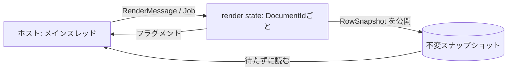

# 2026-10-03（土）

> 今日のひとこと：whatwg/htmlが、どのブラウザも出していない `MessagePort` の `close` イベントを仕様から外しました。Ladybirdは、描画のスタイル・レイアウトをメインスレッドから切り離す土台づくりを続けています。対象パッケージの新規の脆弱性アドバイザリはありませんでした。

## 今日のリリース

前回の実行（10-02 07:17 JST）以降に出た対象のリリースは、確認できた範囲ではありません（Next.js v16.3.8 / v15.5.27 は9/30、Biome v2.5.15 は9/30、oxlint v1.86.0 は9/28で、いずれも前回より前）。

## トップニュース

### HTMLが `MessagePort` の `close` イベントを取り下げる

【HTML】whatwg/htmlが、`MessagePort` の `close` イベントを入れたコミットのrevertを入れた（2026-10-02、5facb53）。どのブラウザも出荷していないイベントを、仕様から外した形だ。

**何が変わる**：`MessagePort` から `close` イベントがなくなる。あわせて、以前のGC（ガベージコレクション）の扱いに戻る。ポートは簡単には回収されず、相手側の持ち主ドキュメントが破棄されても明示的には切り離されない。相手がまだ生きているかはポーリングで見る。

**なぜ変えた**：コミットメッセージによると、どのブラウザも `close` イベントを出荷していない。GCの挙動もブラウザごとにばらばらで（Chromiumは開始済みのポートだけ回収不能、Firefoxは回収しない、WebKitはメッセージリスナーがあるときだけ回収不能。いずれもメッセージ中の記述で、筆者は未検証）、Firefoxの挙動に合わせるのが妥当だと判断している。#10201 と #12797 をクローズしている。

**何に効く・誰が困る**：`close` イベントを待つ設計のページは、仕様の根拠がなくなる。ただし出荷したブラウザがないので、実害は小さいと読める。実装側は、このイベントのために足したGCの特別扱いを持たなくてよくなる。

**ここまでの経緯**

- 過去の議論：#1766、#9933、#10201、#12797、#12957（コミットメッセージが「将来やり直すときの手がかり」として挙げているもの。日付は未確認）
- 2026-10-02：revert。WPTの側は web-platform-tests/wpt#63174
- 将来再び入れるなら、上のIssueとPRを読み直すことになる

出典: https://github.com/whatwg/html/commit/5facb53

## 今日の深掘り

### LadybirdがDocumentごとの「render state」をメッセージで包んでいく

**選んだ理由**：ブラウザエンジンの内部を、スレッド境界から作り直す過程が、コミットの並びからそのまま読める。読んだのはコミットメッセージと、その主張だけ。個々のRustのソースは、浅いcloneでは読めておらず、本文の引用はメッセージの要旨にとどめる（不明な点は不明と書く）。

**背景**：LadybirdのLibWebは、スタイルとレイアウトの計算をC++のメインスレッドで行ってきた。昨日の号で、スタイル・レイアウトをRust製のエンジンへ移す作業が続いていると書いた（[10-02の号](2026-10-02.md)）。今日の流れは、その次の段だ。

**変更点（コミットメッセージから読めること）**

- 1d8f3fe：Documentごとのrender stateを、ホストが発行する `DocumentId` をキーにしたマップで持つ。ホストはメッセージ（`Create` / `Destroy`）を送ることでしか触れない。メッセージを処理する側だけが `RenderingSide` という証明を発行でき、その型は `Send` でも `Sync` でもないので、処理中のスレッドの外に持ち出せない
- cdd320b：「render stateを描画スレッドへ移す」ために、アリーナ内の共有を `Rc` から `Arc` に変え、「スレッドをまたいでよい」ことをconstアサーションで確認する
- 94bb7ea：レイアウトの行を、不変のスナップショット（`RowSnapshot`）として公開する。`Send + Sync + 'static` で、アリーナへの借用を持たない。ホストは最新のスナップショットを参照カウントで持ち、待たずに読める。更新が必要なときだけ、待つ権利を使って公開し直す
- 1012605：レイアウトの各段階を、render stateへ送るジョブにする。ジョブはビューポートやquirksモードを持ち、計算結果のフラグメントを返す。反映（commit）はホスト側のまま

**この変更から分かる設計思想**：共有可変状態をやめ、「メッセージで頼み、不変のスナップショットで読む」形にしている。スレッド越えの安全性を、実行時の規律ではなく型（`Send` / `Sync` でない証明、constアサーション）で守ろうとしている。最終的にどのスレッド構成にするかは、今回のコミットからは読めない（不明）。推測だが、スタイル・レイアウトとJSを並行に動かす狙いと見える。

出典: https://github.com/LadybirdBrowser/ladybird/commit/1d8f3fe28fc6c9ee3b88fe2c3c44719143d9df32 、https://github.com/LadybirdBrowser/ladybird/commit/94bb7ea3a44f555f38f41baedcd83882113e18dd 、https://github.com/LadybirdBrowser/ladybird/commit/10126057f6224f704db8c4913d6322685e2aea05 、https://github.com/LadybirdBrowser/ladybird/commit/cdd320bad48b4be917e95686e62fe0b602b4df0e

## 仕様の変更

### whatwg/html

#### 通常のナビゲーションで、Navigation APIの追跡オブジェクトがなくても落ちない

【HTML】Navigation API経由で始まっていないナビゲーションには、進行中のAPIメソッドトラッカーが存在しない。そのため非nullの確認を足した（Fixes #13014）。
なぜ変えたか：トラッカーがないケースで、手順が存在しない値を参照してしまうため。
出典: https://github.com/whatwg/html/commit/0cd32204c6d9408be0a42cb15c86145e21deab9d

その他：

- `#process-scroll-behavior` で、`reload` ではスクロールを復元しない（[8c4a393](https://github.com/whatwg/html/commit/8c4a393a0d3053c1a18a9397e1958ab452c3e465)）
- イベントハンドラの「scripting is disabled」判定を、3つの条件に分けて直す（[eeb895f](https://github.com/whatwg/html/commit/eeb895f24e233e51ee50ca47f2e4a33ec3c1cfc1)）。WebDriver BiDiで無効化したときの挙動を戻す修正

### w3c/aria

その他：

- Accnameの「role」参照のあいまいさを解消（[#2917](https://github.com/w3c/aria/pull/2917)）
- 翻訳対象属性のi18n考慮事項（editorial、[#2862](https://github.com/w3c/aria/pull/2862)）

### w3c/wcag3

その他：

- 解説文書の用語定義を整理（[#872](https://github.com/w3c/wcag3/pull/872)）

動きなし：whatwg/dom, whatwg/fetch, whatwg/streams, whatwg/url, tc39/proposals, tc39/ecma262, w3c/csswg-drafts, w3c/ServiceWorker

## ブラウザの実装

取得できず（chromestatus.com・groups.google.comはegressでブロック。今回はChromiumのコミット履歴とWebSearchの確認もしていない）。

## OSSのPR

### TypeScript

#### `source phase imports` に対応する

【TypeScript】`import source x from "..."` のソースフェーズ・インポートを構文として受け付ける。新しい `lib.esnext.modulesource.d.ts` が `AbstractModuleSource`（`Symbol.toStringTag` を持つインターフェース）を宣言する。構文種別の列挙（`SyntaxKind`）が全面的に振り直され、Go側のAST・APIエンコーダと、Node向けAPIパッケージにも同じ変更が入る。
なぜ変えたか：PR本文は読めていない（不明）。提案のStageもここでは確認していない（不明）。
出典: https://github.com/microsoft/TypeScript/pull/63915

その他：

- VS Code拡張が、言語機能の応答にLSPミドルウェアを差し込めるようにする（[#64583](https://github.com/microsoft/TypeScript/pull/64583)）
- content-mappedファイルでJSXの自動挿入を有効化（[#64572](https://github.com/microsoft/TypeScript/pull/64572)）
- `verbatimModuleSyntax` で、既定インポートの隣の空の名前付きインポートを消す（[#64578](https://github.com/microsoft/TypeScript/pull/64578)）
- パス型の準備のバグ修正（[#64544](https://github.com/microsoft/TypeScript/pull/64544)）
- `Array.at` のドキュメントの語を修正（[#64536](https://github.com/microsoft/TypeScript/pull/64536)）

### Next.js

#### Turbopackの「ファサード経由のexport名短縮」が明示的なオプトインになる

【Next.js】名前空間オブジェクトが外に漏れるアプリでも短いキーの恩恵を受けたい人向けに、`experimental.turbopackMangleViaMaterializedNamespaceObject` を足した。未設定なら、`turbopackMangleExportNames` を明示的に `true` にしたときだけ有効になる。canaryの暗黙の本番短縮では有効にならない。
なぜ変えたか：#99285 のロールバックで、ローカル限りのモジュールは分割しない既定に戻した（リモートコンポーネントのシングルトン問題 #99279 を避けるため）。その続きとして、望む人だけが戻せる形にした（PR本文の要旨）。
出典: https://github.com/vercel/next.js/pull/99309

その他：

- 部分プリフェッチ（Partial Prefetching）が未設定のとき警告（[#99452](https://github.com/vercel/next.js/pull/99452)）
- バンドルアナライザー：route要約、比較ツリーマップでの変化表示、非同期モジュールのスコープ表示、ツールバーの再編成（[#98787](https://github.com/vercel/next.js/pull/98787)、[#98837](https://github.com/vercel/next.js/pull/98837)、[#98918](https://github.com/vercel/next.js/pull/98918)、[#98920](https://github.com/vercel/next.js/pull/98920)）
- Turbopackのモジュールキャッシュを `Map` に（[#98947](https://github.com/vercel/next.js/pull/98947)）
- Turbopack：`import.meta.url` を追加のrootでサポート（[#99511](https://github.com/vercel/next.js/pull/99511)）
- Turbopack：永続化の `MustExist` / `AllowMissing` のディスク読み取りの意味づけを改善（[#99249](https://github.com/vercel/next.js/pull/99249)）
- Turbopack：未使用キーのAMQFを32ビットのフィンガープリントに（[#99333](https://github.com/vercel/next.js/pull/99333)）
- Turbopack：outdated collectiblesを正しく維持し、無駄な再実行を防ぐ（[#99386](https://github.com/vercel/next.js/pull/99386)）
- Turbopack：転送しないはずの一時タスク参照を、シリアライズしていないと検証（[#99300](https://github.com/vercel/next.js/pull/99300)）
- App Pageのヘッダー解析をハンドラのエントリポイントへ移動（[#99506](https://github.com/vercel/next.js/pull/99506)）
- エージェント向けのアップグレード手順の整備とドキュメント（[#99293](https://github.com/vercel/next.js/pull/99293)、[#99536](https://github.com/vercel/next.js/pull/99536)ほか）
- ほか、デプロイテストの整理・ドキュメントの修正が十数件

### React

その他：

- `useDeferredValue` とエラー回復が重なったときの無限ループを修正（[#37739](https://github.com/facebook/react/pull/37739)）

### Solid

#### `next` ブランチで、小文字の `on*` は属性として扱うようになる（破壊的変更）

【Solid】`fix!` の印が付いた変更で、小文字の `on*` 名はイベントハンドラではなく属性として扱う。
なぜ変えたか：コミットは読めていない（本文は不明）。
出典: https://github.com/solidjs/solid/commit/4f676973d3274198975db898e598722f5038d2ff

その他：

- nonce付きCSPの下や、スタイルシートが先に読み込まれたときの、スタイルシート待ちフラグメントの表示を修正（[b57eb2e](https://github.com/solidjs/solid/commit/b57eb2e74c089d8a8af0a787b9973e1db3833239)）
- spreadで、子より先に属性を適用（ssrElementと一致）（[365f37d](https://github.com/solidjs/solid/commit/365f37d9d26132e37d2807d4c3f2c3d97d445462)）
- WASIフォールバックを、`/` に触れない環境（Android）でも読む（[41be120](https://github.com/solidjs/solid/commit/41be1205fc13cc08765597c4d6287fa478d6fb27)）
- コンパイル済みSSRのstyleオブジェクトで、計算キーが前の項目に連結される不具合を修正（[98d35b9](https://github.com/solidjs/solid/commit/98d35b9bcdb366efeb67ff551fd118ff76e5ef5b)）

### Vue

その他（`minor` ブランチ、Vapor Mode）：

- compiler-vapor：入れ子になったキャッシュ済みメンバー式を無視（[#15751](https://github.com/vuejs/core/pull/15751)）
- runtime-vapor：vdomのスロット内容を、アウトレットを描画するコンポーネントの下にマウント（[#15747](https://github.com/vuejs/core/pull/15747)）
- compiler-vapor：静的なstyleをvdomと同じくオブジェクトとしてコンポーネントに渡す（[#15745](https://github.com/vuejs/core/pull/15745)）

### Biome

その他：

- 新ルール `noZeroFractions`（[#9817](https://github.com/biomejs/biome/pull/9817)）
- 新ルール `useBigintLiterals`（[#11967](https://github.com/biomejs/biome/pull/11967)）
- 新ルール `noVueBooleanDefault`（[#12052](https://github.com/biomejs/biome/pull/12052)）
- `noUnknownAttribute` がReact 19のtransitionイベントを認識（[#12089](https://github.com/biomejs/biome/pull/12089)）
- HTMLフォーマッタ：スニペット定義をまとめ、必要なときだけ改行（[#12080](https://github.com/biomejs/biome/pull/12080)）
- migrate：未対応ルールの理由を追加（[#12069](https://github.com/biomejs/biome/pull/12069)）

### oxc

その他：

- oxfmt：代入ターゲットのプロパティを代入風に整形（[#27289](https://github.com/oxc-project/oxc/pull/27289)）
- フォーマッタ（CSS・Markdown・JSON）の修正が十数件（[#27288](https://github.com/oxc-project/oxc/pull/27288)、[#27284](https://github.com/oxc-project/oxc/pull/27284)、[#27278](https://github.com/oxc-project/oxc/pull/27278)ほか）
- minifier：入れ子のシーケンスを処理するときの依存関係を修正（[#27273](https://github.com/oxc-project/oxc/pull/27273)）
- lexer：`PairLuts` をヒープ確保・128バイト境界に揃える（[#27282](https://github.com/oxc-project/oxc/pull/27282)、[#27281](https://github.com/oxc-project/oxc/pull/27281)）

### react-hook-form

その他：

- Activityのサブツリーが再接続されたあと、`useWatch` の対象オブジェクトを更新（[#13819](https://github.com/react-hook-form/react-hook-form/pull/13819)）
- `keepDefaultValues` 付きの値なしresetで、`isDirty` を `false` に保つ（[#13820](https://github.com/react-hook-form/react-hook-form/pull/13820)）
- reset後のControllerのblur検証を復元（[#13817](https://github.com/react-hook-form/react-hook-form/pull/13817)）

### Servo

その他：

- `IntersectionObserver` の切断時に `connected_to_document` を更新（[#48581](https://github.com/servo/servo/pull/48581)）
- インラインボックスの開始位置を、ソフトラップの改行で巻き戻す（[#48564](https://github.com/servo/servo/pull/48564)）
- Web Audioの `DelayNode` を実装（サイクル処理なし、[#47957](https://github.com/servo/servo/pull/47957)）
- SVGのデータモデルを追加（[#48467](https://github.com/servo/servo/pull/48467)）
- `BrowsingContextGroup` を `ConstellationWebView` へ移動（[#48017](https://github.com/servo/servo/pull/48017)）
- WebGL：`blitFramebuffer` の前にフレームバッファを初期化（[#48571](https://github.com/servo/servo/pull/48571)）
- ほか、`JSContext` の整理やAndroid・ohosまわりが数件

### Ladybird

その他：前回の実行以降のコミットは333件（cloneの履歴から数えた）。大半が上の深掘りの一連（render state、style engine、レイアウトのジョブ化）。

- タッチパッドのフリングを実装（[f65f79c](https://github.com/LadybirdBrowser/ladybird/commit/f65f79c)）
- レンダラの描画側にフォント接続を持たせる（[5b28d6e](https://github.com/LadybirdBrowser/ladybird/commit/5b28d6e)）

### GHC

その他：

- `TrustOverlay` を組み込み（wired-in）ユニットへ拡張（[5438107](https://github.com/ghc/ghc/commit/54381079e5)）
- ローダが拒否するモジュールを `:add` しない（[c35096f](https://github.com/ghc/ghc/commit/c35096f55d)）
- `Bits` クラスの MINIMAL pragma から `bitSize` を削除（[1d2a26e](https://github.com/ghc/ghc/commit/1d2a26eee4)）

### Wado

その他：コミット約80件。このうち設計に関わるもの。

- 浮動小数点の演算子と `Ord` が、NaNを最大とする同じ順序を読むようにする（[12018a7](https://github.com/wado-lang/wado/commit/12018a7a48)）
- コンパイラの最適化（heap_effect、container_sroa、dce、inline）の高速化が複数件
- `docs/wep-*.md` の追加・変更は確認できず

動きなし：vitejs/vite（v8.3.2のあとコミットなし）, sveltejs/svelte, servo/stylo

## 脆弱性

新規のアドバイザリはありませんでした。次の一覧を確認しました：vercel/next.js（最新は9/30のSSRF）、TanStack/router（最新は9/30のReflected XSS）、withastro/astro（最新は8/27）、nuxt/nuxt（最新は7/27）、vitejs/vite（最新は6/1）。react、svelte、vuejs/core、oxcの一覧は取得していない。npm全体の新着（vm2、trigger.dev）は対象外。

## 仕様を読む会の候補

- HTML標準の `MessagePort` まわり（Web Messaging）：`close` イベントが外れた理由と、GCの扱いがブラウザごとに違う点を、仕様と実装の両面から読める。
- Source Phase Imports：TypeScriptが構文を受け付けた。提案の仕様と、`AbstractModuleSource` の位置づけを読む題材になる。
