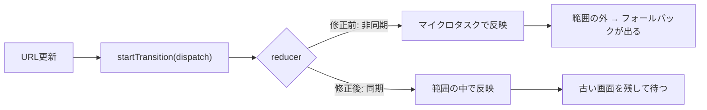

# 2026-10-04（日）

> 今日のひとこと：ECMAScript本体に `Iterator.prototype.join` が入りました（tc39/ecma262、Stage 3 の提案がそのまま仕様の本文へ）。Next.jsはURL更新で不要なSuspenseのフォールバックが出る不具合を直しました。対象パッケージの新規の脆弱性アドバイザリはありませんでした。

## 今日のリリース

前回の実行（10-03 07:16 JST）以降に出た対象の正式なリリースは、タグを確認した範囲ではありません。

## トップニュース

### ECMAScriptに `Iterator.prototype.join` が入る

【TC39】tc39/ecma262のmainに、`Iterator.prototype.join` を足す規範的な変更（Normative）が入った（2026-10-03 17:11 JST、6db9135、#3948、作者はKevin Gibbons）。イテレータの中身を、配列に変えずに1本の文字列へつなぐメソッドだ。

**何が変わる**：`Array.prototype.join` と同じ使い心地のメソッドが、イテレータに生える。区切り文字を渡し、省略時は `","`。`spec.html` に30行が足された（コミットを読んだ範囲）。手順の細部（`null` / `undefined` の扱い、エラー時にイテレータを閉じるか）は、手順の全文を読めていないので、ここでは断定しない（不明）。

**なぜ変えた**：提案リポジトリ（tc39/proposal-iterator-join）の説明では、イテレータを文字列にする操作は頻出だが、今は `Array.from()` で配列を作るか、`reduce()` で途中の文字列を作り空のイテレータで失敗する形になる。その無駄を省くのが動機だ。

**何に効く・誰が困る**：Iterator helpers（`map` / `filter` など）の鎖の最後に、`.join()` を直接つなげる。出荷しているエンジンの状況は、今回確認できていない（不明）。

**ここまでの経緯**

- 提案はStage 3（提案リポジトリのページより。Stageに上がった日付は未確認）
- 2026-10-03：仕様の本文（ecma262）に取り込み
- 過去の号での言及：未確認

出典: https://github.com/tc39/ecma262/commit/6db9135b3d77fd38a81a5a1f1bb6ed77fcca9066 、https://github.com/tc39/proposal-iterator-join

## 今日の深掘り

### Next.js：URL更新で出ていた不要なSuspenseフォールバックを、同期のreducerで防ぐ

**選んだ理由**：Reactの `startTransition` の意味が、非同期の関数を一段挟むだけで失われる、という設計上の落とし穴が1つのPRで読める。読んだのはPR本文の要旨まで。差分のコードは、ここでは読めていない（不明）。

**背景**：Next.jsのApp Routerは、`pushState` / `replaceState`、戻る・進む、bfcacheからの復元で、ルーターの状態を更新する。呼び出し側は `startTransition` の中で更新を投げている。トランジション中なら、Reactは新しい内容が用意できるまで古い画面を残し、Suspenseのフォールバックを出さない。

**変更点（PR本文より）**

- 原因：reducerが非同期関数で包まれ、結果の反映がマイクロタスクへ回っていた。反映が起きる頃には `startTransition` の範囲が閉じており、サスペンドした内容がフォールバックとして見えた
- 修正（#99612）：reducerを同期で動かし、結果を `startTransition` の範囲の中で反映する。bfcache復元だけにあった「緊急の更新」の特別扱いも消えた
- 同じ系統の #99611 で、浅い（shallow）URL更新のときにクライアントのparamsをサスペンドさせない。この差分も未読（不明）
- 以前の試み（#77582）は、性能の懸念でrevertされていたと本文にある

**この変更から分かる設計思想**：トランジションは「その呼び出しの同期的な範囲」に紐づく。だから、`await` や `.then` を挟むと意味が変わる。ルーターのような基盤では、非同期にして楽をするより、同期のまま結果を渡すほうが、Reactのスケジューラとの約束を守りやすい、という判断に見える（筆者の読み）。

出典: https://github.com/vercel/next.js/pull/99612 、https://github.com/vercel/next.js/pull/99611

## 仕様の変更

### tc39/ecma262

トップニュースで扱った。見出しと出典のみ：`Iterator.prototype.join` の追加（[#3948](https://github.com/tc39/ecma262/pull/3948)）。

### whatwg/html

その他（いずれもeditorial）：

- COOPのアクセスレポート用エンドポイントの確認手順を移動（[a5e1501](https://github.com/whatwg/html/commit/a5e1501)）
- `report-to` はURLではなくエンドポイント名、と直す（[fcc6b53](https://github.com/whatwg/html/commit/fcc6b53)）
- COOPまわりの引数・変数・リンクの取り違いを修正（[aa347f3](https://github.com/whatwg/html/commit/aa347f3)）
- 重複していたautofillトークンの制限を削除（[47c10fe](https://github.com/whatwg/html/commit/47c10fe)）

動きなし：whatwg/dom, whatwg/fetch, whatwg/streams, whatwg/url, tc39/proposals, w3c/csswg-drafts（editorialのみ）, w3c/aria, w3c/ServiceWorker, w3c/wcag3

## ブラウザの実装

取得できず（chromestatus.com・groups.google.comはegressでブロック。今回はChromiumのコミット履歴とWebSearchも確認していない）。

## OSSのPR

### Next.js

#### Turbopackが、ESMのexportの表現を軽くする

【Next.js】ライブバインディングと循環参照のため、ESMのexportはgetterとして結ぶ。ただし「値」とgetterの区別がつかないので、従来は値のたびに目印の `0` を前置していた。vercel-siteの実測ではexportの9割が値、getterは1割。そこで、getterのほうに目印を付ける形へ逆転し、出力のバイト数を減らす。
なぜ変えたか：多数派の側から目印を外して、出力サイズを減らすため（コミットメッセージ）。
出典: https://github.com/vercel/next.js/pull/98932

#### React Compilerの既存メモ化の保持を設定できる

【Next.js】`reactCompiler.enablePreserveExistingMemoizationGuarantees` を足した。`false` にすると既存のメモ化を取り除く。未指定なら、BabelかTurbopack（Rust）かの各実装の既定に従う。
なぜ変えたか：PR本文の要旨では、コンパイラの挙動を利用者が選べるようにするため。
出典: https://github.com/vercel/next.js/pull/98589

その他：

- Turbopackのトレースサーバー（MCP）に、割り当てとメモリのデータを追加（[#98546](https://github.com/vercel/next.js/pull/98546)）
- turbo-tasks-backend：変更の追跡でアクセスを確認し、シリアライズ時の無効化ではDataだけ追跡（[#99581](https://github.com/vercel/next.js/pull/99581)）
- turbo-tasks-backendのガードと実行コンテキストを簡素化（[#99599](https://github.com/vercel/next.js/pull/99599)）
- #99249 の後始末：冗長なテストを削り、欠けていた確認を常時有効に（[#99605](https://github.com/vercel/next.js/pull/99605)）
- #98932 が起こしたCIの失敗を修正（[#99621](https://github.com/vercel/next.js/pull/99621)）
- Dockerの例でpnpmのビルドを修正（[#97352](https://github.com/vercel/next.js/pull/97352)）

### TypeScript

その他：

- `getInferTypeParameters` の結果の順序を安定させる（[#64621](https://github.com/microsoft/TypeScript/pull/64621)）
- 誤って移植された `TokensAreOnSameLine` を修正（[#64597](https://github.com/microsoft/TypeScript/pull/64597)）
- ファイルパスを強い型にする（[#64159](https://github.com/microsoft/TypeScript/pull/64159)）

### Biome

その他：

- 新ルール `noIteratorProperty`（[#12083](https://github.com/biomejs/biome/pull/12083)）
- 型推論：mappedな `keyof` 型に対応（[#11854](https://github.com/biomejs/biome/pull/11854)）
- CSS：式ベースの `@at-root` クエリに対応、`if()` の旧構文と新構文を区別（[#12048](https://github.com/biomejs/biome/pull/12048)、[#12047](https://github.com/biomejs/biome/pull/12047)）
- SCSSのリスト式のパース修正（[#12096](https://github.com/biomejs/biome/pull/12096)）
- `useImportExtensions` がHTMLモジュールを考慮（[#12104](https://github.com/biomejs/biome/pull/12104)）
- `noUnknownAttribute` を二分探索にして高速化（[#12091](https://github.com/biomejs/biome/pull/12091)）
- migrate：空の入れ子設定に対応（[#12075](https://github.com/biomejs/biome/pull/12075)）
- `noDuplicateFontNames` が `monospace, monospace` を許す（[#12068](https://github.com/biomejs/biome/pull/12068)）
- ほか、ドキュメント・CIの整理が数件

### oxc

その他：

- linter_codegenが、変わらない生成ファイルを書き換えない（[#27293](https://github.com/oxc-project/oxc/pull/27293)）

### react-hook-form

その他：

- subscribeで、購読名の照合時のメモリ割り当てを減らす（[#13823](https://github.com/react-hook-form/react-hook-form/pull/13823)）

### Servo

その他：

- `beforeinput` を実装（[#48519](https://github.com/servo/servo/pull/48519)）
- 入力型向けのUAShadowRootを実装（[#48586](https://github.com/servo/servo/pull/48586)）
- 保留中のタイマーコールバックが、GCルートから常に到達できるようにする（[#48548](https://github.com/servo/servo/pull/48548)）
- `<image>` の変更で `width` を関連する変更と見なさない（[#48599](https://github.com/servo/servo/pull/48599)）
- `PromiseJobCallback` を削除（[#48600](https://github.com/servo/servo/pull/48600)）
- WebDriver：null/key/pointer/wheelのアクションの継続時間の検証（[#48585](https://github.com/servo/servo/pull/48585)）
- ほか、Androidのフレーム更新・ライフサイクルをComposeへ移す整理が数件、WPTの修正

### Svelte

その他：

- ドキュメント修正のみ（[#18851](https://github.com/sveltejs/svelte/pull/18851)、[#18917](https://github.com/sveltejs/svelte/pull/18917)）

### Solid

その他（`next` ブランチ）：

- 遅れて来たhydrationのclaimが、サーバーのノードを残してしまう不具合を修正（[e44b2e4b](https://github.com/solidjs/solid/commit/e44b2e4b)）
- `h`：呼び出し側のpropsを書き換えずに要素を実体化（[9e85a092](https://github.com/solidjs/solid/commit/9e85a092)）

### Vue

その他（`minor` ブランチ、Vapor Mode）：

- compiler-vapor：キャッシュした識別子が `_ctx` を隠さないようにする（[#15763](https://github.com/vuejs/core/pull/15763)）
- runtime-vapor：hydration終了後にappのmountedフックを実行（[#15753](https://github.com/vuejs/core/pull/15753)）

### Ladybird

その他：前回の実行以降のコミットは168件（cloneの履歴から数えた）。中心は、スタイル・描画の更新を別スレッドのステージに出すための、ホストとの受け渡しの整備。中身は読めていない（コミットの題名のみ）。

- レンダリング更新のスタイル・トランザクションを「飛ばす」形にする（[b4f107c](https://github.com/LadybirdBrowser/ladybird/commit/b4f107c)）
- ホストがステージスレッドへジョブを出して、待たずに進める（[f293558](https://github.com/LadybirdBrowser/ladybird/commit/f293558)）
- レンダリング更新のディスプレイリストを、イベントループの横で記録（[82cce6f](https://github.com/LadybirdBrowser/ladybird/commit/82cce6f)）
- フォントのデータを、ファイルのマップから直接持つ整理（LibGfx / LibCore、数件）
- LibJS：Iterator コンストラクタ、`padStart` / `padEnd` の結果長の確認、BigIntの右シフトの畳み込みなど仕様の細部の修正が十数件

### Wado

その他：コミット41件。`docs/wep-*.md` は4本が変更された（wasm-import、inspect-debug-output、kiln、comparison-traits）。

- 符号なし整数の単項マイナスを廃止し、`wrapping_neg` を追加（破壊的、[0b7d788](https://github.com/wado-lang/wado/commit/0b7d788187)）
- f32/f64の `minimum` / `maximum` を `ieee754_min` / `ieee754_max` に改名し、6つの `ieee754_*` 比較を仕様化（[94935ef](https://github.com/wado-lang/wado/commit/94935efa78)、[6495627](https://github.com/wado-lang/wado/commit/6495627e28)）
- クロージャ・関数値は `Display` を持たない（[c01a82b](https://github.com/wado-lang/wado/commit/c01a82b2fe)）
- `.wasm` / `.wat` のimportは `type` なしだとコンパイルエラー（[d780ede](https://github.com/wado-lang/wado/commit/d780ede638)）

動きなし：facebook/react, vitejs/vite, servo/stylo, ghc/ghc

## 脆弱性

新規のアドバイザリはありませんでした。確認した一覧：vercel/next.js（最新は9/30）、TanStack/router（最新は9/30のReflected XSS）。ほか（react、vite、svelte、vuejs/core、oxc、astro、nuxt）の一覧は、今回は取得していない。

## 仕様を読む会の候補

- Iterator helpers と `Iterator.prototype.join`：イテレータレコードの扱いと、`Array.prototype.join` との差を、仕様の手順で読める。
- Navigationとトランジション：Next.jsの `startTransition` の話を、Reactのスケジューラ側から読む題材になる。
