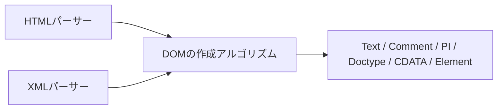

# 2026-10-05（月）

> 今日のひとこと：Ladybirdが、Cookieと HTTP キャッシュを「トップレベルのサイト」ごとに分ける変更を入れました（site partitioning）。whatwg/htmlでは、XMLパーサーがDOMのノード作成アルゴリズムを使う形に仕様が整いました。対象パッケージの新規の脆弱性アドバイザリはありませんでした。

## 今日のリリース

前回の実行（10-04 07:16 JST）以降に出た対象の正式なリリースは、タグを確認した範囲ではありません（Next.jsの `v16.4.0-canary.59` は先行版なので載せない）。

## トップニュース

### LadybirdがCookieとHTTPキャッシュをサイトごとに分ける

【Ladybird】LadybirdBrowser/ladybirdのmasterに、サードパーティCookieとHTTPキャッシュを「トップレベルのサイト」単位で分割するコミットが入った（2026-10-04 JST、キャッシュは 02253c9、Cookieは 0ea38de）。どちらも、これまで全サイトで1つを共有していた状態を解消する。

**何が変わる**

- キャッシュ（02253c9）：エントリのキーが、URLとメソッドだけだった。リクエストに「network isolation key」（トップレベルのサイト、フレームのサイト、サブフレームかなどのフラグ）を持たせ、Fetchの network partition key として使う。RequestServerがディスクキャッシュのキーに織り込む。コンパイル済みWebAssemblyのキャッシュも対象
- Cookie（0ea38de）：サードパーティの文脈で付いたCookieは、付いたときのトップレベルのサイトに属する。祖先にクロスサイトのフレームがあれば、自分のサイト内でもサードパーティ扱い。既存のCookieは移行処理でファーストパーティ扱いのまま残す

**なぜ変えた**：コミットメッセージによれば、あるサイトが別のサイトの読み込み済みの内容を探れ（キャッシュの探り）、キャッシュされたバイトコードをほかのサイトに渡せた。Cookieも、UIプロセスがどのRequestServerクライアントにも任意のURLのCookieを渡していた。いずれも trailofbits/ptp-ladybird の指摘（#354、#515）への対応と書かれている。キーの設計は「Chromeをモデルにした」とある。

**何に効く・誰が困る**：同じ埋め込みを多数のサイトで使っていたものは、サイトごとにキャッシュのヒットやCookieが分かれる。ブラウザを作る側には、分割の単位をどこで決めるか（`URL::Site` の補助、`file:` は1サイト扱い、opaque originのフレームはディスクキャッシュなし）の見本になる。

**ここまでの経緯**

- 10-03・10-04の号：Ladybirdの描画まわりの切り離しを追ってきた（別の流れ）
- 2026-10-04：サイトの分離（WebDriverの既定がiframeのsite isolation、804d29b）、Cookie、キャッシュと続けて入った。ptp-ladybird#1058 への作業の一部（コミット本文より）

出典: https://github.com/LadybirdBrowser/ladybird/commit/02253c9f02a98c466c41c4697e8152c267755fa5 、https://github.com/LadybirdBrowser/ladybird/commit/0ea38de0fa2a0e02b810cd990e88de6505e2fb97

## 今日の深掘り

### whatwg/html：XMLパーサーが、DOMのノード作成アルゴリズムを使う

**選んだ理由**：仕様の記述が「ブラウザが好きに作ってよい」から「このアルゴリズムで作る」へ変わる、小さいが典型的な変更で、diffが短く全部読める。

**背景**：コミット 4c5586a のメッセージによれば、XMLパーサーの節は、要素の作り方（create an element for a token）しか定めておらず、それは接頭辞（prefix）を常にnullで作る。ほかのノードは、realmが仕様で決まっておらず、処理命令（processing instruction）には属性のマップがなく、`getAttribute()` が null を返していた。HTMLパーサーのほうは、別のコミット 85f453b で同じ整理が済んでいる。

**変更点**（`source`、35行追加・9行削除）

- `create an element for a token` に、省略可能な `prefix`（既定null）を足した。中の呼び出しが、決め打ちのnullから `prefix` に変わる
- XMLパーサーの節の文章が、「要素には等価な手順でよい」から、ノードの種類ごとの一覧に置き換わった

```text
- 要素：create an element for a token（要素の接頭辞を渡す）
- Text：create a text node
- CDATASection：create a CDATA section node
- Comment：create a comment node
- ProcessingInstruction：create a processing instruction node
- DocumentType：create a doctype
```

CDATASection用の作成アルゴリズムは、直前のdomのコミット 5e70d79（Editorial: add create a CDATA section node）で足された。htmlの側は、その定義を `data-x-href` で参照している。

**周辺コード**：DOMの仕様側に「ノードを作る手順」が名前付きで揃い、HTMLのHTMLパーサーとXMLパーサーの両方がそれを呼ぶ形になった。



**この変更から分かる設計思想**：パーサーが「どんな木を作るか」ではなく、「どの作成手順を呼ぶか」で書く。realmや属性マップのような細部の決め忘れが、作成手順の側に1回だけ書けば全パーサーに効く。実装（ブラウザ）の挙動の食い違いも、仕様の側から減らせる、という狙いに読める（筆者の読み。ブラウザの対応状況は未確認、不明）。

出典: https://github.com/whatwg/html/commit/4c5586afa4fc6f2feeebcd25be1dca017cb51298 、https://github.com/whatwg/dom/commit/5e70d79

## 仕様の変更

### whatwg/html

深掘りで扱った。見出しと出典のみ：XMLパーサーがDOMのノード作成アルゴリズムを使う（[4c5586a](https://github.com/whatwg/html/commit/4c5586afa4fc6f2feeebcd25be1dca017cb51298)）。

### whatwg/dom

- Editorial：create a CDATA section node の定義を追加（[5e70d79](https://github.com/whatwg/dom/commit/5e70d79)。editorialだが、上の深掘りの前提になっている）

動きなし：whatwg/fetch, whatwg/streams, whatwg/url, tc39/proposals, tc39/ecma262, w3c/csswg-drafts, w3c/aria, w3c/ServiceWorker, w3c/wcag3

## ブラウザの実装

### Servo / Stylo

#### CSSの `progress()` がServoとStyloで既定で有効になる

【Servo】`layout.css.progress-function.enabled` が既定でonになった（stylo [#471](https://github.com/servo/stylo/pull/471)、servo [#48474](https://github.com/servo/servo/pull/48474)、作者はOriol Brufau）。
なぜ変えたか：stylo側の本文に、Firefoxが出荷している（Bugzilla 2047345）とある。Firefoxと共有するStyloの設定を、Servoも合わせた。中身（関数の仕様）は未確認で、不明。
出典: https://github.com/servo/stylo/pull/471

取得できず（chromestatus.com・groups.google.comはegressでブロック）。Chromiumの `runtime_enabled_features.json5`、web-platform-tests/interop は、今回は確認していない。

## OSSのPR

### Ladybird

トップニュースで扱った（キャッシュ・Cookieの分割）。その他、88コミット。主なもの：

#### ゲームパッド入力をサンドボックスの中で扱う

【Ladybird】WebContentからゲームパッドを直接読まず、UI側のサービス経由にして、状態が変わったときだけ読む（[754e1f8](https://github.com/LadybirdBrowser/ladybird/commit/754e1f8)、[e03c110](https://github.com/LadybirdBrowser/ladybird/commit/e03c110)ほか）。
なぜ変えたか：コミット題名から読める範囲では、レンダラープロセスの権限を減らすため（理由の本文は未読、推測）。
出典: https://github.com/LadybirdBrowser/ladybird/commit/754e1f8

その他：

- opener policy（COOP）をレスポンスから強制し、破棄されたopenerをnullに（[4e371ba](https://github.com/LadybirdBrowser/ladybird/commit/4e371ba)、[bae3b70](https://github.com/LadybirdBrowser/ladybird/commit/bae3b70)）
- フォントの問い合わせを、専用のfont serviceの接続に統一（[7355c17](https://github.com/LadybirdBrowser/ladybird/commit/7355c17)ほか）
- LibJS：JSONの不正入力の拒否、`JSON.rawJSON` の検証、`for await` のトップレベル扱いなど、仕様適合の修正が十数件（[f323ed6](https://github.com/LadybirdBrowser/ladybird/commit/f323ed6)ほか）
- 画像・object要素のload delayの解放漏れを修正（[2110bad](https://github.com/LadybirdBrowser/ladybird/commit/2110bad)ほか）
- スタイルの一括更新、GCで生存させる対象の修正など、LibWebの内部整理（多数）

### Servo

- `<marquee>` の寸法属性を実装（[#48604](https://github.com/servo/servo/pull/48604)）
- `<input type="image">` に対応（[#48265](https://github.com/servo/servo/pull/48265)）
- flexアイテムのcross sizeが先に分かる場合のレイアウトを1回に（[#48485](https://github.com/servo/servo/pull/48485)）
- 「fetch and process the linked resource」のアロケーションを削減（[#48615](https://github.com/servo/servo/pull/48615)）
- Androidのstop navigationを `ServoNavigator` へ移動（[#48608](https://github.com/servo/servo/pull/48608)）
- WPT同期（[#48614](https://github.com/servo/servo/pull/48614)）

### Solid（`next` ブランチ）

#### signalsのコアを「hold model」で作り直す

【Solid】ブランチ `next` のsignalsコアが、トランザクションを唯一の保持関係（hold）とするモデルで書き直された（[#3774](https://github.com/solidjs/solid/pull/3774)、1b9ceb67）。題名に「フロアが−23%、hello worldが−18%」とある。
なぜ変えたか：サイズ削減のための計画（`documentation/plans/size-reduction-carve-step1.md`）に沿った作業。本文には、テストが97件失敗（うち66件は既存）のチェックポイントだと書かれている。まだ途中の状態で、完成形ではない。
出典: https://github.com/solidjs/solid/pull/3774

その他：

- ベンチマークをビルド後のパッケージで測るよう変更（[#3776](https://github.com/solidjs/solid/pull/3776)）
- SSRのレスポンスが、body取消と事前の redirect で描画を止めるよう修正（[#3772](https://github.com/solidjs/solid/pull/3772)）
- 描画前に起きたリクエスト失敗を報告（[#3763](https://github.com/solidjs/solid/pull/3763)）

### oxc

- パーサー：TypeScriptのクラス修飾子をJSで拒否、abstract private fieldのエラー、overload診断のspan修正（[#27312](https://github.com/oxc-project/oxc/pull/27312)、[#27314](https://github.com/oxc-project/oxc/pull/27314)、[#27313](https://github.com/oxc-project/oxc/pull/27313)）
- linter：jsx-a11yの `label-has-associated-control`、`mouse-events-have-key-events`、`lang` の検証修正（[#27302](https://github.com/oxc-project/oxc/pull/27302)、[#27306](https://github.com/oxc-project/oxc/pull/27306)、[#27304](https://github.com/oxc-project/oxc/pull/27304)）
- `react/no-unescaped-entities` にsuggestionを実装（[#27292](https://github.com/oxc-project/oxc/pull/27292)）
- AST：`debug_name` の戻り値のlifetimeを元のASTノードに結び付けた（[#27295](https://github.com/oxc-project/oxc/pull/27295)）
- minifier：不要なunfoldを削除（[#27297](https://github.com/oxc-project/oxc/pull/27297)）

### Biome

- lint：`noProcessExit` を追加（[#12122](https://github.com/biomejs/biome/pull/12122)）
- lint（Svelte）：`noSvelteInspect` を追加（[#12067](https://github.com/biomejs/biome/pull/12067)）
- CSS：dynamic supports heads に対応（[#12127](https://github.com/biomejs/biome/pull/12127)）

### react-hook-form

- `useFieldArray`：親の配列が再インデックス中は unregister をスキップ（[#13828](https://github.com/react-hook-form/react-hook-form/pull/13828)）
- フォームの準備前に入力した値を保持（[#13827](https://github.com/react-hook-form/react-hook-form/pull/13827)、#13802）

### Wado

167コミット。`docs/wep-*.md` の更新があった：trait resolution（wep-2026-09-01）、comparison traits（wep-2026-09-23）、wasi-webgpu（wep-2026-09-19）、tagged template literals（wep-2026-01-10）。traitの解決では「member walk」の仕組みが取り除かれた（[287fd6d](https://github.com/wado-lang/wado/commit/287fd6dfc2)）。中身の設計は未読（不明）。

動きなし：facebook/react, vercel/next.js（先行版のみ）, vitejs/vite, microsoft/TypeScript, sveltejs/svelte, vuejs/core（`minor`）, ghc/ghc

## 脆弱性

対象パッケージ（react, next, vite, svelte, vue, oxc, astro, nuxt, TanStack Start）のアドバイザリ一覧を確認し、前回の実行以降に公開されたものはなかった。直近はNext.jsとTanStack Startの9月30日公開分（10-01の号で扱った）。

## 仕様を読む会の候補

- whatwg/htmlの「The XML parser」の節と、DOMの「create a …」系アルゴリズム：今日の変更で両者のつながりが見える。短く、1回で読み切れる
- Fetchの「network partition key」と HTTP cache partitioning：LadybirdのコミットをFetchの該当手順と並べると、仕様の語彙がどう実装の鍵になるかが読める
