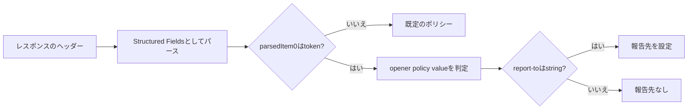

# 2026-10-06（火）

> 今日のひとこと：Next.jsが `forbidden()` と `unauthorized()` を実験機能から外し、設定フラグ `authInterrupts` なしで使えるようにしました。whatwg/htmlでは、COOP・COEPヘッダーの値を Structured Fields の型（token と string）で厳密に読む仕様になりました。対象パッケージの新規の脆弱性アドバイザリはありませんでした。

## 今日のリリース

- 【oxc】oxlint v1.87.0 / oxfmt v0.72.0：`react/no-unescaped-entities` などのlintルール3件にsuggestionが入り、oxfmtはMarkdownを `oxc_formatter_markdown` で整形するようになった（出典: https://github.com/oxc-project/oxc/releases/tag/oxlint_v1.87.0 、oxfmtの変更は [#27256](https://github.com/oxc-project/oxc/pull/27256)）

crates の `oxc` v0.153.0 も同日に出ている。Next.jsの `v16.4.0-canary.60` などは先行版なので載せない。

## トップニュース

### Next.jsが `forbidden()` と `unauthorized()` を安定版にする

【Next.js】vercel/next.jsのcanaryで、`forbidden()` と `unauthorized()` が実験機能から外れた（2026-10-05、[#99689](https://github.com/vercel/next.js/pull/99689)、作者はAndrew Clark、6194d64）。ゲートだった `experimental.authInterrupts` は非推奨になり、指定しても効かない。

**何が変わる**

- `next.config.js` で `authInterrupts: true` を立てなくても、`forbidden.tsx` / `unauthorized.tsx` と、同名の関数が使える
- 設定を持ち回っていた経路（`authInterrupts` を引数に通していた `create-component-tree.tsx` など）が、約40ファイルから消えた。差分は +48 / −263 行
- `config.ts` の `checkDeprecations` に、`experimental.authInterrupts` を使っていると警告を出す処理が足された

**なぜ変えた**：PR本文は「安定化し、フラグを非推奨にする」とだけ書く。実験フラグの先頭にあった「APIが安定したら削除する」というTODOコメントを、実行に移した形。

**注意点（PR本文より）**：`forbidden.ts` / `unauthorized.ts` のバウンダリは、通常のページ描画の一部として先に送られる。あとで遅延描画にする最適化が計画されていて、error や not-found のページと同じ最適化だという。

**何に効く・誰が困る**：認証・認可の失敗を、404とは別にHTTP 403 / 401として扱いたいアプリが、フラグなしで使える。フラグを立てていた既存のアプリは、警告が出るだけで壊れない。

**ここまでの経緯**（日付は、本リポジトリの過去の号にこの題材が出ていないため、PRで確認できた範囲のみ）

- 実験機能として `authInterrupts` の裏に置かれていた（導入のPRは未確認、不明）
- 2026-10-05：安定化（#99689）。遅延描画の最適化は未着手

出典: https://github.com/vercel/next.js/pull/99689

## 今日の深掘り

### whatwg/html：COOP・COEPヘッダーを「型」で読む

**選んだ理由**：ヘッダーの値の解釈が、「パースして中身を見る」から「パースした値の型まで検査する」に変わる、小さく読み切れる変更。仕様と実装（ChromiumとWebKit）が食い違っていたとき、仕様のほうを実装に合わせる判断が見える。

**背景**：`Cross-Origin-Opener-Policy`（COOP）と `Cross-Origin-Embedder-Policy`（COEP）は、HTTPのStructured Fieldsという型つきの文法で書くヘッダー。値は token（`same-origin` など）で、`report-to` パラメーターに報告先の名前を付けられる。ところが仕様の手順は、パース結果の型を確かめていなかった。たとえば値が文字列（`"same-origin"`）や数値でも、先頭の要素を比較する手順に進んでしまう。

**変更点**（`source`、24行追加・14行削除。コミット bf84f3c）

COOPの手順は、パース結果 `parsedItem` が token かどうかを先に確かめるようになった。

```text
- If parsedItem is not null:
+ If parsedItem is not null and parsedItem[0] is a token:
```

`report-to` のほうは、COOPでは「文字列なら」と書かれていたものが、構造化ヘッダーの string 型を指す形に直った。COEPでは「`report-to` があれば」だったので、「あって、しかも string なら」と条件が増えた。

コミットメッセージには、きまりの悪い点も書かれている。報告先の名前（endpoint name）は本来 token のはずで、Permissions-Policy など他のヘッダーは `report-to` に token を使う。それでも ChromiumとWebKitが string を要求しているので、いまは仕様をそれに合わせた。テストは web-platform-tests/wpt#63239。

**周辺コード**



**この変更から分かる設計思想**：仕様が実装に追いつくときは、「あるべき姿」より「相互運用できている姿」を先に書く（コミットメッセージが、あるべき姿との食い違いを認めたうえでそうしている）。型の検査を手順に明示すると、どのブラウザでも同じ入力に同じ結果が出る、というWPTの検証の土台になる。

ブラウザの実装への影響は未確認（コミットメッセージによれば、ChromiumとWebKitはすでにこの挙動）。

出典: https://github.com/whatwg/html/commit/bf84f3c5a9cf87ac0a9f6461f32151971ad2279b

## 仕様の変更

### whatwg/html

#### COOP・COEPが Structured Fields の型を検査する

深掘りで扱った。出典: https://github.com/whatwg/html/commit/bf84f3c5a9cf87ac0a9f6461f32151971ad2279b

#### script の `type` 属性の空白を、classic 以外では削らない

【HTML】`type=" module "` は、module script として扱われなくなった。JavaScriptのMIMEタイプかどうかを判定するときだけ、前後のASCII空白を削る。
なぜ変えたか：WebKitとChromiumがすでにそう実装していて、仕様を合わせた（Fixes #13012）。
出典: https://github.com/whatwg/html/commit/ac737fa

その他：

- サニタイズのアルゴリズムが、MathMLの `<a>` を扱うようになった（[7adadbe](https://github.com/whatwg/html/commit/7adadbe)）
- Infraの等価性の語彙に統一（Editorial、[81b92f4](https://github.com/whatwg/html/commit/81b92f4)）

### whatwg/dom

- PIのシリアライズで、`>` の文字参照を直した（[b76da7a](https://github.com/whatwg/dom/commit/b76da7a)）

### w3c/aria

- html-aam の `abbr` まわりのPRを取り込み（[#2927](https://github.com/w3c/aria/pull/2927)。中身は未読、不明）

動きなし：whatwg/fetch, whatwg/streams, whatwg/url, tc39/proposals, tc39/ecma262, w3c/csswg-drafts, w3c/ServiceWorker, w3c/wcag3

## ブラウザの実装

### Servo / Stylo

- Styloを 2026-10-01 版に更新（[servo#48528](https://github.com/servo/servo/pull/48528)）
- stylo側で、Firefoxの変更に追従する修正が2件（0cb5092、3dc2c8f。それぞれ Phabricator D324114・D324125 への fixup）

### Ladybird

#### LibJSとLibWebの境界を「host object」に寄せる作業が続く

【Ladybird】`JS::Object` からLibWeb向けの述語を取り除き（57ae32c）、platform object、WindowProxy、interface constructor、WebAssembly の関数・モジュールなどを、LibJS側が用意するhost objectとして作り直す一連のコミットが入った。`Iterator.prototype.join` の実装（99e1e5a）も同じ並びにある。
なぜ変えたか：コミット題名から読める範囲では、LibJSがLibWebの型を知らなくてよい形にして、エンジンを埋め込み用のAPIとして切り出すため。理由の本文は未読で、推測。10-05の号で見たGCディスパッチの話（BACKLOGの候補）とも地続きに見える。
出典: https://github.com/LadybirdBrowser/ladybird/commit/57ae32c

取得できず（chromestatus.com・groups.google.comはegressでブロック）。Chromiumの `runtime_enabled_features.json5`、web-platform-tests/interop は、今回は確認していない。

## OSSのPR

### Next.js

`forbidden()` / `unauthorized()` の安定化は、トップニュースで扱った。

#### Instant Insightsに `prefetch()` と navigation の項目が入る

【Next.js】開発時のオーバーレイで、プリフェッチとナビゲーションの即時性を示す情報が増えた（[#97801](https://github.com/vercel/next.js/pull/97801)）。あわせてPartial Prefetchingの周辺（[#99659](https://github.com/vercel/next.js/pull/99659)、[#99665](https://github.com/vercel/next.js/pull/99665)、[#99679](https://github.com/vercel/next.js/pull/99679)）が動いている。
なぜ変えたか：PR本文は未読で、不明。
出典: https://github.com/vercel/next.js/pull/97801

その他：

- `'use cache'` のroot paramへの依存をビルド時に集める（[#99274](https://github.com/vercel/next.js/pull/99274)）
- PPFのruntime prerenderで、同期IOのエラーをログに出す（[#99688](https://github.com/vercel/next.js/pull/99688)）
- 設定オブジェクトを書き換えずに、compile-modeのメタデータなどを外に持つ整理（[#99496](https://github.com/vercel/next.js/pull/99496)、[#99491](https://github.com/vercel/next.js/pull/99491)、[#99490](https://github.com/vercel/next.js/pull/99490)）
- eslint-config-nextがESLint 10に対応（[#99628](https://github.com/vercel/next.js/pull/99628)）
- Turbopackのruntimeファイルを全部型検査に（[#99670](https://github.com/vercel/next.js/pull/99670)）
- 耐久的な `use cache` エントリの環境変数リストをソート（[#99657](https://github.com/vercel/next.js/pull/99657)）
- バンドルアナライザーのデルタの色を統一（[#99607](https://github.com/vercel/next.js/pull/99607)）
- next-swcのネイティブビルドの再実行条件を修正（[#99669](https://github.com/vercel/next.js/pull/99669)）

### Solid（`next` ブランチ）

ほかに40件近いコミット。主なもの：

#### signalsに「semantic fuzzer」が見つけた不具合の修正が続く

【Solid】Ryan Carniatoが、意味論のファズ（semantic fuzzer）で見つけた不具合を、ルールに沿って直している（[#3801](https://github.com/solidjs/solid/pull/3801)、[#3798](https://github.com/solidjs/solid/pull/3798)、[#3806](https://github.com/solidjs/solid/pull/3806)）。lane（並行する更新の単位）への所属の裁定が入った。
なぜ変えたか：題名から読める範囲では、実装の穴を手書きのテストではなくファズで洗い出し、見つかった挙動を仕様のルールに戻して決めるため（推測）。中身は未読。
出典: https://github.com/solidjs/solid/pull/3806

その他：

- SSR：中断したshellが `<Errored>` の上でも `<Loading>` の内容を保つ、ストリーム描画の終了が中断中のshellを待つ（[#3770](https://github.com/solidjs/solid/pull/3770)、[#3771](https://github.com/solidjs/solid/pull/3771)）
- hydrationペイロードが、自分で出したrejectionを受け持つ（[#3803](https://github.com/solidjs/solid/pull/3803)）
- 通常のflushで、effectキューの統合をスキップするperf改善（[#3790](https://github.com/solidjs/solid/pull/3790)）
- compilerのソース位置（TSRX、SSR captures、行終端の数え方）の修正が約10件（[#3805](https://github.com/solidjs/solid/pull/3805)ほか）
- effectコールバックの推論でタプルを保つ型修正（[#3795](https://github.com/solidjs/solid/pull/3795)）

### oxc

- lexer：文脈の判定を「全体を歩く」実装に統一（[#27354](https://github.com/oxc-project/oxc/pull/27354)、[#27353](https://github.com/oxc-project/oxc/pull/27353)）
- oxfmt：Markdownを `oxc_formatter_markdown` で整形（破壊的変更、[#27256](https://github.com/oxc-project/oxc/pull/27256)）。日本語・中国語の周りの改行の保持（[#27331](https://github.com/oxc-project/oxc/pull/27331)）
- linter：`unicorn/prefer-query-selector` に `allowWithVariables`（[#27346](https://github.com/oxc-project/oxc/pull/27346)）
- minifier：`yield` の `undefined` 引数を畳む（[#27324](https://github.com/oxc-project/oxc/pull/27324)）
- semantic：`TSMethodSignature` の computed キーを外側のスコープで訪問（[#27357](https://github.com/oxc-project/oxc/pull/27357)）
- formatter_css：mdn-contentで見つかったレイアウトの修正（[#27326](https://github.com/oxc-project/oxc/pull/27326)）

### Biome

- lint：`noTailwindRestyledComponents` を追加（[#11801](https://github.com/biomejs/biome/pull/11801)）
- lint：`useLogicalProperties` が値も対象に（[#11953](https://github.com/biomejs/biome/pull/11953)）
- lint：`noIteratorProperty` の追加をrevert（[#12148](https://github.com/biomejs/biome/pull/12148)）
- migrate：対応しないルールの理由を追加（[#12142](https://github.com/biomejs/biome/pull/12142)）
- `noSelfAssign` が等価なメンバー名を比べる（[#12155](https://github.com/biomejs/biome/pull/12155)）
- Tailwindのパーサー、SCSSのpercentage stepsの修正（[#12152](https://github.com/biomejs/biome/pull/12152)、[#12128](https://github.com/biomejs/biome/pull/12128)）

### TypeScript

- importsの再開始：後から来たファイルが `node_modules` の深さを下げたとき（[#64632](https://github.com/microsoft/TypeScript/pull/64632)）
- Sessionのidle cache cleanタイマーが保存されない不具合を修正（[#64624](https://github.com/microsoft/TypeScript/pull/64624)）
- 古いローカライズのhandbackを削除（[#64620](https://github.com/microsoft/TypeScript/pull/64620)）

### Vue（`minor`）

- compiler-vapor：コンポーネント内の素の `<template>` で、親のスロットを分離（[#15772](https://github.com/vuejs/core/pull/15772)）
- compiler-vapor：空のディレクティブ式でも正しいコードを生成（[#15771](https://github.com/vuejs/core/pull/15771)）

### Ladybird

上のブラウザの実装の節のほか、LibWebでcontainer queryの `::before` / `::after` の再構築と表示切り替えをオフスレッドで行う変更（81a3c87、8dd35af）など、約290コミット。

### Servo

- 圧縮・展開ストリームと、ストリームのchunk読み取りで一時コピーを減らす（[#48654](https://github.com/servo/servo/pull/48654)、[#48646](https://github.com/servo/servo/pull/48646)）
- JS値の変換で、typed arrayなどのインターフェースをsequenceより優先（[#48640](https://github.com/servo/servo/pull/48640)）
- `hyper` のkeep-alive接続に上限（[#48645](https://github.com/servo/servo/pull/48645)）
- WebGL 2の `*_BITS` をdraw framebufferから読む（[#48651](https://github.com/servo/servo/pull/48651)）
- そのほかAndroid、build、a11yテストなど

### GHC

- `HsModuleName` をASTに、`ModuleName` をGHC側に分ける（Trees that Growの整理、[575c4bc](https://github.com/ghc/ghc/commit/575c4bc6cb)）

### Wado

約120コミット。WEP（`docs/wep-*.md`）では、HashMap / HashSetの設計（既定のseedを `#[benign]` なグローバルから取る、`Default` と `Deserialize`、エントリのシリアライズ、GaleMap / GaleSet の廃止）が主に動き、「behavior classes」のWEPも追加された（[91c67f0](https://github.com/wado-lang/wado/commit/91c67f005d)）。コンパイラでは、呼び出しの情報を名前ではなく宣言から読む修正（[7d12ec0](https://github.com/wado-lang/wado/commit/7d12ec0545)）。中身の設計は未読（不明）。

動きなし：facebook/react, vitejs/vite, sveltejs/svelte, react-hook-form/react-hook-form

## 続報

- 10-04の号で扱った `Iterator.prototype.join`（[2026-10-04](2026-10-04.md)）が、LadybirdのLibJSに実装された（99e1e5a）。仕様に入った翌日に実装が出た：仕様 → 実装

## 脆弱性

対象パッケージ（react, next, vite, svelte, vue, oxc, astro, nuxt, TanStack Start）のアドバイザリ一覧を確認し、前回の実行（10-05 07:17 JST）以降に公開されたものはなかった。直近は、Next.jsとTanStack Startの9月30日公開分（[2026-10-01](2026-10-01.md)で扱った）。

## 仕様を読む会の候補

- whatwg/htmlの「Cross-origin opener policies」と「Embedder policies」の、ヘッダーのパース手順：今日の変更で型の検査が入り、Structured Fieldsとの境目が読める。Fetchのヘッダー構造化の節と並べると、1回で収まる
- Next.jsの `forbidden.tsx` / `unauthorized.tsx` と、HTTP 401 / 403の意味：実装（`create-component-tree.tsx`）とRFC 9110の定義を並べて、フレームワークがステータスコードをどう抽象化するかを読む
