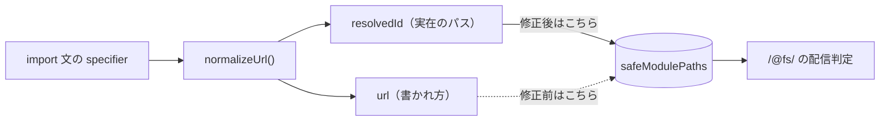

# 2026-10-07（水）

> 今日のひとこと：Viteが、dev server のファイル配信とHTML変換に関する3件の脆弱性（Moderate 2件、Low 1件）を直すセキュリティリリース（v8.3.3 など5本）を出しました。昨日トップニュースにしたNext.jsの `forbidden()` / `unauthorized()` の安定化は、全ページのHTMLに約2.3KBが増える回帰が見つかって、翌日に取り消されました。

## 今日のリリース

- 【Next.js】v16.4.0：正式版。リリースページの本文は取得できず（WebFetchで中身が表示されなかった）、目玉は不明。ただし直前に `forbidden()` / `unauthorized()` の安定化が取り消されて実験機能に戻っている（出典: https://github.com/vercel/next.js/releases/tag/v16.4.0 、取り消しは [#99734](https://github.com/vercel/next.js/pull/99734)）
- 【Vite】v8.3.3 / v8.2.4 / v8.1.6 / v7.3.7 / v6.4.4：セキュリティリリース。dev serverの `server.fs` 制限をすり抜けるファイル読み取り2件と、`transformIndexHtml` まわりの低重大度1件を修正（出典: https://github.com/vitejs/vite/releases/tag/v8.3.3 、詳細は「脆弱性」）
- 【Svelte】svelte@5.57.2：パッチ。トップレベル `await` を待つ間に破棄されたコンポーネントで async derived を作らない修正など（出典: https://github.com/sveltejs/svelte/releases/tag/svelte%405.57.2 、変更一覧は `packages/svelte/CHANGELOG.md`）
- 【Solid】v1.9.16：SSRのネストした `<Suspense>` が古い描画の子要素で完了してしまう不具合の修正と、seroval 1.6.8 への更新（出典: https://github.com/solidjs/solid/releases/tag/v1.9.16 、`packages/solid/CHANGELOG.md`）

## トップニュース

### Next.jsが `forbidden()` / `unauthorized()` の安定化を1日で取り消す

【Next.js】[10-06の号](2026-10-06.md)で取り上げた安定化（#99689）が、2026-10-06に [#99734](https://github.com/vercel/next.js/pull/99734) で取り消された（作者はAndrew Clark、5b10604925）。`authInterrupts` は実験フラグに戻り、同日の v16.4.0 は実験機能のまま出た。

**何が変わる**

- 非推奨にしたはずの `experimental.authInterrupts` が、再び必要になる。ドキュメントの変更も巻き戻され、`forbidden.mdx` などが書き換わった
- 差分には `define-env.ts` や `build/templates/*`（`app-page-runtime.ts`、`edge-ssr-app.ts` など）が含まれ、フラグがビルド時の定義として通り直している

**なぜ変えた**（PR本文より）：安定版にすると、組み込みの403・401フォールバックが、`forbidden.tsx` を持たないアプリを含む「すべてのページ」のペイロードに描画される。create-next-appの素の状態で、1ページあたり非圧縮のHTMLが約2.3KB、gzipで約125バイト増える。作者は、この回帰を知っていたのに、影響が全アプリ・全ページに及ぶことを忘れていたと書いている。v16.4のリリースを止めないため、フォールバックを遅延描画にする実装が済むまで実験機能に置く。

**何に効く・誰が困る**：昨日の号を見てフラグを外したアプリは、`authInterrupts` なしで `forbidden()` を呼ぶと使えなくなるはず（この挙動はPR本文とドキュメントの差分からの推測で、実機では確認していない）。フラグを残していたアプリは影響なし。

**ここまでの経緯**

- 2026-10-05：安定化（#99689）。PR本文には、遅延描画の最適化が計画中と書かれていた（[10-06の号](2026-10-06.md)）
- 2026-10-06：回帰が分かり取り消し（#99734）。同日 v16.4.0 を公開
- 今後：フォールバックの遅延描画が入ったら、再び安定化される見込み（時期は不明）

出典: https://github.com/vercel/next.js/pull/99734

## 今日の深掘り

### Vite：`safeModulePaths` に「URL」ではなく「解決済みID」を入れる

**選んだ理由**：開発サーバーの「このファイルは配信してよい」という許可の仕組みが、URLの読み替えで破れる例として、仕組みと修正が小さな差分で読み切れる。

**背景**：Viteの dev server は、`server.fs.allow` / `server.fs.deny` の外のファイルを `/@fs/` から返さない。ただし、ソースコードが `import` しているモジュールは「安全」と見なして、許可の外でも返せるようにしている。この「安全」の記録が `config.safeModulePaths` のセットだ。

脆弱性（GHSA-rq7h-c2jc-7f22、Moderate、CVSS 6.3）は、この記録の入れ方にあった。アドバイザリによれば、プロジェクト内の `<root>/etc/hostname` を `import "/etc/hostname"` のように読み込むと、ルート相対のパスが、システムの絶対パス `/etc/hostname` と同じ文字列になる。Viteはその文字列をそのまま安全として記録し、あとの `/@fs/etc/hostname` へのリクエストが通ってしまう。成立するのは、dev serverを `--host` でネットワークに公開していて、非Windows環境で、`server.fs.deny` に当たらないファイルの場合。

**変更点**（`packages/vite/src/node/plugins/importAnalysis.ts`、c3e06f92e）

```diff
 let [url, resolvedId] = await normalizeUrl(specifier, start)
+if (resolvedId) {
+  config.safeModulePaths.add(cleanUrl(resolvedId))
+}
 resolvedId = resolvedId || url
-
-// record as safe modules
-// safeModulesPath should not include the base prefix.
-config.safeModulePaths.add(fsPathFromUrl(stripBase(url, base)))
```

修正前は、importの書かれ方（URL）から `fsPathFromUrl` でファイルパスを逆算して記録していた。修正後は、プラグインの `resolveId` が実際に解決した絶対パス（`resolvedId`）がある場合だけ、それを記録する。解決できなかったimportは記録しない。テスト（`dev.spec.ts`）にも、解決されなかったSSRのimportを記録しないことの確認が足されている。

**周辺コード**



同じ日の別の修正（ba8b7ab43、GHSA-vfpm-58rq-9qcg）は、`transform.ts` の `isServerAccessDeniedForTransform` が `?raw`・`?url`・`?inline`・`.svg` のときだけ `fs` の許可を確かめ、`?vite-wasm-instance` を確かめていなかったので、正規表現 `wasmInstanceRE` を加えた。許可を確かめる入口が、クエリの種類ごとに列挙されている形そのものが弱点だった。

**この変更から分かる設計思想**：許可の判定は「入力の文字列」ではなく「解決の結果」を信頼の根拠にする。入力側の読み替え（パスの絶対・相対、URLのクエリ）は、そのたびに抜け穴になりうる。

出典: https://github.com/vitejs/vite/commit/c3e06f92e969952466b4e2f5801e85e1e00cd905 、https://github.com/vitejs/vite/security/advisories/GHSA-rq7h-c2jc-7f22

## 仕様の変更

### whatwg/html

#### `<script type>` の前後の空白だけを取り除く

【HTML】`type=" module "` のような値は、classic でも module でもなくなる。仕様は、JavaScriptのMIMEタイプかどうかを確かめるとき、前後のASCII空白だけを取り除く形に直った。
なぜ変えたか：WebKitとChromiumの実装に合わせるため（Issue #13012、前回の変更のフォローアップ）。
出典: https://github.com/whatwg/html/commit/ac737fa

#### 画像の更新で `width` を「関連する変更」から外す

【HTML】`` の「relevant mutation」（変わると画像の取得をやり直す属性）の一覧から `width` が外れた。
なぜ変えたか：これを実装すると、いくつかのテストが不安定になるか、誤って通るようになるため（Servoが見つけた、Issue #9371）。
出典: https://github.com/whatwg/html/commit/ba3400b

[10-06の号](2026-10-06.md)で取り上げたCOOP・COEPの構造化フィールドの変更（bf84f3c）は、今回の集計期間より前にマージされている。

その他：

- whatwg/fetch：接続のキャッシュキーとCORS-preflightのキャッシュキーの比較を、Infraの `equals` に統一（[e9460d1](https://github.com/whatwg/fetch/commit/e9460d1)）
- whatwg/dom：PI（処理命令）のシリアライズで `>` の文字参照を修正（[b76da7a](https://github.com/whatwg/dom/commit/b76da7a)、2026-10-05 21:51 CEST。前回の号の時刻より前の可能性が高く、念のため載せる）
- whatwg/url：Infraの等価比較を使う編集上の整理（[dcd3d6b](https://github.com/whatwg/url/commit/dcd3d6b)、Editorial）

動きなし：whatwg/streams, tc39/ecma262, tc39/proposals, w3c/csswg-drafts（editorialのみ）, w3c/aria, w3c/ServiceWorker, w3c/wcag3

## ブラウザの実装

取得できず（chromestatus.com・groups.google.comはegressでブロック）。Chromiumの `runtime_enabled_features.json5` のコミット履歴とblink-devの検索は、今回は確認していない。

## OSSのPR

### Next.js

#### turbo-tasksのスナップショットが、書き換えるときにタスクを複製する

【Next.js】Turbopackの永続キャッシュ（turbo-tasks）で、スナップショット中の最初の変更時にタスクをコピーし（[#99649](https://github.com/vercel/next.js/pull/99649)）、コピーをbincodeでエンコードする（[#99644](https://github.com/vercel/next.js/pull/99644)）。失敗したスナップショットのあとは永続化を止める（[#99732](https://github.com/vercel/next.js/pull/99732)）。
なぜ変えたか：PR本文は未確認、不明。コミット題名から、スナップショット中の全タスクの複製コストを減らす狙いと読めるが、推測。
出典: https://github.com/vercel/next.js/pull/99649

その他：

- 静的エクスポートで設定した出力ディレクトリを保つ（[#99507](https://github.com/vercel/next.js/pull/99507)）
- カスタムルートのメタデータを設定の外に置く（[#99508](https://github.com/vercel/next.js/pull/99508)）
- パラメーターのマッチ利用をビルドメタデータに記録（[#99594](https://github.com/vercel/next.js/pull/99594)）
- 静的ルートのエラーの案内を改善（[#99724](https://github.com/vercel/next.js/pull/99724)）
- Turbopack：パスをバッチに足す前にinvalidatorの対応表を確認（[#99711](https://github.com/vercel/next.js/pull/99711)）、正規化したパスのキャッシュ（[#99270](https://github.com/vercel/next.js/pull/99270)）
- turbo-tasks-backend：GC済みタスクの扱いを整理（[#99647](https://github.com/vercel/next.js/pull/99647)、[#99646](https://github.com/vercel/next.js/pull/99646)、[#99645](https://github.com/vercel/next.js/pull/99645)、[#99729](https://github.com/vercel/next.js/pull/99729)）
- ESMエクスポートをgetterに寄せる最適化を取り消し（[#99704](https://github.com/vercel/next.js/pull/99704)）
- Bundle Analyzer Agent Skill の追加と拡張（[#99169](https://github.com/vercel/next.js/pull/99169)、[#99170](https://github.com/vercel/next.js/pull/99170)、[#99172](https://github.com/vercel/next.js/pull/99172)、[#99173](https://github.com/vercel/next.js/pull/99173)、[#99174](https://github.com/vercel/next.js/pull/99174)、[#99387](https://github.com/vercel/next.js/pull/99387)、[#99731](https://github.com/vercel/next.js/pull/99731)）
- `ai-upgrade` の対話まわり（[#99702](https://github.com/vercel/next.js/pull/99702)、[#99727](https://github.com/vercel/next.js/pull/99727)、[#99736](https://github.com/vercel/next.js/pull/99736)）

### Vite

その他：

- Vite：セキュリティ修正3件と launch-editor の更新（[#23653](https://github.com/vitejs/vite/pull/23653)、[#23654](https://github.com/vitejs/vite/pull/23654)、[#23655](https://github.com/vitejs/vite/pull/23655)、[#23656](https://github.com/vitejs/vite/pull/23656)）。詳細は「脆弱性」

### Svelte

#### 破棄されたコンポーネントや切れた依存で、async derived が残らないようにする

【Svelte】トップレベル `await` を待つ間に破棄されたコンポーネントでは async derived を作らない（[#18931](https://github.com/sveltejs/svelte/pull/18931)）。再接続時に derived の購読が重複しないよう直す（[#18899](https://github.com/sveltejs/svelte/pull/18899)）。
なぜ変えたか：PR本文は未確認、不明。
出典: https://github.com/sveltejs/svelte/pull/18931

その他：

- `{:else}` の直後に `{:else}` や `{:else if}` が来たらエラー（[#18900](https://github.com/sveltejs/svelte/pull/18900)）
- `bind:activeElement` のフォーカス要素が消えても `state_unsafe_mutation` を投げない（[#18921](https://github.com/sveltejs/svelte/pull/18921)）
- 本番で、トップレベル `await` のあとに代入したイベントハンドラーが付くように（[#18933](https://github.com/sveltejs/svelte/pull/18933)）
- pendingブランチだけの `{#await}` を出力（[#18908](https://github.com/sveltejs/svelte/pull/18908)）
- ネストしたboundaryのコメントが別のノードに置き換わったときの回復（[#18925](https://github.com/sveltejs/svelte/pull/18925)）
- URL更新中に `SvelteURLSearchParams` を追跡しない（[#18791](https://github.com/sveltejs/svelte/pull/18791)）

### Vue（`minor`ブランチ）

その他（Vapor Mode）：

- コンポーネントタグをスロットのスコープから解決（[#15787](https://github.com/vuejs/core/pull/15787)）
- `v-memo` が無視されるときに警告（[#15788](https://github.com/vuejs/core/pull/15788)）
- setupのコンポーネント検索順をvdomに合わせる（[#15786](https://github.com/vuejs/core/pull/15786)）
- `script setup` のないvaporスクリプトを拒否（[#15790](https://github.com/vuejs/core/pull/15790)）
- テンプレートがグローバルプロパティに触れたら警告（[#15789](https://github.com/vuejs/core/pull/15789)）
- compiler-sfc：tsconfigのglobマッチャーをキャッシュ（[#15784](https://github.com/vuejs/core/pull/15784)）、rolldownのspreadヘルパー検出（[#15785](https://github.com/vuejs/core/pull/15785)）

### Solid（`main`）

その他：

- サーバーで、Suspenseの完了クロージャーを毎回の描画で付け替え、古いキャプチャを防ぐ（[#3745](https://github.com/solidjs/solid/pull/3745)）
- DOM Expressions 0.40.11 と seroval 1.6.8 に更新（37a9d358）

### Ladybird

#### 描画をStyleLayoutスレッドとPaintスレッドに分け、Skiaへの直接リンクをLibWebから外す

【Ladybird】Andreas Klingらのコミット列で、スタイル計算の入力（`StyleEngineInput`）の整理とRust側への移管が進んだ。描画では、フレームはStyleLayoutスレッドでコミットし、Paintスレッドが表示する形に一本化され、表示キュー（presentation queue）が消えた（2ff7e2d）。LibWebはSkiaを直接リンクしなくなり（659af3b）、`getImageData` や `createImageBitmap` などのラスタライズはコンポジター（compositor）側で行う（f60804d、0c98660）。
なぜ変えたか：コミットメッセージによれば、どのLibWebのコードもSkiaのシンボルを参照しておらず、直接リンクは `DT_NEEDED` を増やしSkiaのヘッダーを見せるだけだったため。
出典: https://github.com/LadybirdBrowser/ladybird/commit/659af3b

その他：スタイルエンジン（Rust側）への移管が多数（transitions、easing、font-face の順序づけ、メディアクエリ評価など。例：[775a9ca](https://github.com/LadybirdBrowser/ladybird/commit/775a9ca)、[06da485](https://github.com/LadybirdBrowser/ladybird/commit/06da485)、[239425f](https://github.com/LadybirdBrowser/ladybird/commit/239425f)、[6a3eb3b](https://github.com/LadybirdBrowser/ladybird/commit/6a3eb3b)）。そのほか約60コミット、`LibGfx` の未使用APIの削除、新しいrealmのグローバルオブジェクトのrootingなど。

### Servo

その他：

- `` のmargin系の次元属性を実装（[#48605](https://github.com/servo/servo/pull/48605)）
- IDBCursor の `update` / `delete` を実装（[#48402](https://github.com/servo/servo/pull/48402)）
- 範囲入力（range）を操作可能に（[#48342](https://github.com/servo/servo/pull/48342)）
- WebGL：`vertexAttribIPointer` と属性型チェックの修正（[#48678](https://github.com/servo/servo/pull/48678)）
- WebGPU：バッファ内容の扱いを新方式に（[#48372](https://github.com/servo/servo/pull/48372)）
- writable stream の underlying sink を常にrootする（[#48656](https://github.com/servo/servo/pull/48656)）
- タッチ互換のマウスイベントを `ScriptThread` で同期的に発火（[#48671](https://github.com/servo/servo/pull/48671)）
- `TracedDOMString` を作り、`DOMString` を `RootTraceableBox<TracedDOMString>` に（[#48360](https://github.com/servo/servo/pull/48360)）
- http2のタイマー（[#48657](https://github.com/servo/servo/pull/48657)）、LCP用のURL受け渡し（[#48668](https://github.com/servo/servo/pull/48668)）、`StructuredData` の移動（[#48667](https://github.com/servo/servo/pull/48667)）、小さな整理（[#48677](https://github.com/servo/servo/pull/48677)）

### Biome

その他：

- lint に `noNestedSwitch` を追加（[#12166](https://github.com/biomejs/biome/pull/12166)）
- Tailwindパーサー：括弧と単項式の修正（[#12156](https://github.com/biomejs/biome/pull/12156)。一度revertされ（#12173）、[#12174](https://github.com/biomejs/biome/pull/12174) で再投入）
- コメント判定ヘルパーの共通化（[#12171](https://github.com/biomejs/biome/pull/12171)）

### oxc

その他：

- 新クレート `oxc_formatter_toml`（`oxc-toml` を包む。破壊的変更の印つき、[#27365](https://github.com/oxc-project/oxc/pull/27365)）
- codegen：負の `BigIntLiteral` を `-` のあとに出力する修正（[#27378](https://github.com/oxc-project/oxc/pull/27378)、[#27377](https://github.com/oxc-project/oxc/pull/27377)）、`TSJSDocNonNullableType` のassert修正（[#27373](https://github.com/oxc-project/oxc/pull/27373)）
- minifier：cjs・スクリプトで不要なimport/exportの結合を避ける（[#27291](https://github.com/oxc-project/oxc/pull/27291)）
- oxfmt：`FileKind` の再構成、svelte-in-mdx-in-md、stderr のblocking など（[#27370](https://github.com/oxc-project/oxc/pull/27370)、[#27369](https://github.com/oxc-project/oxc/pull/27369)、[#27368](https://github.com/oxc-project/oxc/pull/27368)、[#27363](https://github.com/oxc-project/oxc/pull/27363)、[#27359](https://github.com/oxc-project/oxc/pull/27359)）
- lexer の整理（[#27367](https://github.com/oxc-project/oxc/pull/27367)）

### React

その他：

- Fragment refs の2つのフラグ（`enableFragmentRefsInstanceHandles`、`enableFragmentRefsTextNodes`）を整理（[#37732](https://github.com/facebook/react/pull/37732)）
- Flight：デバッグ情報のスタックフレームがないエラーの復元を修正（[#37730](https://github.com/facebook/react/pull/37730)）

### TypeScript

その他：

- DOM型の更新（[#64604](https://github.com/microsoft/TypeScript/pull/64604)）
- asyncのAPIで dispose の Promise を捨てない（[#64584](https://github.com/microsoft/TypeScript/pull/64584)）
- JSのコンストラクター定義プロパティの不安定な診断を修正（[#64646](https://github.com/microsoft/TypeScript/pull/64646)）

### react-hook-form

その他：

- `useForm`：propsから消えたオプションを、再描画時にリセット（[#13831](https://github.com/react-hook-form/react-hook-form/pull/13831)）
- `useFieldArray`：重複したindexを無視し、`remove` に渡したindexを変えない（[#13830](https://github.com/react-hook-form/react-hook-form/pull/13830)）

### Wado

コミットは約60件で、大半はClaudeやwado-botによる整理。`docs/wep-*.md` の新規追加は確認できなかった。設計に関わるもの：

- `core:json`：`to_bytes_canonical` をRFC 8785（JCS）に準拠させた（5ce97f5fbb）
- 最適化器：panicするブロックの書き込み、`!` 型の呼び出しの扱い、bounds-check eliminationの維持（08f264cf99、7a948232b9、c2b50f33bb）
- trait solver：重複するimplを候補からIDで除く（6761ec7999）
- `grog` のWEPを仕上げ、既知の未対応を `package-grog/TODO.md` に移動（ed5b86b2f0）

その他：上記以外のコミット（golden fixtureの再生成、merge conflictの解消、tidy）。

動きなし：servo/stylo

## 続報

- [10-06の号](2026-10-06.md)のNext.js `forbidden()` / `unauthorized()` の安定化は、2026-10-06に取り消された（上のトップニュース）。「実装 → 安定化 → 回帰 → 実験に戻す」まで来た
- [10-01の号](2026-10-01.md)のNext.jsのセキュリティリリース（v16.3.8 / v15.5.27）の次の版として、v16.4.0 が出た

## 脆弱性

### Viteのdev serverに3件の脆弱性（2026-10-06公開、sapphi-red 報告）

【脆弱性】影響パッケージは `vite`（`vite-plus` も影響）。修正版は 8.3.3、8.2.4、8.1.6、7.3.7、6.4.4。出典は各アドバイザリ。

| ID | 重大度 | 内容 |
|---|---|---|
| [GHSA-rq7h-c2jc-7f22](https://github.com/vitejs/vite/security/advisories/GHSA-rq7h-c2jc-7f22) | Moderate（CVSS 6.3） | プロジェクトのパスがシステムのパスと一致すると、`server.fs.allow` の外のファイルが返る（非Windows） |
| [GHSA-vfpm-58rq-9qcg](https://github.com/vitejs/vite/security/advisories/GHSA-vfpm-58rq-9qcg) | Moderate（CVSS 6.3） | `?vite-wasm-instance` が `server.fs` の確認を通らず、ファイルの先頭4バイトがエラーメッセージに出る |
| [GHSA-9jrq-w75r-8gcw](https://github.com/vitejs/vite/security/advisories/GHSA-9jrq-w75r-8gcw) | Low（CVSS 4.0） | middleware modeで、`//evil.example/payload.js?/../../package.json` のようなURLから、別オリジンのスクリプトが読み込まれる |

**攻撃原理と成立条件**

- 1件目：深掘りの通り。dev serverをネットワークに公開（`--host`）し、`<root>/etc/hostname` のようなファイルがimportされていて、`server.fs.deny` に当たらない場合
- 2件目：`--host` か `server.host` で公開、Node.jsかDeno（Bunは影響なし）、ファイルの先頭4バイトが機密の場合。影響は 8.2.0〜8.3.2 のみ
- 3件目：`middlewareMode: true` か `appType: 'custom'` で、ブラウザのリクエストURLを加工せず `server.transformIndexHtml` に渡し、HTMLにインラインのmoduleスクリプトがあり、読み込まれたスクリプトからアクセスできる機密がある場合。アドバイザリは、Chromiumは `?` 以降をクエリとして `/../../` を残すが、Viteはファイルシステムのパスとして扱う不一致を原因に挙げている

**修正コミット**（`vitejs/vite`）

- 1件目：c3e06f92e。`safeModulePaths` に解決済みIDを入れる（深掘りを参照）
- 2件目：ba8b7ab43。`isServerAccessDeniedForTransform` に `wasmInstanceRE`（`/[?&]vite-wasm-instance(?:&|$)/`）を足し、`checkLoadingAccess` の対象にする
- 3件目：7dafd8e56。`getHtmlFilename`（`indexHtml.ts`）が、URLの `cleanUrl` を通すようになった。テストは、`//` や `///` で始まるリクエストURLが、インラインmoduleのproxy URLの先頭に残らないことを確かめる（アドバイザリは修正コミットのリンクを載せていない。コミットとアドバイザリの対応は、題名とテストからの推定）

**同種の脆弱性パターン**：許可の判定が「入力の文字列の読み替え」に依存し、読み替えの経路が増えるたびに抜け穴ができる。Viteの `server.fs` まわりでは、`?raw` や `?inline` などクエリごとの確認漏れが、過去にも繰り返されている（過去の個別のアドバイザリは今回は確認していない）。

**関連**：Solid v1.9.16 は seroval 1.6.8 に更新し、リリースノートに seroval の脆弱性修正（CVE-2026-104846、CVE-2026-104845）が含まれると書いている。seroval のアドバイザリ自体は対象外のため、中身は確認していない。

他の対象（react、next、svelte、vue、oxc、astro、nuxt、TanStack）は、2026-10-05以降の新規アドバイザリなし。

## 仕様を読む会の候補

1. whatwg/html の `<script>` の `type` 属性の扱い（"prepare the script element" の手順）。`type=" module "` が module にならない、という一行の変更の背後に、仕様と実装の食い違いを直す判断が詰まっている。
2. Vite の `server.fs`（`checkLoadingAccess`、`safeModulePaths`、`/@fs/`）の読み会。1日で3件の脆弱性が出た題材で、「許可の判定をどこに置くか」を、URL・クエリ・解決済みIDの3段で追える。
