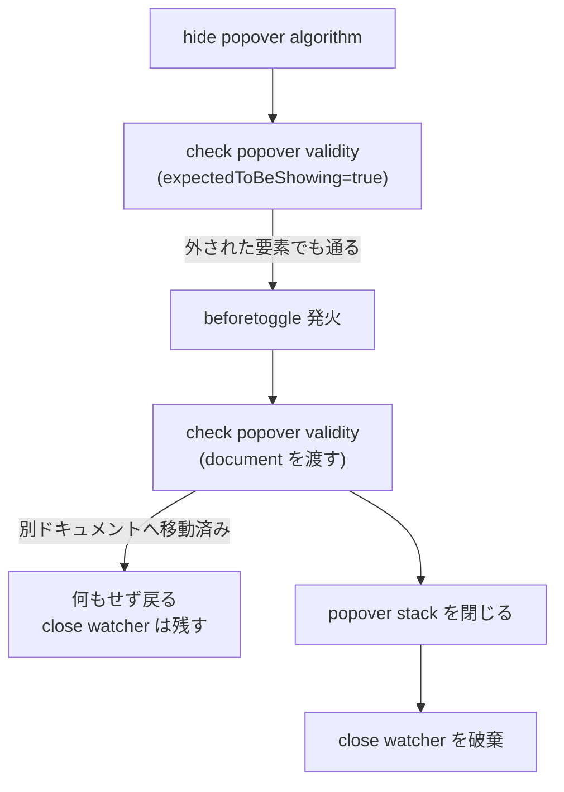

# 2026-10-08（木）

> 今日のひとこと：whatwg/htmlで、DOMから外された `popover` が画面に残り続ける仕様上の穴が塞がりました。あわせてTrusted Typesの仕様がHTML本体に取り込まれ続けています。新規の脆弱性はなく、新しい正式リリースもありませんでした。

## トップニュース

### DOMから外した `popover` が、仕様どおりに閉じるようになる

【HTML】`popover` 属性を持つ要素を表示中に DOM から外すと、仕様上は「閉じる処理」が必ず失敗し、ポップオーバーがトップレイヤーに残る状態になっていた。whatwg/htmlはこの手順を直し、外された要素も別のドキュメントへ移された要素も閉じられるようにした（Jake Archibald、Fixes #9161）。

**何が変わる**

- `hidePopover()` は、要素が接続されていない、またはノードドキュメントが fully active でない場合も、表示中なら閉じられる。以前はここで `InvalidStateError` を投げた
- 閉じる前提かどうかを `expectedToBeShowing` という引数で表す。「接続されているか」「fully active か」は、表示するときだけ要求する
- `beforetoggle` の中で別ドキュメントに移されて再表示された要素を、元の処理が誤って閉じることがなくなる

**なぜ変えた**（コミットメッセージより）：要素の「removing steps」は、親から外したあとに走る。ところが閉じる手順の最初の確認（popover validity）は「接続されていなければ例外」だったので、この経路では必ず失敗していた。結果、ポップオーバーは表示中のまま残る。

**何に効く・誰が困る**：ポップオーバーを持つ要素を動的に外すUI（フレームワークの条件描画、`<iframe>` ごとの破棄など）。ブラウザ側の実装がこの手順に追いつくかは、今回の調査では不明。

**ここまでの経緯**

- Issue #9161 で報告（日付は未確認）
- 2026-10-07：仕様に修正がマージ
- 今後：WPTの追加と各エンジンの実装を確認する段階（未確認）

出典: https://github.com/whatwg/html/commit/efc54f7

## 今日の深掘り

### popoverの「閉じる手順」は、閉じるときの前提を緩める

**選んだ理由**：「状態を変える前提条件を検証する関数」が、表示と非表示で別の前提を持つべき例として、仕様の差分が小さく読み切れる。

**背景**：popoverには「表示する」と「閉じる」の手順があり、どちらも最初に `check popover validity` を呼ぶ。この検査は、要素が接続されていること、ノードドキュメントが fully active であることなどを確かめる。表示するときはもっともな条件だ。しかし閉じるときは違う。要素が外されたから閉じるのであって、外された時点で接続は切れている。

**変更点**（`source`、efc54f7）：検査の条件に `expectedToBeShowing` が加わった。差分から読むと次の形になる。

```diff
-     <li><p><var>element</var> is not <span>connected</span>;</p></li>
+     <li>
+     <p><var>expectedToBeShowing</var> is false and <var>element</var> is not
+     <span>connected</span>;</p>
```

`fully active` の条件も同じ形で、`expectedToBeShowing` が false のときだけ要求される。追加されたノートは、表示中でも「接続されていない」「fully activeでない」状態がありうること（removing steps が親から外した後に走る、`<iframe>` がナビゲートで消える）を明記している。

もう一つの変更は、close watcher の破棄の位置だ。以前は手順の途中にあり、早期リターンでも破棄されていた。これを手順が最後まで完了したときだけに動かした。



**周辺コード**：`document` を検査に渡すのは、表示手順がすでにやっていたことに合わせる形。`beforetoggle` のリスナーが要素を別ドキュメントに移して再表示した場合、元の手順が移動先のポップオーバーを閉じるのを防ぐ。

**この変更から分かる設計思想**：同じ検証関数を「入る」と「出る」で共有すると、出口で不要な前提を課してしまう。出口は「何が起きていても必ず片付けられる」ことを優先し、前提を呼び出し側が宣言する形に分けた。

出典: https://github.com/whatwg/html/commit/efc54f7

## 仕様の変更

### whatwg/html

#### Trusted Typesの断片パース対応が、HTML本体に入る

【HTML】`innerHTML`、`outerHTML`、`insertAdjacentHTML()`、`createContextualFragment()`、`setHTMLUnsafe()`、`parseHTMLUnsafe()` が「get trusted type compliant input」を呼ぶ形になった。デフォルトポリシーの `createParserOptions` で、サニタイザーやスクリプト実行の扱いを差し替えられる。HTMLドキュメントのみ対象で、`srcdoc`、`document.write()`、`DOMParser`、`execCommand("insertHTML")` は据え置き。
なぜ変えたか：w3c/trusted-types#606 と対になる変更。断片パースの手順が、安全・不安全・レガシーの3つのモードを1つの引数で受ける形にまとまった。
出典: https://github.com/whatwg/html/commit/c60d337

#### `HTMLScriptElement` のIDL変更を、Trusted Types仕様からHTMLに移す

【HTML】`HTMLScriptElement` の `innerText` と `textContent` が `TrustedScript` を受け、`src` は `TrustedScriptURL`、`text` は `TrustedScript` を受ける。挙動の変更はない。
なぜ変えたか：これまでTrusted Types仕様が「monkey patch」していたIDLを、HTML側に取り込むため（w3c/trusted-types#607 に依存）。移す際に、`text` セッターが「渡された値」と書くべきところを、準拠文字列にしていなかった誤りも直した。
出典: https://github.com/whatwg/html/commit/a1b6270

#### worklet に cross-origin isolated capability と time origin を公開する

【HTML】`WorkletGlobalScope` の cross-origin isolated capability が、空欄のTODOから、外側の settings object の値を返す定義になった。
なぜ変えたか：w3c/hr-time#169 が `AudioWorkletGlobalScope` で `performance.now()` を同じ粗さで公開できるようにするため（#13006）。
出典: https://github.com/whatwg/html/commit/5753553

### whatwg/url

#### `search` セッターが `searchParams` と食い違わない

【URL】`url.search = "a=\tb"` のように、ASCII のタブや改行を含む値を設定すると、クエリは `a=b` になるのに `searchParams` は `["a", "\tb"]` を持ち、次に `searchParams` を変更したときにタブが `%09` で復活していた。セッターが、基本URLパーサーの処理を通った後のクエリを解析する形に直った（Fixes #931）。
なぜ変えたか：`href` セッターやURLの初期化と同じ形にそろえ、Gecko、WebKit、Node.js の挙動に合わせるため。WPTは web-platform-tests/wpt#63344。
出典: https://github.com/whatwg/url/commit/fde3f74

### w3c/csswg-drafts

#### `line-clamp` の構文と longhand を更新し、`block-ellipsis` と `text-overflow` の関係を明記

【CSS】css-overflow-4 で `line-clamp` の構文と longhand を更新する一連のコミット（Florian Rivoal、issue #13670 に基づく）。別のコミットで `block-ellipsis` と `text-overflow` の相互作用を明確にした（#14516）。
なぜ変えたか：構文の詳細は未確認。Ladybirdが同日に `-webkit-line-clamp` の挙動を直しており、実装側の動きとつながる。
出典: https://github.com/w3c/csswg-drafts/commit/15e844ee 、https://github.com/w3c/csswg-drafts/commit/1f04ca5c

その他：

- css-color-4：`opacity-value` のシリアライズが、`opacity` 以外のプロパティにも適用されると明確化（[4dd6b0d7](https://github.com/w3c/csswg-drafts/commit/4dd6b0d7)、#1042）
- whatwg/html：Infraの `clone`（map clone）を参照一覧に追加（[c60d337](https://github.com/whatwg/html/commit/c60d337) に同梱）

動きなし：whatwg/dom, whatwg/fetch, whatwg/streams, tc39/ecma262, tc39/proposals, w3c/aria, w3c/ServiceWorker, w3c/wcag3（editorialのみ）

## ブラウザの実装

取得できず（chromestatus.com・groups.google.comはegressでブロック）。Chromiumの `runtime_enabled_features.json5` のコミット履歴とblink-devの検索、web-platform-tests/interop のIssueは、今回は確認していない。

## OSSのPR

### React

#### Trusted Typesの統合フラグが全環境で有効になり、分岐が消える

【React】`enableTrustedTypesIntegration` のフラグを削除した（[#37782](https://github.com/facebook/react/pull/37782)）。コミットメッセージは「全環境で有効だったから」のみ。`DOMPropertyOperations.js` と `ReactDOMComponent.js` の条件分岐が消えた。同じ作者が `enableEffectEventMutationPhase`（[#37777](https://github.com/facebook/react/pull/37777)）と `enableParallelTransitions`（[#37771](https://github.com/facebook/react/pull/37771)）も「全環境で有効」として整理した。
なぜ変えたか：PR本文は短く、整理の理由は「すでにどこでも有効」。コードを読むと、フラグの分岐をなくす整理と読める。
出典: https://github.com/facebook/react/pull/37782

その他：

- `enableBrowserAPI`、`enableAsyncDebugInfo` を整理（[#37774](https://github.com/facebook/react/pull/37774)、[#37772](https://github.com/facebook/react/pull/37772)）
- 使われていない `enableFastAddPropertiesInDiffing` の残りを削除（[#37781](https://github.com/facebook/react/pull/37781)）
- wwwテストで `enableComponentPerformanceTrack` を有効化（[#37775](https://github.com/facebook/react/pull/37775)）
- ホスト設定のcapabilityフラグを boolean 型に（[#37740](https://github.com/facebook/react/pull/37740)）
- DevTools：同一ドキュメントのナビゲーションで拡張を再マウントしない（[#37780](https://github.com/facebook/react/pull/37780)）

### Next.js

その他：

- Turbopack：EsmBindingのコード生成をバッチ化（[#99722](https://github.com/vercel/next.js/pull/99722)）
- Turbopack：トレースのメモリ・並行度の計測を拡張、`turbo-trace-size` CLI を追加（[#99233](https://github.com/vercel/next.js/pull/99233)、[#99254](https://github.com/vercel/next.js/pull/99254)、[#99685](https://github.com/vercel/next.js/pull/99685)、[#99765](https://github.com/vercel/next.js/pull/99765)、[#99777](https://github.com/vercel/next.js/pull/99777)、[#99775](https://github.com/vercel/next.js/pull/99775)）
- `next/font/google` のフォント取得失敗を「Module not found」ではなく取得エラーとして報告（[#99574](https://github.com/vercel/next.js/pull/99574)）
- turbo-tasks：スナップショットの pending ビットを排他の下で取る実験（[#99747](https://github.com/vercel/next.js/pull/99747)）
- create-next-app：新規プロジェクトで ESLint 10 を使う、エージェント用フィードバックを AGENTS.md に書く（[#99814](https://github.com/vercel/next.js/pull/99814)、[#99813](https://github.com/vercel/next.js/pull/99813)）
- swc v81 に更新、rustc を nightly-2026-10-04 に更新（[#99720](https://github.com/vercel/next.js/pull/99720)、[#99682](https://github.com/vercel/next.js/pull/99682)）
- instant codemod が同じ階層のテストファイルに当たる不具合、bundle optimizer skill の修正（[#99795](https://github.com/vercel/next.js/pull/99795)、[#99818](https://github.com/vercel/next.js/pull/99818)）
- フォントデータ更新、vendored @mswjs/interceptors 更新、CI・pnpm まわり、turbopack の未使用依存整理（[#99753](https://github.com/vercel/next.js/pull/99753)、[#99485](https://github.com/vercel/next.js/pull/99485)、[#99770](https://github.com/vercel/next.js/pull/99770)、[#99041](https://github.com/vercel/next.js/pull/99041)、[#99825](https://github.com/vercel/next.js/pull/99825)、[#99824](https://github.com/vercel/next.js/pull/99824)、[#99748](https://github.com/vercel/next.js/pull/99748)）

### Vite

その他：

- bundled-dev：`/@vite/client` を配信し `@vite/env` をスタブ化（[#23664](https://github.com/vitejs/vite/pull/23664)）、CSSのHMRヘルパーの import 元を `/@vite/client` に（[#23674](https://github.com/vitejs/vite/pull/23674)）
- watcher：`ensureWatchedFile` で root 判定の前にファイルを正規化（[#23673](https://github.com/vitejs/vite/pull/23673)）

### Biome

#### Tailwindの旧名ユーティリティを検出する `noTailwindLegacyUtilities` が入る

【Biome】nursery ルート `noTailwindLegacyUtilities` を追加（JavaScript と HTML 向け）。Tailwind が後方互換のためだけに残している旧クラス名（例：`flex-grow` → `grow`、`bg-gradient-to-r` → `bg-linear-to-r`）を報告して、現在の名前に直す。Tailwindパーサーも、`flex-grow-0` や `max-w-screen-lg` の基底名を正しく切り出すように直った（[#12185](https://github.com/biomejs/biome/pull/12185)）。
なぜ変えたか：changeset の説明は、旧名を使い続けるクラスの検出と自動修正まで。動機の詳細（Tailwind v4 への移行支援など）は不明。
出典: https://github.com/biomejs/biome/pull/12185

その他：

- Sass：keyframes 内の文（[#12191](https://github.com/biomejs/biome/pull/12191)）、`attr()` の値（[#12190](https://github.com/biomejs/biome/pull/12190)）、コアで Sass を有効化（[#12132](https://github.com/biomejs/biome/pull/12132)）
- Tailwindパーサー：二項マイナスのトークン化、CSS変数の省略記法、先頭が数字のカスタムバリアント（[#12181](https://github.com/biomejs/biome/pull/12181)、[#12183](https://github.com/biomejs/biome/pull/12183)、[#12180](https://github.com/biomejs/biome/pull/12180)）
- 型推論：テンプレートリテラルから string 型を推論（[#12115](https://github.com/biomejs/biome/pull/12115)）
- `useImportExtensions` が設定済みの拡張子マッピングを解決（[#12202](https://github.com/biomejs/biome/pull/12202)）
- `noConfusingVoidType`、`useConsistentObjectDefinitions` の誤検出を修正（[#12177](https://github.com/biomejs/biome/pull/12177)、[#12178](https://github.com/biomejs/biome/pull/12178)）
- loader の JS プラグインの修正（[#12188](https://github.com/biomejs/biome/pull/12188)）

### oxc

その他：

- linter：型 import の修正が衝突して不正な構文（`import type { A, type B }`）を作るのを防ぐ。Kibana の ecosystem CI でパニックしていた（[#27409](https://github.com/oxc-project/oxc/pull/27409)）
- oxfmt：シンボリックリンクされた設定を探索で辿る（[#27389](https://github.com/oxc-project/oxc/pull/27389)）
- minifier：特定の識別子名の判定に ident を使う（[#27208](https://github.com/oxc-project/oxc/pull/27208)）
- codegen：空の do-while の本体前に余分なインデントを出さない（[#27407](https://github.com/oxc-project/oxc/pull/27407)）
- linter docs・CI・テストの整理（[#27408](https://github.com/oxc-project/oxc/pull/27408)、[#27414](https://github.com/oxc-project/oxc/pull/27414)、[#27390](https://github.com/oxc-project/oxc/pull/27390)）

### TypeScript

その他（Goへの移植版、`microsoft/TypeScript`）：

- emit のクラッシュ修正：デコレーターのメタデータ、重複する private 名、不正な分割代入（[#64633](https://github.com/microsoft/TypeScript/pull/64633)、[#64670](https://github.com/microsoft/TypeScript/pull/64670)、[#64651](https://github.com/microsoft/TypeScript/pull/64651)）
- CommonJS の export 代入が関数内ループの影の名前で壊れる問題を修正（[#64676](https://github.com/microsoft/TypeScript/pull/64676)）
- 名前空間の無い `import defer` を拒否（[#64640](https://github.com/microsoft/TypeScript/pull/64640)）
- emit リゾルバーごとに nodebuilder をキャッシュ（[#64649](https://github.com/microsoft/TypeScript/pull/64649)）
- `workspace/symbol` のクラッシュ修正、ドキュメントシンボルからトップレベルの import を除外（[#64642](https://github.com/microsoft/TypeScript/pull/64642)、[#64160](https://github.com/microsoft/TypeScript/pull/64160)）
- API：クライアントモジュールを VS Code 拡張から公開、診断まわりの修正（[#64647](https://github.com/microsoft/TypeScript/pull/64647)、[#64637](https://github.com/microsoft/TypeScript/pull/64637)、[#64638](https://github.com/microsoft/TypeScript/pull/64638)）
- JSDocParameterTag の扱い、フレーキーな診断、テストファイルの絞り込み（[#64617](https://github.com/microsoft/TypeScript/pull/64617)、[#64636](https://github.com/microsoft/TypeScript/pull/64636)、[#64675](https://github.com/microsoft/TypeScript/pull/64675)）

### Solid

その他（`main`）：

- DOM Expressions を 0.40.12 に更新。SSR で動的な属性名・タグ名を検証し、class と style の名前をエスケープする（[#3873](https://github.com/solidjs/solid/pull/3873)、dom-expressions#592）。1.9.17 のバージョンコミット（[25138e1c](https://github.com/solidjs/solid/commit/25138e1c)）が入ったが、リリースの公開は確認できなかった

### Svelte

その他：

- コンポーネントの初期化中、プロパティの存在確認のための state source を作り続ける（[#18949](https://github.com/sveltejs/svelte/pull/18949)）

### react-hook-form

その他：

- `hasOwnProperty` という名前のフィールドの dirty 値を安全に取り出す（[#13832](https://github.com/react-hook-form/react-hook-form/pull/13832)）

### Ladybird

#### MSE（Media Source Extensions）の SourceBuffer の再構築が一気に進む

【Ladybird】Zaggy1024 による約30コミットの連続で、`SourceBuffer` ごとに `Demuxer` を持つ設計、無効化されたバッファ範囲の追跡、置換されたフレームでの再シーク、`QuotaExceededError` を先に投げる処理、`ended` の更新、`audioTracks` などのトラックリスト公開が入った。中心は `a347647`（SourceBuffer ごとの Demuxer）と `cca70b0`（無効化範囲の追跡）。
なぜ変えたか：コミットメッセージは「何をするか」のみ。動機は不明。MSE の仕様に沿わせる作業の一部と読めるが、推測。
出典: https://github.com/LadybirdBrowser/ladybird/commit/a347647

その他：

- SVG 画像：ドキュメントの読み込み完了を待つ、タスクを HTML のイベントループに載せる、`SVGDecodedImageData` の生成を promise にする（[3e8cc0b](https://github.com/LadybirdBrowser/ladybird/commit/3e8cc0b)、[5a976f5](https://github.com/LadybirdBrowser/ladybird/commit/5a976f5)、[b30f7a6](https://github.com/LadybirdBrowser/ladybird/commit/b30f7a6)、[a7d47a6](https://github.com/LadybirdBrowser/ladybird/commit/a7d47a6)）
- XML の読み込み完了で HTML パーサーの完了ステートマシンを使う（[84b955b](https://github.com/LadybirdBrowser/ladybird/commit/84b955b)）
- パース済み CSS 画像の相対URLを、現在のドキュメントに対して解決する（[5dae58b](https://github.com/LadybirdBrowser/ladybird/commit/5dae58b)）
- `-webkit-line-clamp` で切られた内容をスクロール可能なオーバーフローに残す（[954c564](https://github.com/LadybirdBrowser/ladybird/commit/954c564)）
- View Transition 疑似要素の同期前にレイアウトを更新、スクロール駆動アニメーションの扱い（[23eee30](https://github.com/LadybirdBrowser/ladybird/commit/23eee30)、[1a30eee](https://github.com/LadybirdBrowser/ladybird/commit/1a30eee)）
- Wasm の exports オブジェクトをすべての realm で同じにする（[61c3c02](https://github.com/LadybirdBrowser/ladybird/commit/61c3c02)）
- `scroll-snap-type: none` の box で snap 軸の探索を省く（[22e0621](https://github.com/LadybirdBrowser/ladybird/commit/22e0621)）
- クラッシュレポートの UI（Qt）のポップオーバー化など、Rust のビルド警告をエラー扱い、Rust のグローバルアロケーターを共有クレートへ（[3c49e28](https://github.com/LadybirdBrowser/ladybird/commit/3c49e28)、[e31fd06](https://github.com/LadybirdBrowser/ladybird/commit/e31fd06)、[931d6c7](https://github.com/LadybirdBrowser/ladybird/commit/931d6c7)）
- メディア：データが来ていないまま idle を出たとき再要求、他（[119be96](https://github.com/LadybirdBrowser/ladybird/commit/119be96)）

### Servo / Stylo

その他：

- Stylo と Servo から `layout.grid.enabled` の pref を削除（Grid は常時有効）（[servo/stylo#479](https://github.com/servo/stylo/pull/479)、[servo#48718](https://github.com/servo/servo/pull/48718)）
- grid：コンテナのサイズが不定のとき、min・max の値を正しく渡す（[#48644](https://github.com/servo/servo/pull/48644)）
- service worker：コンテナにメッセージ関連のイベントハンドラーを追加（[#48680](https://github.com/servo/servo/pull/48680)）
- Fetch・net・DOMString まわりのコピー削減（[#48721](https://github.com/servo/servo/pull/48721)、[#48720](https://github.com/servo/servo/pull/48720)、[#48702](https://github.com/servo/servo/pull/48702)、[#48588](https://github.com/servo/servo/pull/48588)、[#48589](https://github.com/servo/servo/pull/48589)、[#48675](https://github.com/servo/servo/pull/48675)、[#48650](https://github.com/servo/servo/pull/48650)）
- `srcset` の生成と選択を効率化（[#48562](https://github.com/servo/servo/pull/48562)）
- タッチ終了で合成マウスイベントが出ないとき click count をリセット（[#48699](https://github.com/servo/servo/pull/48699)）
- UA ShadowRoot 内の要素に対するクリックの回避策を削除（[#48712](https://github.com/servo/servo/pull/48712)）
- DOM ポインタを `MutNullableDom` に置換、OHOS の servoshell の修正、他（[#48715](https://github.com/servo/servo/pull/48715)、[#48684](https://github.com/servo/servo/pull/48684)、[#48687](https://github.com/servo/servo/pull/48687)、[#48542](https://github.com/servo/servo/pull/48542)、[#48393](https://github.com/servo/servo/pull/48393)、[#48688](https://github.com/servo/servo/pull/48688)）

### ghc/ghc

その他：

- 起動時に標準ファイル記述子を空けたままにしない（[8d49ed42d8](https://github.com/ghc/ghc/commit/8d49ed42d8)、#24450）。changelog の文の修正（[65bcf9e911](https://github.com/ghc/ghc/commit/65bcf9e911)）

### wado-lang/wado

#### `export(World::name)` で関数をワールドの export に割り当てる

【Wado】`export(Command::run) fn main()` と書くと、`main` が world の export `run` を提供する。シグネチャは world の定義と照合され、対象が world でない、export 名が存在しない、他の提供元と衝突する場合はエラーになる。同日、コンポーネントのデフォルトインターフェースを裸の名前で import する機能と、ライブラリが常にデフォルトインターフェースを export する機能も入った。
なぜ変えたか：コミットメッセージは動作の説明のみ。WEP（`docs/wep-*.md`）で `contract` 宣言を外し、manifest が world を選ぶ形にしたコミット（[7845f975de](https://github.com/wado-lang/wado/commit/7845f975de)）が前日にあり、設計の流れとつながる。
出典: https://github.com/wado-lang/wado/commit/a4dbb2ec57

その他：コミット約60件。最適化（`sroa_param`、`dae` の名前とクローンの識別、インライン展開）、newtype が参照先のトレイトメソッドを引き継ぐ機能（[23707e4e5c](https://github.com/wado-lang/wado/commit/23707e4e5c)）、`&mut self` 呼び出しの修正、CIの計測スキルとベンチマークの更新。

動きなし：vuejs/core（`minor` ブランチ）, solidjs/solid の `next` ブランチ

## 議論ウォッチ

取得できず（今回はDiscussions、Issue一覧、standards-positions、TC39ノートのWebFetchを実行していない）。

## 続報

- Trusted Types：[09-23の号](2026-09-23.md)の `javascript:` URL ナビゲーション、[10-02の号](2026-10-02.md)のタイマー文字列に続き、今日はスクリプト要素のIDLと断片パースが whatwg/html に取り込まれた。Trusted Types を「仕様の外の monkey patch」から「HTMLの手順の一部」に移す作業が、ここ2週間続いている。React 側も `enableTrustedTypesIntegration` を整理した（上記）。

## 脆弱性

新規のアドバイザリはなし。react、next、vite、svelte、vue、oxc、astro、nuxt、TanStack/router のアドバイザリ一覧を確認した。Viteの3件（2026-10-06公開）は[10-07の号](2026-10-07.md)で扱い済み。

## 仕様を読む会の候補

- **popover の hide popover algorithm と check popover validity**（whatwg/html の `source`）：今日の深掘りの題材。「表示」と「非表示」で前提が違う検証関数を、仕様がどう書き分けるかを手順の文章で読める。
- **URL の `search` セッターと基本URLパーサー**（whatwg/url の `url.bs`）：パーサーが入力を黙って書き換えるため、リストとクエリが食い違う。`href` セッターとの書き方の違いを比べると、URL API が「パーサーの出力」を唯一の真実にする理由が分かる。
