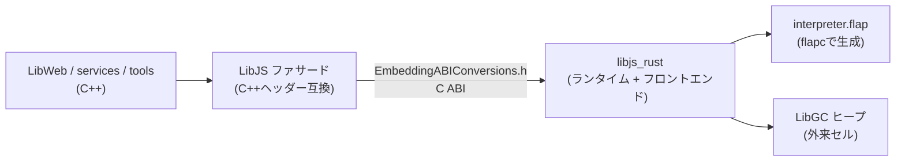

# 2026-10-09（金）

> 今日のひとこと：Ladybirdが、JavaScriptエンジンLibJSのC++製ランタイムを丸ごと削除し、Rust製ランタイムに一本化しました（約11万行の削除）。新規の脆弱性はなく、正式リリースはVite v8.3.4とSolid 2.0.0-rc.14です。

## 今日のリリース

- 【Vite】v8.3.4：dev serverの再起動要求の取りこぼし、静的エイリアスのパス境界の判定、`import.meta.hot.acceptExports`（bundled dev）などの修正と追加（出典: https://github.com/vitejs/vite/releases/tag/v8.3.4 ）
- 【Solid】solid-js 2.0.0-rc.14（`@solidjs/signals` ほか同時リリース）：書き込み可能なderivedの手動書き込みを先に適用する順序への変更と、サーバー描画の`<Loading>`まわりの修正（出典: https://github.com/solidjs/solid/releases/tag/solid-js%402.0.0-rc.14 ）

## トップニュース

### LadybirdのJSエンジンが、C++ランタイムを捨ててRustに一本化される

【Ladybird】LadybirdBrowser/ladybirdのmasterで、LibJS（JavaScriptエンジン）のC++製ランタイムが削除され、LibWebなどの利用側は既定でRust製ランタイムの上に建つようになった。削除のコミットだけで567ファイル、約11.7万行の削除になる。

**何が変わる**

- `Meta: Build LibJS's users on the Rust LibJS runtime by default`（2c109b1）：LibWeb・サービス・ツールが、既定でRust製ランタイムにビルドされる。それまでは `LIBJS_RUNTIME=Cpp` で旧ランタイムに戻せた
- `Meta: Stop building the C++ LibJS runtime`（d0f42a1）：`LIBJS_RUNTIME` と `ENABLE_LIBJS_RUST_RUNTIME` のスイッチを削除。`js-rust` などの名前は `js`、`test262-runner`、`test-js-runtime` に戻る
- `LibJS: Remove the C++ runtime`（4014a8a）：オブジェクトモデル、環境、レルム、全ビルトイン、IntlとTemporalのC++実装を削除
- 残るのは、C++側のAPIを再現する「ファサード（facade）」と、ファサードと共有していたもの（`interpreter.flap`、`ErrorTypes` のメッセージ、ホストオブジェクトのABI）

**なぜ変えた**：コミットメッセージが語るのは移行の手順で、動機そのものは書かれていない（動機は不明）。読み取れるのは、並走させて同じテスト結果になることを確かめてから旧側を消す、という段取りだ。2c109b1 は「LibWebのテスト、test262、LibJSのテスト一式が両ランタイムで同じ結果になる」ことを既定切り替えの根拠にしている。

**何に効く・誰が困る**：LibJSを自分のビルドで使っている人、`LIBJS_RUNTIME=Cpp` を使っていた人。Rustツールチェーンがビルドの必須要件になる（Flatpakのcargoソースの扱いも変わった）。実行性能への影響は、今回の調査では不明。

**ここまでの経緯**

- 2026-10-08（コミット日時）：Rustランタイムの追加（d1562d3）から、各ビルトインの移植、既定の切り替え、C++ランタイムの削除までが、約130コミットのまとまりとしてmasterに入った。コミット日時は全て同じ（積んだ系列をまとめて取り込んだ形と読めるが、推測）
- それ以前の経緯（Rustフロントエンド、Flapの導入）は、今回の調査では日付を確認していない

出典: https://github.com/LadybirdBrowser/ladybird/commit/2c109b1 、https://github.com/LadybirdBrowser/ladybird/commit/4014a8a 、https://github.com/LadybirdBrowser/ladybird/commit/d0f42a1

## 今日の深掘り

### 「C++のAPIを変えずに、中身をRustに入れ替える」ファサードの作り方

**選んだ理由**：1,600を超えるC++のソースファイルを書き換えずに、エンジンの中身を別言語に差し替えた設計を、コミットメッセージから読める。大規模な書き換えの進め方の教材になる。

**背景**：LibWebはJSエンジンのAPIを大量に呼ぶ。2459350 のメッセージによると、`HostObject.h` だけで LibWeb の1,607個の翻訳単位が include している。呼び出し側を一斉に書き換えるのは現実的でない。

**変更点**：

- Rustランタイムは `libjs_abi` というクレートで、NaN-boxingのタグ、ビルトインID、完了タイプなどの値を一か所に定義する（24d0446）。それ以前は、Rustのフロントエンドが C++側の値の私的なコピーを持っていて、「三つ目のコピーがずれても気づけない」状態だった
- `interpreter.flap` というバイトコードインタプリタは、C++側と同じものをRust側でも使う（d1562d3）。ランタイムは、インタプリタが呼ぶ182個のランタイム関数を実装する。ビルドスクリプトが `flapc` に「どの関数をどう呼ぶか」を尋ね、`#[repr(C)]` のビュー、`extern "C"` の入り口、`RuntimeFunctions` トレイトを生成する。未実装の関数はその名前でプロセスを止める
- ファサード側は、C++の既存ヘッダーと同じシグネチャ・オーバーロード・デフォルト引数を保つ。C ABIへの変換は `EmbeddingABIConversions.h` だけが担う（2459350）。`Value` はNaN-boxingをRustと「ビット単位で共有」するので、インラインの経路を残せる
- GCは `LibGC` のヒープを共有する。Rust側のセルは「vtableを持たない外来セル」として扱い（5bfa081）、Rustのデータブロックも `LibGC` のプリミティブ用領域に置く（1cfa507）

**周辺コード**：最後に b113a05 で、別ワークスペースだったランタイムのクレートを `libjs_rust` に統合した。理由は「C++ランタイムと並べて作っていたから別クレートだった。C++が消えたので一つでよい」。ルートのワークスペースに入ったので、`cargo fmt` と `clippy` の検査対象にもなった。

**この変更から分かる設計思想**：差し替えは、(1) 値のレイアウトを共有して境界のコストを下げる、(2) 互換APIの背後に新実装を置く、(3) 同じテストを両方で通す、(4) 通ったら旧側を消す、の順で進んだ。ABIの定義を一か所に集め、ずれるとビルドが落ちる（オフセットの静的アサーション）ようにしているのも、並走期間の事故を機械に見つけさせるためだ。

出典: https://github.com/LadybirdBrowser/ladybird/commit/d1562d3 、https://github.com/LadybirdBrowser/ladybird/commit/2459350 、https://github.com/LadybirdBrowser/ladybird/commit/24d0446 、https://github.com/LadybirdBrowser/ladybird/commit/b113a05

### `bun check` が「tscと同じ答え」を目指す進め方

**選んだ理由**：型チェッカーの移植で、どうやって互換性を測るかが具体的な数字つきで書かれている。ts-rustと並べて読める。

**背景**：`bun check` はtypescript-goの型チェッカーの移植で、2026-10-06に #44361 で入った。以降、PRごとに「`tsc` 7.0.2との差」を潰している。

**変更点**：

- #44726（4c54c9bc6）：`tsc` は通すのに `bun check` が誤ってエラーにした9種のプログラムと、見逃した1種を修正。たとえば `NoInfer<T>` の値をスプレッドした結果が、スプレッドの中身を落としてTS2322になっていた
- #44748（620b50f6a）：`skipLibCheck` 下で、生成された`.d.ts`が同じ名前を二度宣言していると、`tsc` は `Method` を `any` とみなすが、`bun check` は `const` の型とみなしていた。`tsc` と同じ扱いに揃えた
- 検証の数字（PR本文、自己申告）：TypeScript自身のテストで、エラー出力13,101件中13,101件がバイト単位で一致。型・シンボル・宣言ファイルのベースラインも全件一致。3つの宣言の順列229モジュールでは、修正前に120行の差があった

**周辺コード**：差の出た例を小さなプログラムにして、CIで両ツールに通す方式を取っている（PR本文では2,347件、うち新規1件）。バグを直すたびに回帰テストの束が増える。

**この変更から分かる設計思想**：「仕様」は書かれた文書ではなく、`tsc` の出力そのもの。だから正しさの定義が「`tsc` との一致」になり、エッジケースは `any` 扱いのような、仕様に書かれない挙動まで写し取ることになる。

出典: https://github.com/oven-sh/bun/pull/44726 、https://github.com/oven-sh/bun/pull/44748

## 仕様の変更

### w3c/csswg-drafts

#### `stretch()` が css-sizing-4 に入る

【CSS】`width` などのサイズ指定に `stretch(<length-percentage>)` が加わる。マージンボックスが引数のサイズになるよう、auto マージンを0として扱い、マージンの相殺なども計算上は無視する。`fit-content(<length-percentage>)` は、この `stretch()` を使った式に定義し直された。
なぜ変えたか：`fit-content()` の「利用可能な空間を引数に置き換える」という説明を、マージンボックス基準の一つの関数に切り出して、整合を取るため（推測。コミットメッセージには理由が書かれていない）。詳細は ISSUE(5715) として未決。
出典: https://github.com/w3c/csswg-drafts/commit/062dc948

#### CSSOM View：スクロールのPromiseが `ScrollResult` で解決される

【CSS】スクロールAPI（`scrollTo()` などが返すPromise）が、`{ interrupted: boolean }` を持つ `ScrollResult` で解決されるようになる。別のスクロールに中断された場合は `interrupted: true`、最後まで進めば `false`。viewportのスクロールは、2つのPromiseがどちらも非中断のときだけ非中断になる。
なぜ変えたか：以前のPromiseは完了と中断を区別できなかった。PR #12495（本文は未確認）。
出典: https://github.com/w3c/csswg-drafts/commit/2b26877d

その他：

- css-grid-3：`flow-tolerance` を `fit-tolerance` に改名（[#10884](https://github.com/w3c/csswg-drafts/commit/0ff603b4)）
- css-content-3：`match-parent` の定義をやり直し（[#5478](https://github.com/w3c/csswg-drafts/commit/c8459c50)）、alt text内のcounterをat-riskに（[#10387](https://github.com/w3c/csswg-drafts/commit/0a439193)）
- css-sizing-4：`fit-content()` と循環パーセントの扱いを明確化（[#11805](https://github.com/w3c/csswg-drafts/commit/77c73372)）
- css-forms-1：フォームコントロールの疑似要素すべてに `box-sizing: border-box`（[#14571](https://github.com/w3c/csswg-drafts/commit/0289e95a)）
- css-overflow：クランプされた内容は「見た目だけ」抑止されると明記、テスト対応表を更新（[1dafa605](https://github.com/w3c/csswg-drafts/commit/1dafa605)）

動きなし：whatwg/html、whatwg/dom、whatwg/fetch、whatwg/streams、whatwg/url、tc39/ecma262、tc39/proposals、w3c/ServiceWorker、w3c/wcag3（前回の実行以降にマージなし）。w3c/aria は CI のチェックを足した1件のみで除外。

## ブラウザの実装

取得できず（chromestatus.com・groups.google.comはegressでブロック。上記はコミット履歴と検索結果から）。web-platform-tests/interop は今回確認していない。

### Chromium（`runtime_enabled_features.json5` の履歴）

- 機能の出荷（Ship / by default）にあたるコミットはなし
- 2026-10-07：`[svg] style reuse (3/3): Handle mutations and enable` でSVGのスタイル再利用を有効化（[c401d7e](https://github.com/chromium/chromium/commit/c401d7e06d8b3ac57b621ac5c871370910aab4f4)）。内部の最適化で、利用者に見える機能ではない
- 2026-10-08：`Keep wavy text decorations continuous across fragments` が入って、同日revertされた（[198d0b6](https://github.com/chromium/chromium/commit/198d0b60e4b380d9af19291d6f36813a808c675b) → [b418a9f](https://github.com/chromium/chromium/commit/b418a9ffac5991a2c053b45596a2abcebac4e877)）。理由は不明

## OSSのPR

### Ladybird

トップニュースと深掘りで扱った件を除いて、前回の実行以降は約158コミット。

#### アクセシビリティツリーとスクリーンリーダー対応が入る

【Ladybird】LibWebにアクセシビリティツリーの基盤が入り、QtのUI（LinuxのAT-SPI2とOrca、macOSのNSAccessibility）に接続された。`aria-hidden`、`visibility:hidden`、`display:contents`、`aria-describedby` など、仕様の細かい扱いを一つずつコミットにしている。macOSとOrcaの出力の回帰テストとCIも追加。
なぜ変えたか：コミットメッセージは「何を除くか」の規則だけで、動機は書かれていない（不明）。
出典: https://github.com/LadybirdBrowser/ladybird/commit/9b29d84 、https://github.com/LadybirdBrowser/ladybird/commit/136c487

#### スタイルとレイアウトを切り離す「クロックレーン」の作り直しが続く

【Ladybird】10-03の号で追ったスタイル・レイアウトの切り離しの続き。アニメーションやホバー遷移を扱う「クロックレーン」（presented frameごとに1本）を整理し、リース方式をレーン方式に置き換えた（[6e62b56](https://github.com/LadybirdBrowser/ladybird/commit/6e62b56)）。スタイルエンジンの大きな表をフォークと共有するコピーオンライトの導入も同じ並び。
なぜ変えたか：コミットメッセージに理由の記述は少なく、詳細は不明。
出典: https://github.com/LadybirdBrowser/ladybird/commit/6e62b56

その他：

- 色の解決（`getComputedStyle` の相対色、テーマ色、カーソルのグラデーションなど）をRustに移動（[aa0269d](https://github.com/LadybirdBrowser/ladybird/commit/aa0269d)）
- 別オリジンの`<link>`スタイルシートを「origin-clean」でなくし、ルールを読むとSecurityErrorを投げる（[c0d68bd](https://github.com/LadybirdBrowser/ladybird/commit/c0d68bd)）
- テキストシャドウを共有レイヤーで描画（[a89d750](https://github.com/LadybirdBrowser/ladybird/commit/a89d750)）
- `Array.prototype.indexOf` のpacked storage直接走査、JSON文字列エスケープの一時割り当て削減（[1ec6c04](https://github.com/LadybirdBrowser/ladybird/commit/1ec6c04)、[e92ec55](https://github.com/LadybirdBrowser/ladybird/commit/e92ec55)）
- Qt UIのブックマークダイアログ、macOSのネイティブコンテキストメニューなど（[00fa3c3](https://github.com/LadybirdBrowser/ladybird/commit/00fa3c3)）

### Servo / Stylo

#### StyloでServoビルドの`sideways-rl`・`sideways-lr`が有効になる

【Servo】縦書きの `sideways-rl` / `sideways-lr` writing mode が、Servoのビルドでも有効になった（stylo #481）。
出典: https://github.com/servo/stylo/commit/fdddade62

その他（servo/servo）：

- 3Dのstacking contextを共有する要素に別のstacking contextを作る（[#47933](https://github.com/servo/servo/pull/47933)）
- 空の`<input>`のゼロ幅スペースのハックを削除（[#48652](https://github.com/servo/servo/pull/48652)）
- ブロックレベルを含むインラインボックスの断片を描かない（[#46445](https://github.com/servo/servo/pull/46445)）
- 行レイアウトでぶら下がる空白と削除される空白の追跡を改善（[#48591](https://github.com/servo/servo/pull/48591)）
- アクセシビリティデータの更新方法をリファクタ（[#48707](https://github.com/servo/servo/pull/48707)）
- `PolicyContainer` を `Arc` に（[#47720](https://github.com/servo/servo/pull/47720)）
- WebGL：uniform blockメンバの `getUniformLocation` がnullを返す、`DEPTH_STENCIL_ATTACHMENT` のエイリアス扱い（[#48751](https://github.com/servo/servo/pull/48751)、[#48689](https://github.com/servo/servo/pull/48689)）
- `TimerListener` のリーク修正、スタイルシート読み込みタスクの修正ほか約10件（[#48752](https://github.com/servo/servo/pull/48752)、[#48714](https://github.com/servo/servo/pull/48714)）

### TypeScript（Go版）

#### Go版のコードが共有データシンボルの扱いを整理する

【TypeScript】microsoft/TypeScript のmainに、Anders Hejlsbergによる`Shared data symbols`（#64691）が入った。65ファイルを触る変更で、コミットメッセージに説明はなく、中身の意図は不明。同日に「[api] Prepare for beta release」（#64681）も入っている。
出典: https://github.com/microsoft/TypeScript/pull/64691

その他：

- computed property nameを、親の文法エラーに関わらず常に検査（[#64674](https://github.com/microsoft/TypeScript/pull/64674)）
- 再エクスポートするモジュールを宣言emitのために索引化（[#64469](https://github.com/microsoft/TypeScript/pull/64469)）
- `getDocumentationForSymbol` のdocstringを関数に移動（[#64686](https://github.com/microsoft/TypeScript/pull/64686)）

### pingdotgg/ts-rust（tsc-rs）

前回の実行以降は約73コミット。多くは `docs(state)` などのエージェント運用の記録（件数のみ）。

#### R181：`tsc -b` の emit のみ・noCheck タスクの完了条件などを修正

【TypeScript】R181（batch 64）として、`tsc -b` で emit のみ・`noCheck`・構文エラーのタスクが「emitが終わった時点で完了する」ように直され、`tsc -b -w` は1サイクル中の`.d.ts`と`.json`の最初のパースを保持するようになった（Goの`build/host.go`に合わせる）。READMEの既知の問題から`tsc -b`の記述が狭められた（[fbb9847](https://github.com/pingdotgg/ts-rust/commit/fbb9847)）。`UPSTREAM.json` の`current`は `dc37b5249ab6` のまま（今回の期間に変更なし）。互換性・速度の数字は自己申告で、今回は検証していない。
出典: https://github.com/pingdotgg/ts-rust/commit/e2ca74f

### oven-sh/bun（`bun check` のみ）

トップの深掘りで扱った #44726、#44748 に加えて、

- `bun check`：`tsc` との差をさらに修正（[#44685](https://github.com/oven-sh/bun/pull/44685)）。union の一部が他を継承するときの型、条件型を基底クラスに渡すクラス、ループ内のrest要素など

### Vite

#### bundled dev で `import.meta.hot.acceptExports` が使えるようになる

【Vite】bundled devモード（Rolldown上のdev）で、モジュールが一部のexportだけをHMRで受け付ける `import.meta.hot.acceptExports` に対応した。PRの本文は空で、動機は不明。
出典: https://github.com/vitejs/vite/pull/23463

#### dev serverの再起動要求が、再起動中に来ても落とされなくなる

【Vite】再起動の最中に別の再起動が要求されると、後の要求が捨てられていた。捨てずに再実行する。
なぜ変えたか：Issue #23392。
出典: https://github.com/vitejs/vite/pull/23484

その他：

- 静的エイリアスのマッチをパス境界で判定（[#23643](https://github.com/vitejs/vite/pull/23643)）
- `chunkImportMap` が有効で base がルートでないときのpreloadを修正（[#23698](https://github.com/vitejs/vite/pull/23698)）
- preloadヘルパーが読み込み中のスタイルシートを待つ（[#23662](https://github.com/vitejs/vite/pull/23662)）
- 循環するチャンクのCSSをキャッシュしない（[#23636](https://github.com/vitejs/vite/pull/23636)）
- 深いimportのカスタム拡張子をoptimizerのスキャンで扱う（[#23678](https://github.com/vitejs/vite/pull/23678)）
- JS風クエリで終わるモジュールをJSとして扱わない（[#23687](https://github.com/vitejs/vite/pull/23687)）
- lightningcssでpreprocessorをファイルのパスから解決（[#23688](https://github.com/vitejs/vite/pull/23688)）
- HTMLの変換でファイルシステムのルートをwatcherに足さない（[#23689](https://github.com/vitejs/vite/pull/23689)）
- HMRのデフォルト値を破壊的に変更しない（[#23576](https://github.com/vitejs/vite/pull/23576)）
- 入力オプションのunescapingを一旦削除（[#23694](https://github.com/vitejs/vite/pull/23694)）
- クライアントで、変わっていないadopted stylesを書き直さない（[#23697](https://github.com/vitejs/vite/pull/23697)）
- module-runnerでsource mapのない呼び出し位置をクローンしない（性能）（[#23646](https://github.com/vitejs/vite/pull/23646)）

### Biome

#### `useSortedClasses` がTailwind v4のソーターに切り替わる

【Biome】クラス並べ替えのlintが、Tailwind v4のソーターに切り替わり、名前も `useTailwindSortedClasses` に改名された。PR本文は読めていない（不明）。
出典: https://github.com/biomejs/biome/pull/12149

その他：

- lint：`noOctal`（[#12110](https://github.com/biomejs/biome/pull/12110)）、YAMLの`noEmptySource`（[#12214](https://github.com/biomejs/biome/pull/12214)）、Vueの`noVueRootVIf`（[#12077](https://github.com/biomejs/biome/pull/12077)）、Svelteの`useSvelteKitResolve`（[#11957](https://github.com/biomejs/biome/pull/11957)）を追加
- JS APIにgrit検索を公開（[#8912](https://github.com/biomejs/biome/pull/8912)）
- Vueの整形：statementのイベントハンドラ、引用符内のディレクティブ値（[#12218](https://github.com/biomejs/biome/pull/12218)、[#12131](https://github.com/biomejs/biome/pull/12131)）
- CSS/SCSS：modern `if()` のSass値、補間されたat-rule名、変数で始まるmedia range（[#12209](https://github.com/biomejs/biome/pull/12209)、[#12205](https://github.com/biomejs/biome/pull/12205)、[#12196](https://github.com/biomejs/biome/pull/12196)）
- GritQLのメタ変数をCSSのセレクタ・プロパティ名で対応、字句解析のリファクタ（[#12199](https://github.com/biomejs/biome/pull/12199)、[#12200](https://github.com/biomejs/biome/pull/12200)）
- CIをnextestに、insta挙動の修正（[#12222](https://github.com/biomejs/biome/pull/12222)、[#12220](https://github.com/biomejs/biome/pull/12220)）

### oxc

#### minifierが、定数引数のIIFEの未使用呼び出しを消す

【oxc】`const f = x => x + 1; f(1);` のように、結果が使われない即時実行関数の呼び出しを、定数引数を追跡して除去する。デフォルト引数・分割代入・rest・スプレッドがある場合は保守的に諦める。
なぜ変えたか：呼び出しが `(x => x + 1)(1)` として残っていたため。
出典: https://github.com/oxc-project/oxc/pull/27434

その他：

- oxfmtがAstroを `prettier-plugin-astro@1.x` 経由で対応、LSPと`--migrate prettier`も（[#27386](https://github.com/oxc-project/oxc/pull/27386)、[#27388](https://github.com/oxc-project/oxc/pull/27388)、[#27387](https://github.com/oxc-project/oxc/pull/27387)）
- oxlint・oxfmtのLSPが設定エラーをクライアントに表示（[#25486](https://github.com/oxc-project/oxc/pull/25486)、[#26014](https://github.com/oxc-project/oxc/pull/26014)、[#26003](https://github.com/oxc-project/oxc/pull/26003)）
- JS版codegenのmegamorphicアクセス削減など性能改善7件（[#27454](https://github.com/oxc-project/oxc/pull/27454)ほか）
- 型を意識したlintで、診断ごとにソースを共有（[#27462](https://github.com/oxc-project/oxc/pull/27462)）
- transformer：staticブロックの合成privateフィールドを避ける（[#27300](https://github.com/oxc-project/oxc/pull/27300)）
- semantic：optional memberのdeleteを`MemberWriteTarget`に（[#27430](https://github.com/oxc-project/oxc/pull/27430)）
- formatter：jsdocの`@description`幅の判定（[#27439](https://github.com/oxc-project/oxc/pull/27439)）、oxfmtの内部名の整理4件

### Next.js

その他（前回の実行以降の非botコミットのうち、docs・テストのみを除く）：

- Node.js 24でテレメトリの送信が`AbortSignal`の型検査で落ちる不具合を修正（[#99842](https://github.com/vercel/next.js/pull/99842)）
- Turbopack：ファイルシステムキャッシュの保存失敗時に原因を報告（[#99823](https://github.com/vercel/next.js/pull/99823)）
- turbo-tasks-fs：`NotFound` のwatcherエラーを出さない（[#99794](https://github.com/vercel/next.js/pull/99794)）
- 非推奨の`React.FormEvent`を`SubmitEvent`に置き換え（[#99821](https://github.com/vercel/next.js/pull/99821)）
- upgrade evalのfixtureでnextをCVE-2026-94483向けに更新（[#99838](https://github.com/vercel/next.js/pull/99838)）。このCVEの詳細は今回確認できていない

### Solid

#### 2.0.0-rc.14：書き込み可能なderivedの優先順位を戻す

【Solid】`next`系の2.0.0-rc.14で、writable derivedへの手動書き込みを先に適用し、その後にderivationを書き込み値を`prev`として再実行する順序になった。beta.11の優先順位を逆転する変更で、Issue #3733 の修正。サーバー描画では、`<Loading>`が収束しない、memo再作成での100% CPUハング（#3815）などを修正。トレースのmaterializerを`@solidjs/web/frames/trace`に分けて遅延読み込みにし、使わないページでbrotliで約6.6KB減った（リリースノートより）。
出典: https://github.com/solidjs/solid/releases/tag/solid-js%402.0.0-rc.14

### react-hook-form

その他：

- `Object.prototype`のメンバ名のフィールドがblur・setValueでtouchedにならない不具合（[#13833](https://github.com/react-hook-form/react-hook-form/pull/13833)）
- `cloneObject`がスパース配列の長さを保つ（[#13834](https://github.com/react-hook-form/react-hook-form/pull/13834)）

### ghc/ghc

その他（コミットメッセージを根拠）：

- DmdAnal：`AbsDmd` を `maxDmd` で中立元にする（[f76464c](https://github.com/ghc/ghc/commit/f76464cff4)）
- CI：lint系ジョブをプラットフォーム非依存に（[c082313](https://github.com/ghc/ghc/commit/c0823135a3)、[15ece29](https://github.com/ghc/ghc/commit/15ece296a7)）

### Wado

前回の実行以降は約100コミット。多くは最適化の並列化と `docs`・`chore` なので件数のみ。

#### 最適化器を複数スレッドで動かす WEP が書かれ、実装が進む

【Wado】`docs/wep-2026-10-08-parallel-optimizer.md` が追加された。`package-gale` のコンパイルの62%がNIRの固定点ループにあり、関数が約16,000あるのに1コアで動く。原因は `Vec<Rc<RefCell<NirFunction>>>` のような構造がスレッドを渡れないこと、とWEPは述べる。決定の第一は「出力はスレッド数に依存しない」で、1スレッド・複数・`wasm32`で同じバイト列を出す。実装は同日に `NirFunction` を `Send + Sync` にする変更から始まり、各パスを順にスレッドへ載せている（[b204ac2](https://github.com/wado-lang/wado/commit/b204ac29a3)、[f7cb5cb](https://github.com/wado-lang/wado/commit/f7cb5cbb1f)）。
なぜ変えたか：コンパイル時間の大半が1コアに載っているため（WEPの計測表）。
出典: https://github.com/wado-lang/wado/commit/49238a456c

その他：

- v0.0.35（10-07 19:14 JST）・v0.0.36（22:22 JST）をタグ。v0.0.36には `wep-2026-10-07-default-interface-as-module.md` が含まれる
- 効果ハンドラ：ハンドラのメソッドは全ての経路で`resume`する（[dcba415](https://github.com/wado-lang/wado/commit/dcba4152a2)）、`resume`を文（`ReturnStmt`）として扱う（[3785f40](https://github.com/wado-lang/wado/commit/3785f40139)）
- 並列最適化の性能とベンチマークCI（2xで警告、4xで失敗）（[82736b5](https://github.com/wado-lang/wado/commit/82736b5758)）
- `url.resolve`がスキームを持つ参照を絶対として読む（[547571c](https://github.com/wado-lang/wado/commit/547571cc7f)）

動きなし：facebook/react（`enableTrustedTypesIntegration` のフラグ着地は10-08の号の範囲）、sveltejs/svelte、vuejs/core（`minor`）。

## 続報

- 10-08の号で追ったwhatwg/htmlの`popover`の修正：今日はwhatwg/htmlに新しいマージがなく、続報なし。
- 10-07の号で取り上げたVite v8.3.3のセキュリティリリースの後、通常の修正を集めた v8.3.4 が出た。
- 10-03の号のLadybirdのスタイル・レイアウトの切り離しは、クロックレーンの作り直しとして続いている（上記）。

## 仕様を読む会の候補

- CSS Sizing Level 4 の `stretch()`：マージンボックス基準のサイズ指定と、`fit-content()` の再定義が同時に入った。ISSUE(5715) が未決なので、どこが決まっていないかも読める。
- CSSOM View の「perform a scroll」：`ScrollResult` で、中断と完了をPromiseに載せる仕組み。viewportスクロールの2つのPromiseの合成規則が短く読める。
