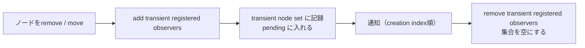

# 2026-10-10（土）

> 今日のひとこと：whatwg/htmlが、`<style>` を `<body>` の中に置くことを（条件つきで）適合とする変更を入れました。条件は「前にある内容を再スタイルしない」ことです。新規の脆弱性はなく、今日の正式リリースは ts-rust v0.2.0 だけです。

## 今日のリリース

- 【TypeScript】ts-rust v0.2.0：tscバイナリのPGOビルド、linux-arm64のCI、Windows(msvc)でのテスト通過など。ベンチマーク資料は追加されたが、リリースページに数字は載っていない（出典: https://github.com/pingdotgg/ts-rust/releases/tag/v0.2.0 ）

## トップニュース

### HTMLで、`<style>` を `<body>` の中に置いてよくなる（ただし前の内容を再スタイルしないなら）

【HTML】whatwg/htmlのmainに、`style` 要素を「フローコンテンツが期待される場所の、親の最初の子」として置いてよいとする変更が入った（877d614）。`@import` を含まず、スタイルルールがすべて `@scope`（`<scope-start>` なし）の中にある場合に限る。

**何が変わる**

- `style` 要素のカテゴリに「フローコンテンツ」が加わった。使える文脈にも「フローコンテンツが期待される場所。ただし親の最初の子」が加わった
- `body` の子孫の `style` には追加の適合条件がつく。スタイルシートに `@import` を書かない。スタイルルールと、`<scope-start>` を持つ `@scope` は、`<scope-start>` を持たない `@scope` の中に置く（例：`@scope { ... }`、`@scope to (.x) { ... }`）。`@mixin` と `@supports-condition` の中は例外
- 例のイメージ（仕様の条件を満たす形。コードは筆者が書いた例）：

```html
<section>
  <style>@scope { p { color: teal } }</style>
  <p>この段落だけが対象</p>
</section>
```

**なぜ変えた**：Issue #12951 で、CSSの仕様自身が `@scope` の説明で `<body>` 内の `<style>` を使っているのに、適合チェッカーが誤りとして報告する、という指摘が出た（2026-09-16）。一方で、`<style>` が前にある内容を再スタイルすると、スタイル無効化とレイアウト再計算、最悪はFOUC（スタイルなし表示のちらつき）を起こす。そこで「`@scope` の起点が `style` の親になるので、すでに描画されているかもしれない内容には効かない」形だけを許した。

**何に効く・誰が困る**：コンポーネント単位で `<style>` を隣に置く書き方（SSRやMarkdown生成のHTMLなど）が、適合チェッカーで通るようになる。ブラウザはもともと `<body>` 内の `<style>` を動かしているので、実行時の挙動は変わらない。ブラウザ各社の立場は、Issueからは読み取れなかった（不明）。

**ここまでの経緯**

- 過去に #1605 で「性能への影響」が問われたが、証拠のある答えは出ていなかった（Issueの記述による）
- 2026-09-16：#12951 が立つ
- 2026-09-27：HTMLバリデータ側に「再スタイルしえないなら許す」実装が入る（Issue上の記述）
- 2026-09-30：仕様のPR #13007 が出て、CSSWGにレビューを依頼
- 2026-10-09：mainに入り、#12951 がクローズ。コミットには AI（Claude）との共著の記載がある

出典: https://github.com/whatwg/html/commit/877d6146487f15b15bc8dd0e3c625063a37b456a 、https://github.com/whatwg/html/issues/12951

## 今日の深掘り

### 仕様の穴を、実装の挙動に合わせて埋める：MutationObserver の「一時的な登録」

**選んだ理由**：`MutationObserver` の「transient registered observer（一時的な登録済みオブザーバ）」が、仕様の上ではずっと掃除されていなかったという話で、後始末の設計を学べる。コミットメッセージが原因の履歴まで書いていて読みやすい。

**背景**：`MutationObserver` で `subtree` を監視していると、監視下のノードが外されても、外れたノードの中の変更を取りこぼしたくない。そのため、ノードを外すときに外れたノードへ「一時的な登録」を足し、通知が終わったら消す（transient registered observer）。ところが 50b3051 で、オブザーバの「node list」が `observe()` に渡したノードだけを持つ形になった。すると一時的な登録の付いたノードがnode listに入らず、掃除の対象から漏れた。さらに d34d52d で「レコードが積まれたオブザーバだけを通知する」形になり、`attributes` + `subtree` で子を外しただけの場合は、掃除そのものが走らなくなった（コミットメッセージによる）。

**変更点**（3071e5f、dom.bs）：

- オブザーバごとに「transient node set」（ノードへの弱参照の集合）を持つ。一時的な登録を足すときに、ここへノードを記録する
- 新しいアルゴリズム「add transient registered observers」を切り出し、`remove` のインライン処理を置き換える。一時的な登録を足したとき、そのオブザーバを pending mutation observers に入れる。つまりノードを外した時点で、通知のマイクロタスクが予約される
- 通知後は「remove transient registered observers」で、transient node set のノードから自分の一時的な登録を消し、集合を空にする
- 通知の順序を、オブザーバの「creation index」（生成順）の昇順で固定する。以前は集合の複製の順に頼っていた
- `move` のアルゴリズムも一時的な登録を足す。`disconnect()` は node list を空にする



**周辺コード**：`replaceChildren()` では、新しい子を入れたあとにレコードを積むので、通知のマイクロタスクが以前より早く予約されることがある、とコミットは明記している。WebKit の `moveBefore()` はまだ一時的な登録を足さない。テストは web-platform-tests の #63390。

**この変更から分かる設計思想**：仕様を書き換えた動機は「実装（ChromiumとGecko）がそう動いている」ことの追認だ。状態を足すときは、消す場所もセットで足す。弱参照の集合を持つのは、仕様の上でも、ノードの寿命を延ばさないための工夫と読める（推測）。

出典: https://github.com/whatwg/dom/commit/3071e5f

## 仕様の変更

### whatwg/html

#### `<style>` を `<body>` に置ける

トップニュースを参照。

### whatwg/dom

#### MutationObserverの一時的な登録の後始末

深掘りを参照。

### tc39/ecma262

- Atomics用の `RevalidateAtomicAccess` が、TypedArray要素の全バイトを考慮するよう変更（Normative、[#3926](https://github.com/tc39/ecma262/pull/3926)）
- 数字リテラルの文法まわりのeditorial整理（[#3988](https://github.com/tc39/ecma262/pull/3988)。editorialなので詳細は省略）

### w3c/csswg-drafts

#### css-color-4 に EdgeSeeker ガマットマッピングの擬似コードが入る

【CSS】Chris Lilleyが、色域外の色を色域に収めるアルゴリズム「EdgeSeeker」の擬似コードをcss-color-4へ追加した。同日に、RGB空間への限定、数値的に安定した円弧の交点計算などの修正が続いた。なぜその方式かは、今回の調査では不明。
出典: https://github.com/w3c/csswg-drafts/commit/6fa56e0b 、https://github.com/w3c/csswg-drafts/commit/3cfa13e8

その他：

- animation-triggers-1：イベント関数の値の定義を整理（[#14515](https://github.com/w3c/csswg-drafts/pull/14515)）、範囲の短縮記法（[#14524](https://github.com/w3c/csswg-drafts/pull/14524)）、見落としの修正（[#14581](https://github.com/w3c/csswg-drafts/pull/14581)）、typo修正（[#14580](https://github.com/w3c/csswg-drafts/pull/14580)）
- css-counter-styles-3 / css-content-3：定義済みの記号型カウンタースタイルの生成をcss-counter-stylesへ移動、UA描画記号の例外を `content` と整合させた（[26ec9eae](https://github.com/w3c/csswg-drafts/commit/26ec9eae)）

動きなし：whatwg/fetch, whatwg/streams, whatwg/url, tc39/proposals, w3c/aria, w3c/ServiceWorker, w3c/wcag3

## ブラウザの実装

取得できず（chromestatus.com・groups.google.comはegressでブロック）。`runtime_enabled_features.json5` のコミット履歴とblink-devの検索は、今回は時間の都合で確認していない。

### Servo / Stylo

#### StyloでtextのIndent `hanging` / `each-line` が設定つきで有効になる

【Servo】Styloが `text-indent` の `hanging` と `each-line` を、設定（pref）の裏で有効にした。
出典: https://github.com/servo/stylo/pull/483

その他（Servo）：

- ContainerTiming の PaintMetric に対応（[#46966](https://github.com/servo/servo/pull/46966)）
- WebDriverの Get Computed Role を正しく実装（[#47339](https://github.com/servo/servo/pull/47339)）
- UAShadowRootの移行を完了（[#48686](https://github.com/servo/servo/pull/48686)）
- タッチ互換のマウスイベントでポインタイベントを出さないよう修正（[#48701](https://github.com/servo/servo/pull/48701)）
- microtask checkpoint で ClearKeptObjects を実行（[#48739](https://github.com/servo/servo/pull/48739)）
- AccessKitで、フォーカスされたノードを設定（[#48708](https://github.com/servo/servo/pull/48708)）
- flex:column の不定サイズ項目で、事前計算した最小・最大主軸サイズを考慮（[#48670](https://github.com/servo/servo/pull/48670)）
- Stylo側のpreferenceの値をStyloから取得（[#48719](https://github.com/servo/servo/pull/48719)）
- 他にAndroid関連4件、依存更新5件、CI・WebGLのテスト安定化など（件数のみ）

## OSSのPR

### Bun（`bun check` のみ）

#### `bun check` が、宣言ファイルを全プロジェクトで一度だけ読む

【TypeScript】`bun check` の #44807（e555359cc）。`allowJs` で `this[k] = ...` を含むオブジェクトリテラルが落ちる不具合と、3つの誤ったエラーを直した。あわせて、プロジェクト参照のビルドで宣言ファイルを1チェックにつき1回だけ読むようにした。作者の自己申告では、プロジェクト参照のビルドが最大1.5倍速、単一スレッドの処理量が多くのプログラムで11〜45%減。ただしメモリは増える例もあり（Storybook 647→980MB と報告）、PR本文と後続コミットメッセージで数字が揺れている。
なぜ変えたか：同じ `.d.ts` を複数のプロジェクトが読み直していた無駄を省くため。
出典: https://github.com/oven-sh/bun/pull/44807

その他：

- テスト用ディレクトリ `test/` の型エラーをすべて修正（[#44614](https://github.com/oven-sh/bun/pull/44614)）

### microsoft/TypeScript

#### Go版の `esnext` にイテレータヘルパーの型が入る

【TypeScript】`lib.esnext.iterator.d.ts`（149行）が追加され、`esnext` の設定に含まれた（#64095）。10-02の号の `Promise.allKeyed` に続く、esnext の型の追加。
出典: https://github.com/microsoft/TypeScript/pull/64095

その他：

- APIの同期接続で、ネストしたリクエストをスタックの順で返す（[#64639](https://github.com/microsoft/TypeScript/pull/64639)）
- ローカライズファイルの更新（bot、除外）

### pingdotgg/ts-rust

【TypeScript】v0.2.0 をリリース（上記）。mainでは、上流 microsoft/TypeScript への追従（R185・R186の取り込み、`#64649`、`#64159`、`#64640`、`#63915`、`#64519` などの上流PR単位の移植）と、Windows(msvc)向けのテスト修正、Clippyの `redundant_clone` の有効化が入った。コミットは約218件で、そのうち `docs` が68件。互換性・速度の数字は今回読んでいない（自己申告のため、読んだときはそう断る）。
出典: https://github.com/pingdotgg/ts-rust/releases/tag/v0.2.0

### Next.js

#### カスタムwebpack対応（実験的）が再び入る

【Next.js】「Reland experimental custom webpack support」（#99234）。一度戻された機能が再度入った。理由はPR本文を読んでいないので不明。
出典: https://github.com/vercel/next.js/pull/99234

#### `next/image-optimizer-transform` が公開サブパスになる

【Next.js】画像最適化の変換部分を `next/image-optimizer-transform` として公開した（#99312）。脆弱性（10-01号のSSRF）を受けた整理かどうかは不明。
出典: https://github.com/vercel/next.js/pull/99312

その他：

- Turbopack：チャンクグループの正規化（[#98733](https://github.com/vercel/next.js/pull/98733)）、複数チャンクグループを1回の呼び出しで処理（[#99686](https://github.com/vercel/next.js/pull/99686)）、チャンクされたグループの登録の修正（[#99749](https://github.com/vercel/next.js/pull/99749)）
- Turbopack：トレースの圧縮・差分符号化・行の省略（[#99808](https://github.com/vercel/next.js/pull/99808)、[#99779](https://github.com/vercel/next.js/pull/99779)、[#99780](https://github.com/vercel/next.js/pull/99780)、[#99778](https://github.com/vercel/next.js/pull/99778)）
- Turbopack：Nodeの子プロセスが接続できないときに対処しやすいエラーを出す（[#99887](https://github.com/vercel/next.js/pull/99887)）、モジュール解決で realpath エラーを無視（[#99951](https://github.com/vercel/next.js/pull/99951)）
- `GoogleTagManager#dataLayer` のXSS対策の回帰テスト（[#99464](https://github.com/vercel/next.js/pull/99464)。テストのみだが、対象はセキュリティ）
- ビルドのツリー表示の割り当てを削減（[#99930](https://github.com/vercel/next.js/pull/99930)）、子ルートから生成されたパスの分類を修正（[#99864](https://github.com/vercel/next.js/pull/99864)）
- リリースブランチを `releases/lts/*` に固定（[#99807](https://github.com/vercel/next.js/pull/99807)）、Reactの更新（[#99879](https://github.com/vercel/next.js/pull/99879)）、エージェントのアップグレードのテレメトリ（[#99925](https://github.com/vercel/next.js/pull/99925)）
- 他にデプロイテスト関連4件（件数のみ）

### Vite

その他：

- bundled dev：`server.origin` をアセットURLに適用（[#23683](https://github.com/vitejs/vite/pull/23683)）、出力ファイルの正規化（[#23684](https://github.com/vitejs/vite/pull/23684)）、`build.chunkImportMap` を無視（[#23685](https://github.com/vitejs/vite/pull/23685)）
- `base` の除去をパスの完全なセグメントに一致するときだけにする（[#23641](https://github.com/vitejs/vite/pull/23641)）
- optimizerのロックファイルのハッシュで `yarn.lock` にフォールバック（[#23667](https://github.com/vitejs/vite/pull/23667)）
- bundled devのテストスキップのタグ付け4件（件数のみ）

### oxc

#### ASTがコメントを保持する形になり、パース中にノードIDを割り当てる

【oxc】コメントの「attachment storage」が追加され（#27393）、`Comment` から `Copy` が外れた（#27431）。パーサーはパース中にノードIDを割り当てる（#27411）。いずれも破壊的変更（`!`）。ツール側の作りに影響する。なぜこの順に入れたのかは、PR本文を読んでいないので不明。
出典: https://github.com/oxc-project/oxc/pull/27393 、https://github.com/oxc-project/oxc/pull/27411

#### oxfmtの `--migrate prettier` が改善される

【oxc】`--migrate prettier` を改善し（#27444、破壊的）、`--init` と `--migrate biome` のメッセージを揃えた（#27474）。
出典: https://github.com/oxc-project/oxc/pull/27444

その他：

- パーサー：export の後に no-side-effects 注釈を適用（[#27504](https://github.com/oxc-project/oxc/pull/27504)）、TypeScriptの回復ノードをAST構築関数で作る（[#27487](https://github.com/oxc-project/oxc/pull/27487)）
- レキサー：`Comment` を1回のmemcpyでコピー（[#27503](https://github.com/oxc-project/oxc/pull/27503)）
- ミニファイア：非有限数の畳み込みで `delete` の意味を保つ（[#27466](https://github.com/oxc-project/oxc/pull/27466)）
- リンター：`prefer-bigint-literals` の自動修正の修正（[#25690](https://github.com/oxc-project/oxc/pull/25690)）
- React Compiler：抑制範囲を借用で扱う（[#27495](https://github.com/oxc-project/oxc/pull/27495)）
- CI高速化4件、その他の整理・テスト修正数件（件数のみ）

### Biome

その他：

- Vue用リント `noVueRequiredPropWithDefault` を追加（[#12090](https://github.com/biomejs/biome/pull/12090)）
- Svelte用リント `noSvelteObjectInTextMustaches` を追加（[#12072](https://github.com/biomejs/biome/pull/12072)）
- `noTailwindArbitraryValues` の修飾子の扱いと回避オプション（[#12194](https://github.com/biomejs/biome/pull/12194)）、パッケージから読むスタイルシートの対応（[#12192](https://github.com/biomejs/biome/pull/12192)）
- Markdownの整形で、CJK文字の文章折り返しを修正（[#12232](https://github.com/biomejs/biome/pull/12232)）
- CSSのモデルルールの集まり（[#12014](https://github.com/biomejs/biome/pull/12014)）、CLIのinspect修正2件（[#12208](https://github.com/biomejs/biome/pull/12208)、[#12230](https://github.com/biomejs/biome/pull/12230)）

### Ladybird

#### LibJSのインタプリタに、キー付きプロパティのキャッシュが入る

【Ladybird】10-09号のRust化の続きとして、LibJSの性能の変更が連続して入った。コード位置ごとにキー付きアクセスをキャッシュする（4f754d9）、キャッシュが外れる多様なキーはキャッシュしない（27ab796）、メガモーフィックなキャッシュをFibonacciハッシュで引く（91cac83）、文字列定数を intern して比較を安くする（9331dc0）など。具体的な数字は、今回の調査では読んでいない（不明）。
出典: https://github.com/LadybirdBrowser/ladybird/commit/4f754d9

その他（約100コミットのうち、主なもの）：

- LibCompositing：ディスプレイリストの記録の再生・検証・問い合わせをRust側へ移動（b49139f、82c0ddd、a9ec150、a61a33b など）
- LibRegex：文字クラスのビットマップ、範囲の併合、レジスタ書き込みの取り消しによるバックトラック（a9159a4、2816a8f、37befac）
- LibWeb：サブグリッドの測定（256f551、7dfd529）、逆向きcross axisでのflex項目の整列（9dc572e）、ドラッグ中のhover更新の抑制（d3b18f7）
- LibJS：`Array.prototype` の反復メソッドをJavaScriptで実装（c94846a）、Map/Setの記憶域をGCに報告（c38df66）
- テストの安定化・WPT実行の改善数件

### Wado

wado-lang/wado：約90コミット。`docs/wep-*.md` の追加・変更は今回読んでいない（不明）。言語・コンパイラの設計では、「型引数を持つ構造体・implを wadopoet が受け付ける」（aad543b）、「trait境界の関連型が曖昧な場合を判定する」（2da09d1）、「定数の整数演算が桁あふれ・トラップする場合に警告」（d14cebd）、「シフト量をオペランド型で受け、ビット幅で剰余を取る」（1e95948）、Component Modelの境界の名前付けを `to_cm_name` に一本化（3fa9818）、が目立つ。残りは整理・生成物の更新。

### servo / stylo

OSSのPRとしてはブラウザの実装の節にまとめた。

動きなし：facebook/react, solidjs/solid, react-hook-form/react-hook-form, sveltejs/svelte, vuejs/core（minor）, ghc/ghc

## 議論ウォッチ

取得できず（今回は議論系のリポジトリ・Discussionsを確認していない。時間の都合）。

## 脆弱性

新規のアドバイザリはなし。react, next, vite, svelte, vue, oxc, astro, nuxt, TanStack Startの一覧の1ページ目を確認し、2026-10-09以降の公開はなかった（直近は Vite 10-06、Next.js と TanStack 09-30）。

## 仕様を読む会の候補

- DOM Standard の MutationObserver（transient registered observer の追加・削除と通知順）：今日のコミットで3つのアルゴリズムが1か所にそろった。差分が小さく、WPTと実装の対応まで追える。
- HTML Standard の `style` 要素：カテゴリ、使える文脈、`@scope` による適合条件が1節に収まる。「なぜ `@scope` ならよいか」を、CSSの `@scope` 仕様とあわせて読める。
