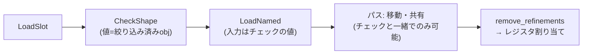

# 2026-10-11（日）

> 今日のひとこと：LadybirdがJavaScriptエンジンLibJSに、Rust製の最適化JIT（SSA形式のIR、投機、インタプリタへの脱出）を一気に入れ、設計書 `ARCHITECTURE.md` も付けました。同じ日にUIプロセスへの権限チェックを積む一連のセキュリティ修正も入っています。新規の脆弱性はありません。

## 今日のリリース

- 【RHF】react-hook-form v7.90.0：`watch` / `subscribe` / dirty判定の高速化と、`Object.prototype` のメンバ名を持つフィールドなど16件前後の不具合修正（出典: https://github.com/react-hook-form/react-hook-form/releases/tag/v7.90.0 、変更点はCHANGELOGで確認）

## トップニュース

### Ladybirdが、LibJSにRust製の最適化JITを入れる

【Ladybird】前回の号以降の約16時間で、Ladybirdのmasterに `LibJS` のJIT関連だけで約60コミットが入った。インタプリタのフィードバックを集める段、SSAのIRと最適化パス、レジスタ割り当て、x86-64とAArch64のアセンブラ、ホット関数のコンパイルとインストールまで揃った。出典のコミットはほぼすべてAndreas Kling。

**何が変わる**

- コンパイラは新しい `libjs_jit` クレート（`Libraries/LibJS/JIT/Rust`）。ランタイム側（スナップショットの取得、コードのインストール、入退出）は `Libraries/LibJS/Rust/src/jit`
- 設計書（268dc96）によると、ベースラインJITはない。インタプリタの命令が持つインラインキャッシュとフィードバックを「ベースライン」とみなし、JITがそれを投機（speculation）に翻訳する。投機が外れたらインタプリタに戻る
- tier-upの予算（呼び出しと、ループの繰り返し）を使い切った実行ファイルは、スナップショットを取ってコンパイルスレッドで処理される。その間インタプリタは走り続け、完了したらメインスレッドがコードを差し込む（d72bb64）
- 長いループはバックエッジでコンパイル済みコードに入る（OSR）

**なぜ変えた**：コミットメッセージと設計書は目的を速度としか書いていない。計測値は今回のコミットには見当たらず、速さの根拠は「不明」。背景には、10-09の号で扱った「LibJSのランタイムをRustへ移した」流れがあるとみられる（推測）。

**何に効く・誰が困る**：JSの重い処理が速くなる見込み。一方で、JITは攻撃面になる。コミットでも `LibSandbox: Allow memory protection keys in the renderer sandbox`（f2cb5d7）が同時に入り、JITコードの置き場をメモリ保護キーで守る方針がうかがえる（設計の詳細は未確認）。

**既定で有効かは、資料の間で食い違う**：設計書は「JIT付きのビルドは `LIBJS_JIT` が別に言わない限りJITを使う」と書く。しかし `Libraries/LibJS/JIT/Rust/src/options.rs` の `Default` は `enabled: false` で、d72bb64のメッセージも「`LIBJS_JIT` で有効にしない限りオフ」「まだJITコードは動かない」と書く。今日のmasterがどちらかは、実行して確かめていない。

**ここまでの経緯**

- 2026-09-26：GCのディスパッチをvtableから型ごとのテーブルにする変更（Rust移行を見据えた変更）を、BACKLOGの候補に記録
- 2026-10-09：LibJSのC++製ランタイムを削除してRust製に一本化（[10-09の号](2026-10-09.md)）
- 2026-10-10（JST）：`libjs_jit` クレートが入り、IR、パス、コード生成、ランタイム連携、テストが続く

出典: https://github.com/LadybirdBrowser/ladybird/commit/268dc96 、https://github.com/LadybirdBrowser/ladybird/commit/d72bb64

## 今日の深掘り

### LibJSのJITは、「チェックの値」をデータ依存にして、動かす・共有する安全性を保つ

**選んだ理由**：JITの設計書（`Libraries/LibJS/JIT/ARCHITECTURE.md`、418行）が、最適化コンパイラの考え方を、実コードと同じ粒度で説明している。とくに「refinement（絞り込み）」の節が、他のJS-JITとの違いが出る箇所で面白い。

**背景**：JSのJITは、「この値は整数」「このオブジェクトはこのshape」と投機してチェックを入れる。最適化では、このチェックの後ろにあるロードを別の場所へ動かしたり、重複を共有したりしたい。ただしチェックより前に動かすと、型が違う値を読んで落ちる。

**変更点（設計書の§3.2を読む）**：

- チェックに依存するノードは、チェック前の値ではなく「チェックの結果の値」を入力に取る（§3.2冒頭）。`CheckObject`、`CheckShape`、`CheckBounds` など、脱出するチェックは入力0を「絞り込み済み」の値として返す
- 分岐の辺ごとに、教科書どおりのpiノード `Refine` を、その辺からしか届かないブロックの先頭に置く
- そのため、チェックは必ずデータ依存になる。ロードを動かす・共有する条件は「そのチェックを動かせるか・共有できるか」だけになり、制御依存や「ロードがすべてを読む」という固定は要らない
- 最後の最適化パスのあとで `edit::remove_refinements()` が `Refine` を消し、「絞り込みだけが違うノード」を最後のGVN（global value numbering）で併合する。レジスタ割り当てとコード生成はrefinementを見ない



**周辺コード**：`Op::properties()` が全opの効果（脱出、呼び出し、メモリのread/write集合、割り当て）を宣言し、各パスは「あるノードのwritesが別のreadsと交わるか」だけを問う。メモリの場所は `FRAME`、`NAMED_SLOTS`、`SHAPES`、`ELEMENTS`、`ELEMENT_COUNTS`、`GLOBAL_BINDINGS`、`BINDINGS` に分かれている。

**この変更から分かる設計思想**：最適化の正しさを、パスごとの注意書きに頼らず、IRの形（データ依存）に埋め込む。パスは効果の表だけを見ればよく、新しいパスを足しても前提が崩れにくい。加えて設計書は「コードと食い違えばどちらかがバグ」と宣言していて、ドキュメントを実装と同期させる運用まで設計に含めている。

出典: https://github.com/LadybirdBrowser/ladybird/blob/268dc96/Libraries/LibJS/JIT/ARCHITECTURE.md

## OSSのPR

### Ladybird

#### UIプロセスの権限を、「届いた入力」を条件に絞る一連の修正

【Ladybird】`LibWebView` に、コンプロマイズされたレンダラが悪用できる経路を塞ぐ変更が連続で入った。いずれもTrail of Bitsの監査の指摘（`trailofbits/ptp-ladybird`）を直すと、コミットメッセージに書いてある。

- クリップボードの読み書きは、UIプロセスが届けた入力による user activation が要る（8254ee1、#651、#735）
- ダウンロードを開く・フォルダで表示するには、`about:downloads` 上のユーザーのクリックが要り、1回で消費される（dd73e64）
- WebUIページ（`about:history` など）は、UIプロセスがそのURLから作ったドキュメントだけがWebUIとして扱われ、専用プロセスに分離される（95a038d、#573、#708、#988）
- ワーカーは、トップレベルのサイトごと（ブラウジングセッションごと）に最大64（a766577、#444）
- WebDriverとDevToolsは、既定でループバックアドレスだけで待ち受ける（841e1a9、41e8508）

なぜ変えたか：レンダラはサンドボックス内の「信頼しないプロセス」なので、レンダラ側のチェック（transient activationなど）に頼らず、UIプロセスが自分で検証する形にする。

出典: https://github.com/LadybirdBrowser/ladybird/commit/8254ee1 、https://github.com/LadybirdBrowser/ladybird/commit/95a038d

#### 複数フレームが同じスタイルシートを読んでも、パースを1回にする

【Ladybird】同じ20,000ルールのシートを8フレームがリンクすると、WebContentのメモリが901 MiB（1フレームは327 MiB）になっていた、とメッセージにある。同時に読み込む文書の間でパース結果を共有する（46cf9aa）。リダイレクトされたシートのURLは、最終URLを基準に解決する（ff03dfc）。
なぜ変えたか：Gmailのように、フレームが同じシートを読むページで、メモリ増がタブの寿命のあいだ続くため。
出典: https://github.com/LadybirdBrowser/ladybird/commit/46cf9aa

その他：

- JIT以外のLibJS最適化：オブジェクトのプロパティ記憶域をGCセルに置く、インラインスロット、JSONのパース／stringifyの高速化など（`LibJS:` の十数コミット）
- アニメーション：効果のタイミングを再利用できる形にし、トランジション開始時にスタック全体をサンプルする（5e4bd87、c5dec79、76a4eb3 ほか）
- 独立した子の挿入やoverflowの変化で、レイアウトボックスを保持する（857b80e、33f7e1c）
- SVGのテキスト長・範囲のDOM API（b397493）、MessagePortの未開始分をGC可能に（5970974）
- 前回以降のmasterは138コミット。うち120件がAndreas Kling

### Servo / Stylo

#### `display: contents` を、置換要素などで `none` と同じに扱う

【Servo】CSS Display 3の「unbox」の規定に合わせ、`display: contents` を一部の要素（置換要素など）で `none` として扱う。Styloで変換し（servo/stylo#484）、Servo側でバンプした（#48784）。レイアウト側でも、置換要素の `display: contents` を `none` 扱いしないよう直した（#48785）。
なぜ変えたか：#48783 の不具合の修正。Web Platform Testsの成績が上がる、と書いてある。
出典: https://github.com/servo/servo/pull/48784 、https://github.com/servo/stylo/pull/484

その他：

- 画像の `loadTime` をnet/script/layoutまで配線（LCPのため）（[#48676](https://github.com/servo/servo/pull/48676)）
- try jobで `servo/perf-analysis-tool` を実行（[#47820](https://github.com/servo/servo/pull/47820)）
- `JSContext` を `script/event_loop` の第1引数にそろえる（[#48795](https://github.com/servo/servo/pull/48795)）、`reflect_dom_object_with_cx` の名前を整理（[#48794](https://github.com/servo/servo/pull/48794)）
- 動画コントロールのレイアウトに置換要素のブロックサイズを渡す（[#44956](https://github.com/servo/servo/pull/44956)）
- macOSのcmd-deleteショートカット（[#48781](https://github.com/servo/servo/pull/48781)）、XMLHttpRequestのエラーメッセージ（[#48786](https://github.com/servo/servo/pull/48786)）ほか数件

### oxc

#### コメントの「付着」の保存方法を作り直す（破壊的変更）

【oxc】`feat(ast)!: refactor comment attachment storage`（[#27512](https://github.com/oxc-project/oxc/pull/27512)）。ASTのコメント付着の持ち方を変える、破壊的変更の印（`!`）つき。PR本文は読んでいないので、動機は「不明」。直後に `CloneIn` を `Comment` に生成する（[#27542](https://github.com/oxc-project/oxc/pull/27542)）、isolated declarationsがそれを使う（[#27543](https://github.com/oxc-project/oxc/pull/27543)）変更が続いた。
出典: https://github.com/oxc-project/oxc/pull/27512

その他：

- minifier：`delete` 式の畳み込み（[#27522](https://github.com/oxc-project/oxc/pull/27522)）、`minimize_if` の未使用式除去の高速化（[#27545](https://github.com/oxc-project/oxc/pull/27545)）
- transformer：ES2022変換などで、対象外のノードの出口処理を飛ばす高速化（[#27489](https://github.com/oxc-project/oxc/pull/27489)、[#27491](https://github.com/oxc-project/oxc/pull/27491)、[#27492](https://github.com/oxc-project/oxc/pull/27492)）
- transformer_plugins：非nullアサーションをまたぐ optional chain を保持（[#27526](https://github.com/oxc-project/oxc/pull/27526)）
- semantic：enum初期化子の文字列への単項演算を評価しない（[#27447](https://github.com/oxc-project/oxc/pull/27447)）
- linterプラグイン：コメント検索のインライン化などの性能改善と、PNPM 12でのビルド遅延の回避（[#27539](https://github.com/oxc-project/oxc/pull/27539)、[#27537](https://github.com/oxc-project/oxc/pull/27537) ほか）
- 依存更新（oxlint-tsgolint v7.0.2004、typos）

### Biome

#### 新しいlintルールが一気に増える

【Biome】Carson McManusの手で、`noUnsafeUnaryMinus`（[#12116](https://github.com/biomejs/biome/pull/12116)）、`useUnaryMinus`（[#12093](https://github.com/biomejs/biome/pull/12093)）、`noNestedTemplateLiterals`（[#12170](https://github.com/biomejs/biome/pull/12170)）、`useCapitalizedConstructors`（[#12081](https://github.com/biomejs/biome/pull/12081)）、`useConsistentJsonFileRead`（[#12109](https://github.com/biomejs/biome/pull/12109)）、Vue向けの `noVueVHtml`（[#12135](https://github.com/biomejs/biome/pull/12135)）と `useVueConsistentEventHyphenation`（[#12053](https://github.com/biomejs/biome/pull/12053)）、Markdown向けの `noEmptySource`（[#12221](https://github.com/biomejs/biome/pull/12221)）が入った。ルールの対象がJS以外（Vue、Markdown）にも広がっている。なぜ入れたかは、PR本文を読んでいないため「不明」。
出典: https://github.com/biomejs/biome/pull/12116

その他：

- Markdownで「friendly CJK semantics」（[#12257](https://github.com/biomejs/biome/pull/12257)）
- CSS/SCSS：未知のat-ruleの引用符つき補間（[#12259](https://github.com/biomejs/biome/pull/12259)）、空のSCSS文（[#12253](https://github.com/biomejs/biome/pull/12253)）、Tailwind `@theme` オプションのパース（[#12203](https://github.com/biomejs/biome/pull/12203)）
- Tailwindの生の色を抽出するcodegen（[#12243](https://github.com/biomejs/biome/pull/12243)）、`noTailwindRestyledComponents` のメッセージを差し替え可能に（[#12252](https://github.com/biomejs/biome/pull/12252)）
- フロー解析：ラベル付きループ内のラベルなし `break`/`continue` の解決（[#12117](https://github.com/biomejs/biome/pull/12117)）
- 修正：`noUselessStringConcat` の数値の文字列化（[#12211](https://github.com/biomejs/biome/pull/12211)）、型推論の配列検出（[#12249](https://github.com/biomejs/biome/pull/12249)）、CLIの終了コード（[#12251](https://github.com/biomejs/biome/pull/12251)）、Svelteの `class:` / `style:` 省略記法を変数の使用とみなす（[#12246](https://github.com/biomejs/biome/pull/12246)）、ほか数件

### Next.js

#### Turbopackのキャッシュ用GCが、canaryで既定になる

【Next.js】Turbopackのガベージコレクションが、canaryで既定で有効になった（[#99596](https://github.com/vercel/next.js/pull/99596)）。ファイルシステムキャッシュが時間とともに膨らむのを抑え、小さいキャッシュのほうが読みが速いため、とメッセージにある。関連して、GCが半端な状態で残す依存辺を2経路で直した（[#99902](https://github.com/vercel/next.js/pull/99902)）。
出典: https://github.com/vercel/next.js/pull/99596

その他：

- webpの機能フラグを廃止し常に有効でビルド（[#99964](https://github.com/vercel/next.js/pull/99964)）
- サーバーエラーのインスペクタが、エラーメッセージの行をスタックフレームとして解析しないよう修正（[#99888](https://github.com/vercel/next.js/pull/99888)）
- スナップショットからシャード別の変更回数を削除（[#99955](https://github.com/vercel/next.js/pull/99955)）
- upgrade evalsのCI追加と再構成（[#99908](https://github.com/vercel/next.js/pull/99908)、[#99880](https://github.com/vercel/next.js/pull/99880)）
- Corepack 0.34.7、Turborepo 2.11.7への更新、pnpmストアのキャッシュキー正規化（[#99959](https://github.com/vercel/next.js/pull/99959)、[#99958](https://github.com/vercel/next.js/pull/99958)、[#99957](https://github.com/vercel/next.js/pull/99957)）
- `v16.5.0-canary.7`（canaryなのでリリース欄には載せない）

### TypeScript / ts-rust

#### Go版チェッカーの「リンクストア」が、ページ表＋アリーナに変わる

【TypeScript】チェッカーがシンボルや型ごとに持つ付随データ（links）の保存庫を作り直した（[#64711](https://github.com/microsoft/TypeScript/pull/64711)、aa81492、Anders Hejlsberg）。`tsc/internal/core/linkstore.go` の `PagedLinkStore` は、以前は256要素のページに値を直接置き、インデックスの上限（`maxPageCount = 65536`）を超えるページはmapに入れていた。変更後は、ページには `*V` のポインタだけを置き、実体は `Arena[V]` から取る。ページ表は1本の伸びるスライスで、mapは廃止した。

```go
link := page[key&LinkPageMask]
if link == nil {
    link = s.arena.New()
    page[key&LinkPageMask] = link
}
```

なぜ変えたか：PR本文は読めていないので「不明」。diffから読めるのは、キーが密な整数であることを前提に、mapへの分岐をなくし、実体をアリーナにまとめる方向への単純化だけ。速度やメモリの数字は確認していない。
出典: https://github.com/microsoft/TypeScript/commit/aa8149273b

#### ts-rust：Windows/Intel Mac向けのリリース整備と、`--api --async` の取り下げ

【TypeScript】pingdotgg/ts-rustの1日約90コミットの大半は、エージェント運用の記録（`goport` の連番「R187」「R188」のソース同期とマージ）。中身のある動きは3つ。

- Windows x64、Windows arm64、Intel macOSのtscが、npmパッケージとリリースに入った（18f02944、07729710）。CIにWindows x64（MSVC）のテストと、Goのtscとの比較が加わった（9196ddd9）
- 各PGO訓練が別々のプロファイルファイルを書くようにした（8146e51f）。Windowsではtscがmainから終了コードを返さず、PGOビルドがプロファイルを書けなかった不具合を直した（891755ef）
- `--api --async` のコールバック応答後の終了をGoに合わせる修正（6f80034e）を入れたが、「R187 STOP」として取り下げた（515506f6）。理由はコミットの範囲では不明

READMEの数字（自己申告）：60のOSSでtype checkがGoの約半分の時間、`tsc` 7比1.89倍。実アプリの`tsc` 6比の幾何平均は、`tsc` 7が7.1倍、`tsc-rs` 13.4倍、`bun check` 20.9倍。Apple M4 Pro、hyperfine中央値5回、`--noEmit --incremental false`。npmのパッケージはBOLTなしなので、計測ビルドより遅い、とも書かれている。上流のピンは microsoft/TypeScript の `673a5f17d713`（2026-09-29、7.1.0-dev）。数字はいずれも本リポジトリのコミットからは再現していない。
出典: https://github.com/pingdotgg/ts-rust

### react-hook-form

v7.90.0を公開（上の「今日のリリース」参照）。そのほか依存更新4件（dependabot、除外）。
出典: https://github.com/react-hook-form/react-hook-form/commit/c0799138

### Wado

#### 数値リテラルの接尾辞を廃止し、`lit as T` にする

【Wado】`1u8` のような接尾辞は字句エラーになり、数値型の名前なら `lit as T` を提案する。`_` は数字と数字の間に1つずつだけ置ける（6d71c1ca0e、`feat!`）。直前に、接尾辞を `as` に置き換える仕様提案（WEP）を取り下げる文書変更（0bf8a98628）がある。指数リテラルは `f64` 型になり、16進リテラルが浮動小数の型名で終わると警告する（2eab15e0fc）。理由は文書の側で、今回は未確認。
出典: https://github.com/wado-lang/wado/commit/6d71c1ca0e

#### Loam：要素ごとの演算チェーンを融合し、判断を報告する

【Wado】テンソル計算のLoamが、要素ごと（elementwise）の連鎖を1つのカーネルにまとめ、畳み込みや行列積の後ろの連鎖をepilogueとして融合する（e5e5a7c981）。値が融合されるのは「1回しか読まれず、同じ反復空間の要素ごとの演算が読み、返り値でない」場合。MNIST-12のConv→Add→Reluが1回の呼び出しになる。カーネルごとに「なぜ書き出すか」を `Reason` で報告し、`loam dump` がテキストまたはJSONで出す。`fuse: false` で融合なしのモジュールを作り、同じビットになることをテストする。WebGPUのバインディングのサイズを超えるカーネルはCPUで走らせる（5ee6968ae6）。
出典: https://github.com/wado-lang/wado/commit/e5e5a7c981

その他：Component Modelのlift/lowerの修正（16個超のフラット引数をメモリ経由に、文字列のバイト解放など）、レシーバ `_` の推論の修正、フォーマッタが trait/impl のメンバ順を保つ修正、ほか。約66コミットのうち大半は上のどちらかの周辺。

### GHC

その他：

- `ifKind` を `freeNamesIfDecl` で考慮、`toIfaceIdDetails` を明示的なパターンマッチに（sheaf、e7cacf59b8、c786065eda）
- 簡単なinterfaceにアノテーションを伝播（d538cac9aa）
- containersサブモジュールを0.8.1に（32c4f4ab2b）
- マージリクエストはGitLabにあり、読めていない。コミットメッセージのみを根拠にした

動きなし：facebook/react, vitejs/vite, sveltejs/svelte, vuejs/core（`minor`）, solidjs/solid（`main`, `next`）, oxc-project/oxc のリリース

## 仕様の変更

### w3c/csswg-drafts

#### css-syntax に「style属性のパース／consume」が入る

【CSS】Tab Atkins-Bittnerが、`css-syntax` に `parse/consume a style attribute` を追加した（64e5504c）。コミットメッセージは、`block` と統合できない、と書いている。これ以上は「不明」。あわせてeditorialが3件（`css-content-3`、`css-syntax-3`）。
出典: https://github.com/w3c/csswg-drafts/commit/64e5504c

### w3c/aria

- editorialのみ（#2839：a11yテスト取り組みの文書更新）で、載せない

動きなし：whatwg/html, whatwg/dom, whatwg/fetch, whatwg/streams, whatwg/url, tc39/ecma262, tc39/proposals, w3c/ServiceWorker, w3c/wcag3（前回の号以降のコミットなし。ただし、fetch、streams、url、proposals、ServiceWorker、wcag3 は浅いcloneが空になっただけで、`git log` では確かめていない）

## ブラウザの実装

取得できず（chromestatus.com・groups.google.comはegressでブロック。以下はChromiumのミラーのコミット履歴から）。

- `CanvasDrawElement` を既定で有効にした（html-in-canvas）。コミット日は10-09表記で、前回の実行より前の可能性がある（e6d4a6c）
- Global Privacy Control APIを「Universal Opt-Out」に接続するコミットが、同日にrevertされた（12652e1 → 2d09262）
- `appearance` が非ウィジェット要素の `display` を変えないようにした（a37d15a、10-10）
- 安定したフラグの掃除：view transition、scrolling、`checkVisibility`、softnav
- Intentのスレッドはまだ検索していない（不明）

出典: https://github.com/chromium/chromium/commits/main/third_party/blink/renderer/platform/runtime_enabled_features.json5

## 議論ウォッチ

取得できた範囲だけ。WICG/proposalsは、最終更新が10-02の #292（Web Vision API）で、前回以降の動きはなし。mozilla/standards-positionsは、10-09更新の #1432（WebAuthn `remoteClientDataJSON` extension）と、それに対するネガティブの立場のPR #1462 が動いた。中身は読んでおらず、論点は「不明」。ほかの議論の場（TC39、CSSWGの決定事項、各RFC）は、今回は確認していない。
出典: https://github.com/mozilla/standards-positions/issues/1432 、https://github.com/mozilla/standards-positions/pull/1462

## 続報

- [10-09の号](2026-10-09.md)で扱った「LibJSのC++ランタイムをRustに一本化」の続き。Rust側の上に、最適化JITが載り始めた（上のトップニュース）
- [10-10の号](2026-10-10.md)で触れたts-rust v0.2.0は、WindowsとIntel Macのバイナリ整備が進んだ

## 脆弱性

新規のアドバイザリはなし。確認したのは react / next / vite / svelte / vuejs/core / oxc / astro / nuxt / TanStack(router) のアドバイザリ一覧の、各1ページ目。最新の公開日は、Next.js 9/30、Vite 10/6（[10-07の号](2026-10-07.md)）、TanStack Start 9/30で、10-09以降に公開されたものはなかった。2ページ目以降は見ていない。

## 仕様を読む会の候補

1. **LibJS JITの `ARCHITECTURE.md` の§3（IRと効果、refinement）**：最適化コンパイラの「効果の表」と「piノード」を、実コードと同じ粒度で読める。418行と短い。
2. **css-syntaxの `parse/consume a style attribute`**：style属性という、昔からある入口をCSS Syntaxのアルゴリズムで定義し直す変更。HTMLの `style` 属性の仕様と並べて読む。
