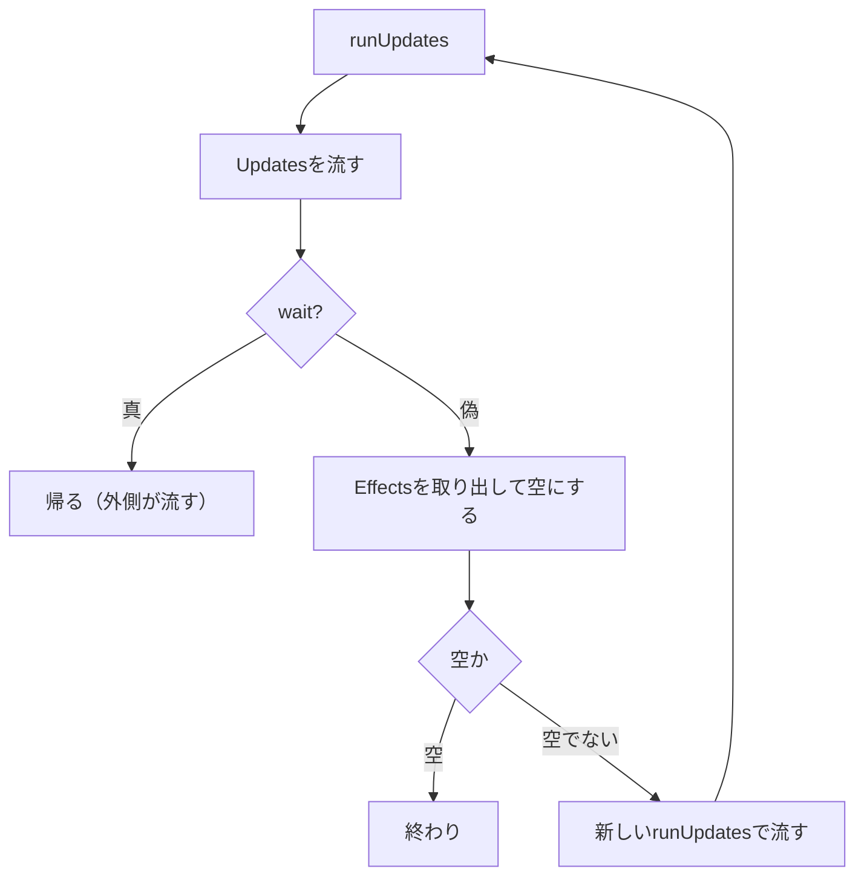

# エフェクトの中の書き込みはいつ流れるのか

> 読んだ版：solidjs/solid `b25c557`（2026-09-04、solid 1.9.15）の `packages/solid/src/reactive/signal.ts`

前章で読んだ `runUpdates` は、`fn` を実行したあと、`completeUpdates(wait)` を呼んでキューを流す。
では、エフェクトの中でsetterを呼んだら、そのエフェクトの消化が終わる前に次の消化が始まるのか。
答えは `completeUpdates` の後半3行の順序にある。

## completeUpdatesの順序

`fn` が終わると、`completeUpdates(wait)` がキューを流す。
Transitionに関わる処理を省いて引く。

```ts
function completeUpdates(wait: boolean) {
  if (Updates) {
    if (Scheduler && Transition && Transition.running)
      scheduleQueue(Updates);
    else runQueue(Updates);
    Updates = null;
  }
  if (wait) return;
  // ...（Transitionの完了と中断の処理を省略）
  const e = Effects!;
  Effects = null;
  if (e.length) runUpdates(() => runEffects(e), false);
  // ...（開発時のフック呼び出しを省略）
}
```

流す順は、純粋な計算が先、エフェクトが後である。

前半は `Updates` を流す。
`runQueue` は `for (let i = 0; i < queue.length; i++)` の1行のループで、`queue.length` を毎回読み直す。
流している途中で積まれた計算も、同じループの後ろで拾われる。
流している間は `Updates` がまだ配列なので、その間に `runUpdates` が呼ばれても、1行目で早期リターンして同じ配列に積むだけになる。
流し終えてから `Updates` を `null` に戻す。

`if (wait) return;` で、エフェクトのキューが外側のものならここで帰る。

後半の3行がエフェクトの流し方である。
`Effects` をローカル変数 `e` に取り出し、`Effects` を `null` にしてから、新しい `runUpdates` の中で `e` を流す。
`runEffects` は変数で、初期値は `runQueue` だが、`createEffect` が初めて呼ばれた時点で `runUserEffects` に差し替えられる（5章で読む）。

## エフェクトの中の書き込み

後半の3行の順序が、冒頭の問いの答えになる。
エフェクトの中でsetterを呼ぶ次の例で、旗の動きを追う。

```js
const [a, setA] = createSignal(0);
const [b, setB] = createSignal(0);
createEffect(() => setB(a() + 1)); // E1
createEffect(() => console.log(b())); // E2

// イベントハンドラの中で
setA(1);
```

| 段階 | 起きること | `Updates` | `Effects` |
| --- | --- | --- | --- |
| 1 | `setA(1)` が `runUpdates` ①を始める | `[]` | `[]` |
| 2 | ①の `fn` がE1に印を付けて積む | `[]` | `[E1]` |
| 3 | ①の `completeUpdates` が `e=[E1]` を取り出す | `null` | `null` |
| 4 | `runUpdates` ②が始まり、E1を流す | `[]` | `[]` |
| 5 | E1の中の `setB` が `runUpdates` ③を呼ぶ | `[]` | `[]` |
| 6 | ③は早期リターンし、E2を②の配列に積む | `[]` | `[E2]` |
| 7 | ②の `completeUpdates` が `e=[E2]` を取り出す | `null` | `null` |
| 8 | `runUpdates` ④が始まり、E2を流す | `[]` | `[]` |

段階4で `Updates` と `Effects` の両方が新しい配列になるのは、段階3で両方が `null` に戻っているからである。
そのため、E1の中の書き込み（段階5）は②のサイクルの内側に入る。
E2はE1の消化の途中では走らない。
②の配列に積まれ、E1を含む一巡が終わってから、次のサイクル④で走る。



エフェクトが書き込みをするたびに、サイクルは一段ずつ再帰する。
エフェクトが新しいエフェクトを積まなくなった時点で、再帰は止まる。

## エフェクトの流し方が変わった経緯

エフェクトの流し方は、Solid 1.5（コミット `a209b35b`、2022年8月）で現在の形になった。
それ以前は、`Effects` を空にしないまま、`batch` の中で `runEffects(Effects)` を呼んでいた。
1.5で、取り出して `null` にしてから新しい `runUpdates` の中で流す形に変わった。
同じリリースで、`batch` の意味も「値を保留する」から「キューに積むだけ」に変わっている（前章）。
エフェクトの流し方の書き換えがその変更に伴うものかどうかは、コミットにもCHANGELOGにも書かれていない。

`Updates` の各要素に `runTop` をかけたとき、その計算が `STALE` ではなく `PENDING` だったらどうなるのかは、次章で追う。

---
確度:
- 実ソース確認済み：`completeUpdates` のTransition以外の流れ、`runQueue` がループのたびに `queue.length` を読み直すこと
- 履歴、PR由来：エフェクトを取り出してから流す形への変更（`a209b35b`、Solid 1.5）
- 推測：1.5でエフェクトの流し方を変えた理由（明文の記述は見つからず）
- 実行で確認：npmの `solid-js@1.9.15` をNode.js（`--conditions=browser`）で動かし、E2がE1の終了後に走ることを確かめた。段階ごとの `Updates` と `Effects` の値は、コードを手で追って書いたもので、実行時に中身を観察してはいない
